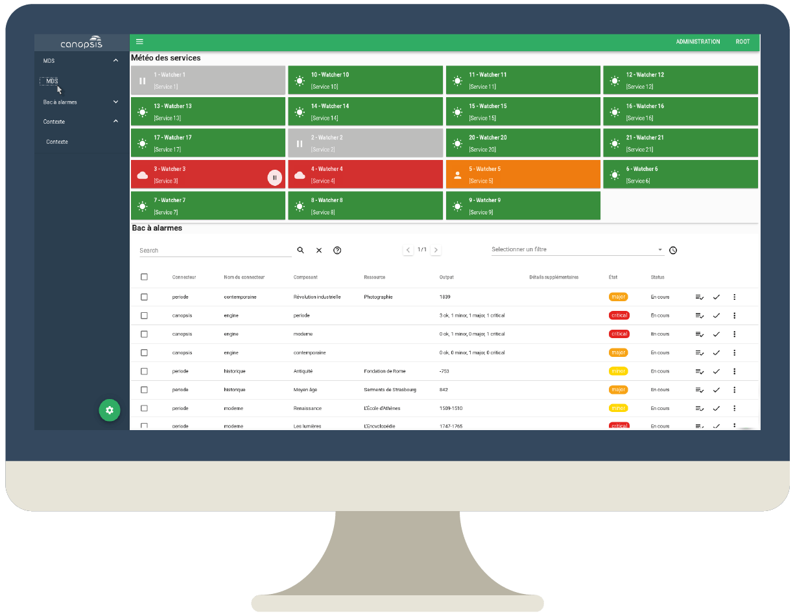

# Canopsis, open-source hypervision

## About

[Canopsis](http://www.canopsis.com) is a modular open-source technology whose goal is to **centralize**, **process** and **report** multiple sources of information, metrics and events into a single platform for monitoring and managing resources.

[Multiple connectors](https://doc.canopsis.net/guide-connecteurs/) can be plugged in Canopsis, such as Icinga, Nagios®, Centreon, Zabbix, Logstash, SNMP, and more.

A demo is available at: [demo.canopsis.net](http://demo.canopsis.net).

## Installation

Canopsis can be installed through [Debian or CentOS packages](https://doc.canopsis.net/guide-administration/installation/installation-paquets/), or with [Docker images](https://doc.canopsis.net/guide-administration/installation/installation-conteneurs/).

## Documentation

Documentation is available (in French) at: [doc.canopsis.net](https://doc.canopsis.net).

## Contributing

Canopsis is built with Python, Go and Vue.js. This open-source edition is licensed under the GNU AGPLv3.

Commercial offers are also available on [canopsis.com](http://www.canopsis.com).

Main development is coordinated on [git.canopsis.net](https://git.canopsis.net/canopsis/canopsis), and then mirrored on [GitHub](https://github.com/capensis/canopsis).

© 2011–2019 Capensis
