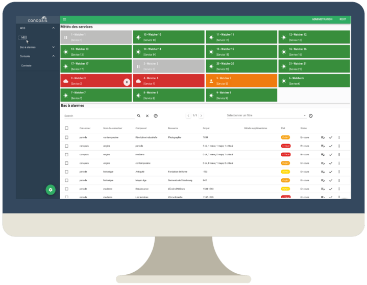

# Canopsis Community, open-source hypervision

## About

[Canopsis Community](https://www.capensis.fr/canopsis/) is a modular open-source technology whose goal is to **centralize**, **process** and **report** multiple sources of information, metrics and events into a single platform for monitoring and managing resources.

[Multiple connectors](https://doc.canopsis.net/interconnexions/) can be plugged in Canopsis, such as Icinga, Nagios®, Centreon, Zabbix, Logstash, SNMP, and more.

A demo is available at: [demo.canopsis.net](https://demo.canopsis.net).

## Installation

Canopsis can be installed through [CentOS packages](https://doc.canopsis.net/guide-administration/installation/installation-paquets/), or with [Docker images](https://doc.canopsis.net/guide-administration/installation/installation-conteneurs/).

## Documentation

Documentation is available (in French) at: [doc.canopsis.net](https://doc.canopsis.net).

## Contributing

Canopsis is built with Python, Go and Vue.js. This open-source Community edition is licensed under the GNU AGPLv3.

Commercial offers (Canopsis Pro) are also available on [canopsis.com](http://www.canopsis.com).

Main development of Canopsis Community is coordinated on [git.canopsis.net](https://git.canopsis.net/canopsis/canopsis-community), and then mirrored on [GitHub](https://github.com/capensis/canopsis).

© 2011–2022 Capensis
