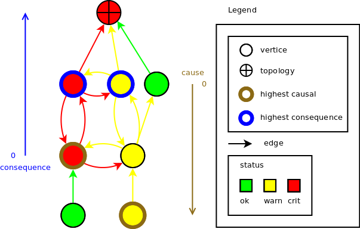

.. _FR__Topology:

========
Topology
========

A topology is a graph representation of an infrastructure dedicated to find failure causes/consequences among hosts and services.

.. contents::
   :depth: 2

----------
References
----------

- :ref:`FR__Event <FR__Event>`
- :ref:`FR__Graph <FR__Graph>`

-------
Updates
-------

.. csv-table::
   :header: "Author(s)", "Date", "Version", "Summary", "Accepted by"

   "David Delassus", "2015/09/01", "0.3", "Update references", ""
   "David Delassus", "2015/09/01", "0.2", "Rename document", ""
   "Jonathan Labéjof", "2015/07/27", "0.1", "Creation", ""

--------
Contents
--------

Description
===========

Une topologie est un :ref:`graph <FR__Graph__graph>` dédié à l'étude des causes
et des conséquences de pannes d'un système. Constituée de sommets à état et d'arrêtes
orientées et à état. Elle est dédié aux analyses de causes et d'impacts de pannes
d'un système.

Représentations
===============

Widget Topology
---------------

L'illustration ci-dessous montre un exemple de schéma de topologie avec des états observés dans une infrastructure, d'états calculés/corrélés par la topologie et des causes/conséquences des changements d'état.

Les axes verticaux de nom “consequence” et “cause” montrent que plus on se rapproche de la topologie, plus la conséquence est importante, et inversement pour les causes. Les causes et les conséquences les plus pertinentes sont surlignées avec la même couleur que la propriété de l'axe intéressé.

Widget list des causes et conséquences
--------------------------------------

Analyse
=======

L'analyse permet à la fois d'observer des corrélations d'état complexe et des informations de causes et de conséquences de dégradations/pannes du système.

Cette analyse est réalisée en liant les noeuds soit à des éléments du contexte, soit à des opérations de propagation de changement d'état dans le sens des arrêtes.

Une opération correspond à une action ou à une condition et deux actions qui sont respectivement réalisées en cas de succès ou d'échec de la condition.

Même s'il est possible de développer ses propres opérations, celles proposées par défaut sont :

Un état recherché est par exemple une valeur spécifique ou non ok.

Actions
-------

- valeur d'état spécifique,
- worst state : pire état observé,
- best state : meilleur état.

Condition/Action
----------------

- at least(n) : au moins n sommets doivent avoir un état correspodant à un état recherché (valeur spécifique ou non ok),
- all : condition validée si tous les sommets ont un état recherché (valeur spécifique ou non ok).

Causes et conséquences
----------------------

Les causes et les conséquences sont des informations calculées par la topologie, qui prennent en paramètre un sommet et une distance, maximale par défaut pour identifier les causes/conséquences les plus importantes.

Conséquences de X : parcours des sommets depuis X dans le sens des arrêtes et tant que l'état n'est pas ok.

Causes de X : parcours des sommets depuis X dans le sens contraire des arrêtes et tant que l'état n'est pas ok.

Afin de faciliter la compréhension du résultat de ces causes et de ces conséquences, la réponse  triera les causes et conséquences dans un ordre temporel en fonction de la date d'émission du changement d'état des sommets.
