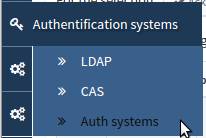
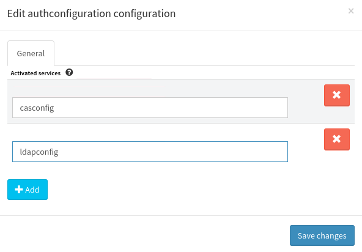

.. _user-ui-auth:

Authentication backends
=======================

This Chapter describes how to configure external authentication backends for
Canopsis

.. note::
   You need to enable the authentication providers in WebServer configuration.
   See the `webserver administrator guide <../../..//developer-guide/backend/webserver.html>`_ , See also the `account management <../../../administrator-guide/accounts-management/index.html>`_

.. toctree::
   :maxdepth: 3
   :titlesonly:

   ldap
   cas

Enable authentication service from UI
-------------------------------------

Authentication systems configuration acces can be activated in the UI by adding the appropriate value for the authentication service.

- First log into the UI with sufficient credentials (authentication rights required)
- Go to the authentication activated services panel as the picture shows below (picture 1)
- Add the appropriate service name in the list. Availables services are ``ldapconfig`` and ``casconfig`` (picture 2)
- Log out and log in the Canopsis application to get access to the specific services configuration sections.

