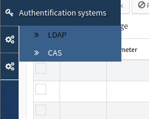
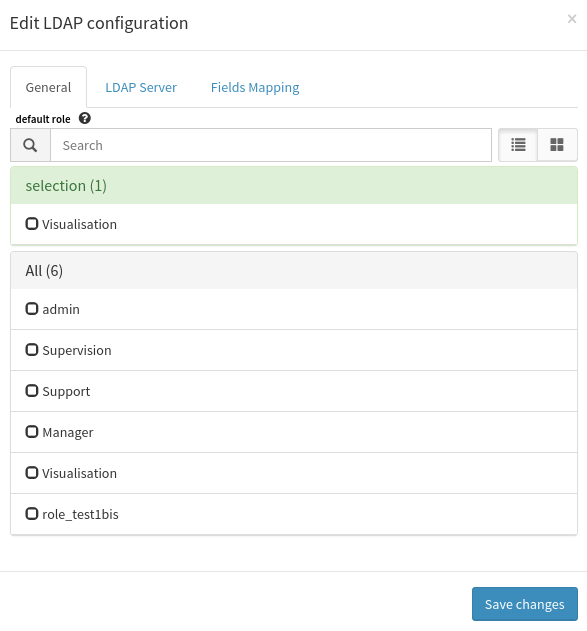
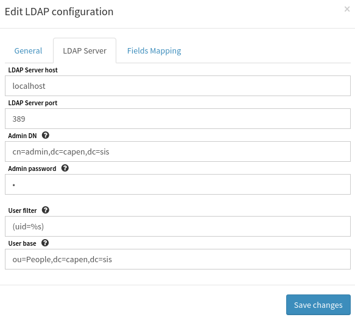
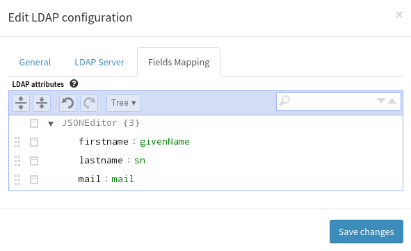

.. _user-ui-auth-ldap:

LDAP Authentication Backend
===========================

.. note::
   The ``ldap`` provider MUST be activated in webserver.

Open configuration form
-----------------------

Click on the *LDAP* menu entry:

This will open the following form:

Detailed form:

 * **Default role:** default role used for user when he logs in for the first time.

Detailed form:

 * **Host:** LDAP server host ;
 * **Port:** LDAP server port ;
 * **Admin DN:** identifier for LDAP admin account ;
 * **Admin password:** password for LDAP admin account ;
 * **User filter:** LDAP filter for users, a ``%s`` MUST be present (will be replaced with wanted username) ;
 * **User DN:** LDAP base directory to look for users.

Detailed form:

 * Map ``attribute -> LDAP attribute`` ;
 * used to fill the Canopsis account with LDAP informations.
