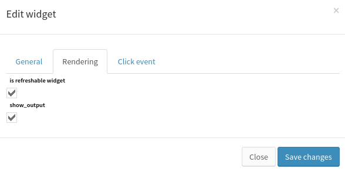
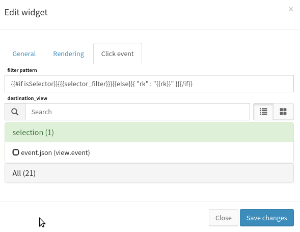

.. _user-ui-widgets-weather:

How to use Weather
==================

Overview
--------

The weather widget allows to display event state in a fashion way. It is designed to get quick overview over specific components and resources statements.

Create a weather in a view
--------------------------

Inserting a weather widget in canopsis requires management rights. Please refer to the canopsis rights management to know more about this topic.

First, choose a view where the weather will be inserted. When done, switch to insert widget edition mode, choose the weather in the list and click on it. The specific form for weather is displayed and let input this widget configuration.

There is no required information to fill for the weather. However, this widget requires inputs in order to display interesting information when rendered. Let's see what and how to configure a weather.

Weather widget general configuration
------------------------------------

The weather widget main configuration is made of the following parameters:

.. image:: ../../../_static/images/frontend/weather_configuration_1.png

Weather configured with the information above will render as following:

.. image:: ../../../_static/images/frontend/weather_renderer_1.png

Explanations:

First we gave a weather title that is displayed directly in the renderer.
Then, We chose to make the widget refresh every minutes. This will trigger the UI refresh with up to date event information.

The event selector in the form allows to select events in the database to watch. These event can be **normal events**, **selector events** or **topology events**. Refer the selector and topology documentations to get more about these topics.

What is considered in the renderer are these events statuses. The render show all selected events with specific colors. The color set depends on the event state as following:

- green : **off**
- yellow : **minor**
- orange : **major**
- red : **critical**
- purple : **acknowleged**

The weather behavior is to display each event color with a general background computed with the worst state of all event in the weather, without considerating acknowleged events state.

Rendering configuration
-----------------------

In this configuration panel, is refreshable widget allow to choose whether or not the widget is refreshed in time. When unchecked, the widget is refreshed only at rendering (when the user asks for the view containing the weather to be displayed).

The show output option allows to choose if the event output is displayed when the weather displays a single event.

Click event configuration
-------------------------

This configuration enables interaction with weather where each event represented will be clickable and will redirect the user to show him the matched event in the selected view with the generated filter.

Filter pattern option is a template representation of what filter to use when user is redirected to the selected view.

Destination view is the view where the click leads the user with the custom filter.
