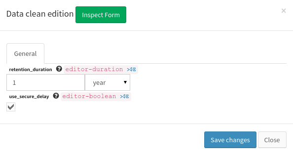

.. _user-engines-datacleaner:

Datacleaner Engine
==================

*NB: need update to taskhandler dataclean*

Changing engine configuration from user interface is reachable via the ui settings panel and by clicking on the Data cleaner sub menu as shown on the below picture.

|image1|

Changeable options ``retention duration`` witch is a duration from now where data are deleted. The second option is a security to allow data deletion under one year (at your own risk)

|image2|

For more technical information about data cleaner engine parameters, please refer to `administrator guide for datacleaner engine <../../administrator-guide/administration/engines-management/datacleaner.html>`_

.. |image1| image:: ../../_static/images/datacleaner/menuaccess.png

