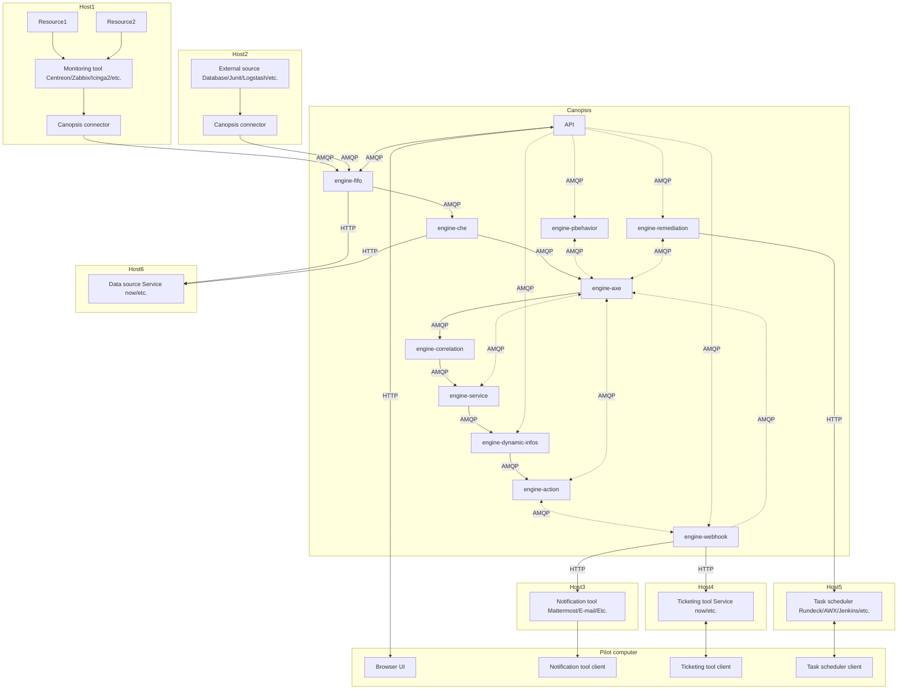
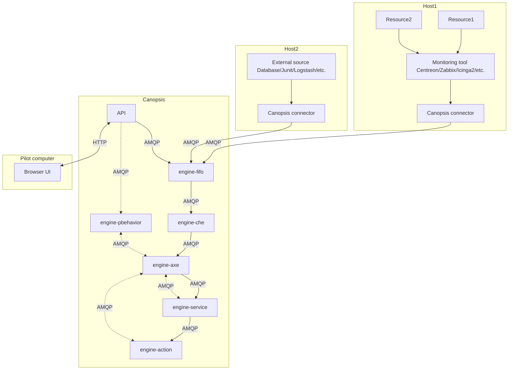

# All engines

## General schemas

A schema which only displays direct interactions between engines and between engines and external services.

### Pro

### Community

## Detailed schemas

- [engine-fifo](./engine-fifo.md)
- [engine-che](./engine-che.md)
- [engine-axe](./engine-axe.md)
- [engine-correlation](./engine-correlation.md)
- [engine-service](./engine-service.md)
- [engine-dynamic-infos](./engine-dynamic-infos.md)
- [engine-action](./engine-action.md)
- [engine-pbehavior](./engine-pbehavior.md)
- [engine-remediation](./engine-remediation.md)
- [engine-webhook](./engine-webhook.md)
