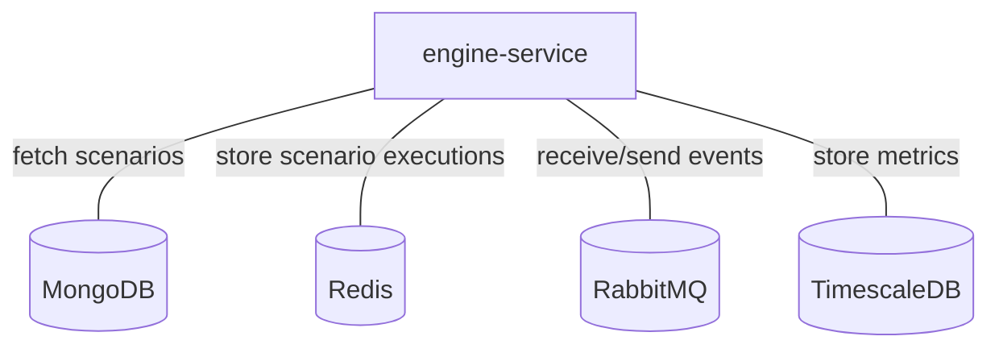

# Engine-action

## Services interactions

A simple schema which only displays direct interactions with all databases, RMQ, external APIs, etc.



## Detailed schemas

The following schemas display flows of events by each use-case of business logic.

### Run a scenario on an alarm change.

```mermaid
flowchart
    C[Canopsis connector]
    EAC[engine-action]
    EF[engine-fifo]
    ECH[engine-che]
    EAX[engine-axe]
    OE[other engines]
    R[(Redis)]
    C -- 1 . Event --> EF
    EF -- 2 . Event --> ECH
    ECH -- 3 . Event --> EAX
    EAX -- 4 . Event --> OE
    OE -- 5 . Event --> EAC
    EAC -. 6 . Store scenario executions .-> R
    EAC -. 7 . Update alarm .-> EAX
    EAX -. 8 . Result alarm .-> EAC
```

### Run a scenario with pbehavior creation.

```mermaid
flowchart
    C[Canopsis connector]
    EAC[engine-action]
    EF[engine-fifo]
    ECH[engine-che]
    EAX[engine-axe]
    EPH[engine-pbehavior]
    OE[other engines]
    R[(Redis)]
    C -- 1 . Event --> EF
    EF -- 2 . Event --> ECH
    ECH -- 3 . Event --> EAX
    EAX -- 4 . Event --> OE
    OE -- 5 . Event --> EAC
    EAC -. 6 . Store scenario executions .-> R
    EAC -. 7 . Update alarm .-> EAX
    EAX -. 8 . Create pbehavior .-> EPH
    EPH -. 9 . Get pbehavior interval for alarm .-> EAX
    EAX -. 10 . Result alarm .-> EAC
```

### Run a scenario if a service exists.

```mermaid
flowchart
    C[Canopsis connector]
    EAC[engine-action]
    EF[engine-fifo]
    ECH[engine-che]
    EAX[engine-axe]
    ESE[engine-service]
    OE[other engines]
    R[(Redis)]
    C -- 1 . Event --> EF
    EF -- 2 . Event --> ECH
    ECH -- 3 . Event --> EAX
    EAX -- 4 . Event --> OE
    OE -- 5 . Event --> EAC
    EAC -. 6 . Store scenario executions .-> R
    EAC -. 7 . Update alarm .-> EAX
    EAX -. 9 . Update services .-> ESE
    EAX -. 9 . Result alarm .-> EAC
```

### Run a scenario with a webhook.

See [engine-webhook](./engine-webhook.md).

### Instruction triggers

See [engine-remediation](./engine-remediation.md).
