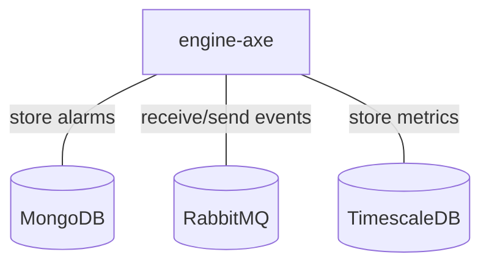

# Engine-axe

## Services interactions

A simple schema which only displays direct interactions with all databases, RMQ, external APIs, etc.



## Detailed schemas

The following schemas display flows of events by each use-case of business logic.

### Create/update an alarm on an event.

```mermaid
flowchart
    C[Canopsis connector]
    EF[engine-fifo]
    ECH[engine-che]
    EAX[engine-axe]
    EN[next engine]
    MDB[(MongoDB)]
    C -- 1 . Event --> EF
    EF -- 2 . Event --> ECH
    ECH -- 3 . Event --> EAX
    EAX -. 4 . Store alarm .-> MDB
    EAX -- 5 . Event --> EN
```

### Scenarios

See [engine-action](./engine-actoin.md).

### Declare ticket rules

See [engine-webhook](./engine-webhook.md).

### Instructions

See [engine-remediation](./engine-remediation.md).

### Meta alarms

See [engine-correlation](./engine-correlation.md).
