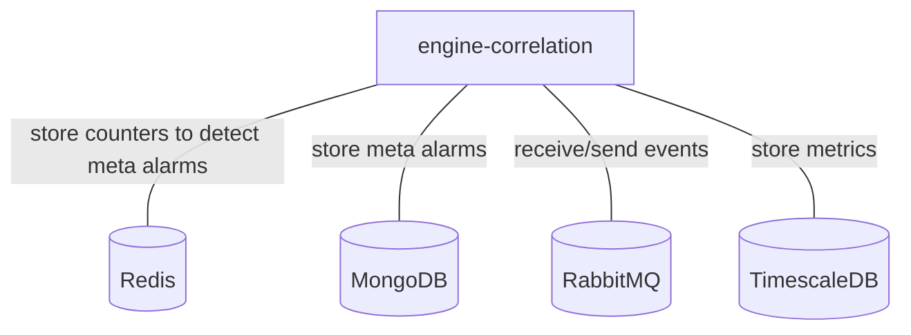
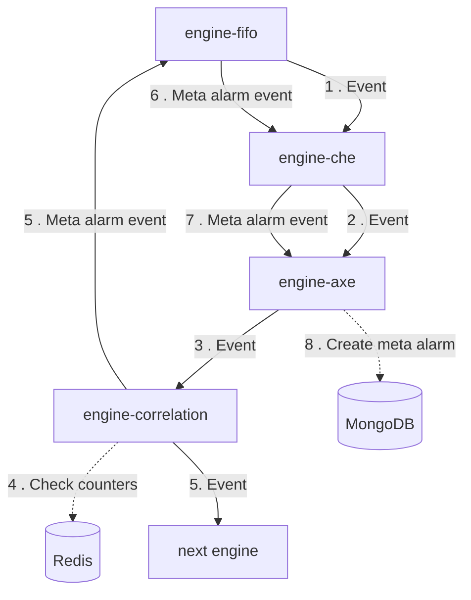
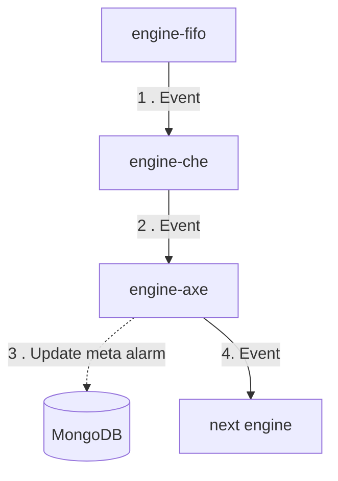
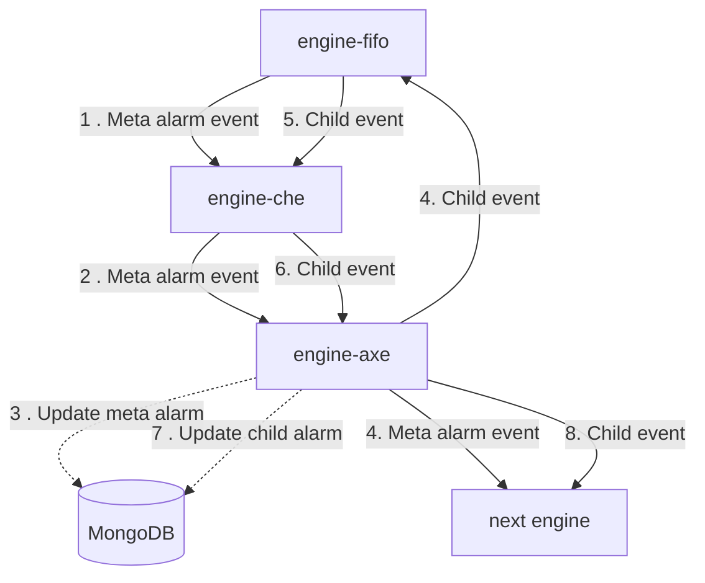

# Engine-correlation

## Services interactions

A simple schema which only displays direct interactions with all databases, RMQ, external APIs, etc.

## Detailed schemas

The following schemas display flows of events by each use-case of business logic.

### Create a meta alarm on an event.

### Update a meta alarm on an event.

### Update a child on a meta alarm change (ack, comment, declare ticket, etc.).

