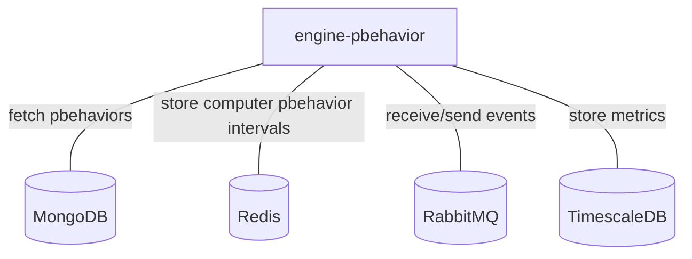
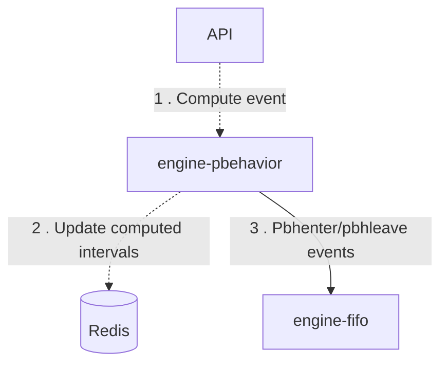
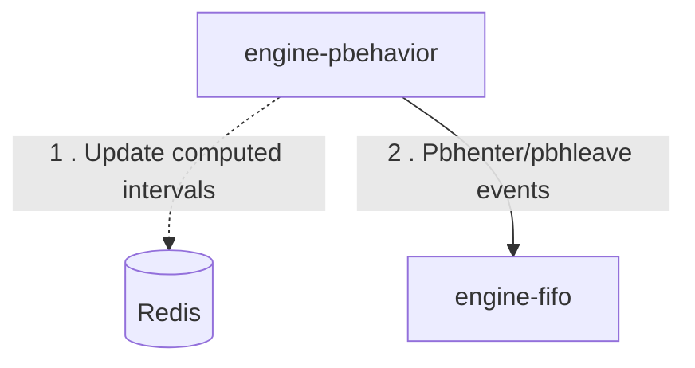

# Engine-pbehavior

## Services interactions

A simple schema which only displays direct interactions with all databases, RMQ, external APIs, etc.

## Detailed schemas

The following schemas display flows of events by each use-case of business logic.

### Create/update/remove a pbehavior.

### Update alarms in periodical process 

### Scenarios

See [engine-action](./engine-actoin.md).
