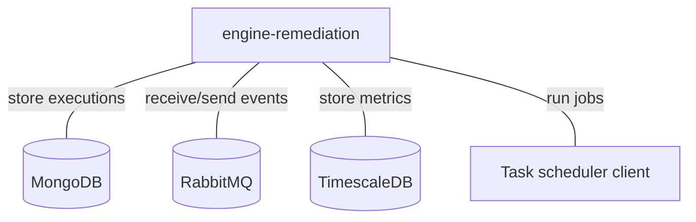
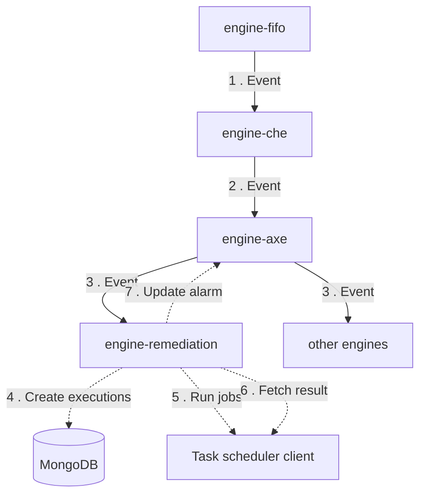
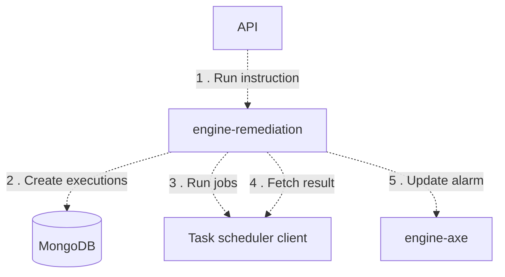
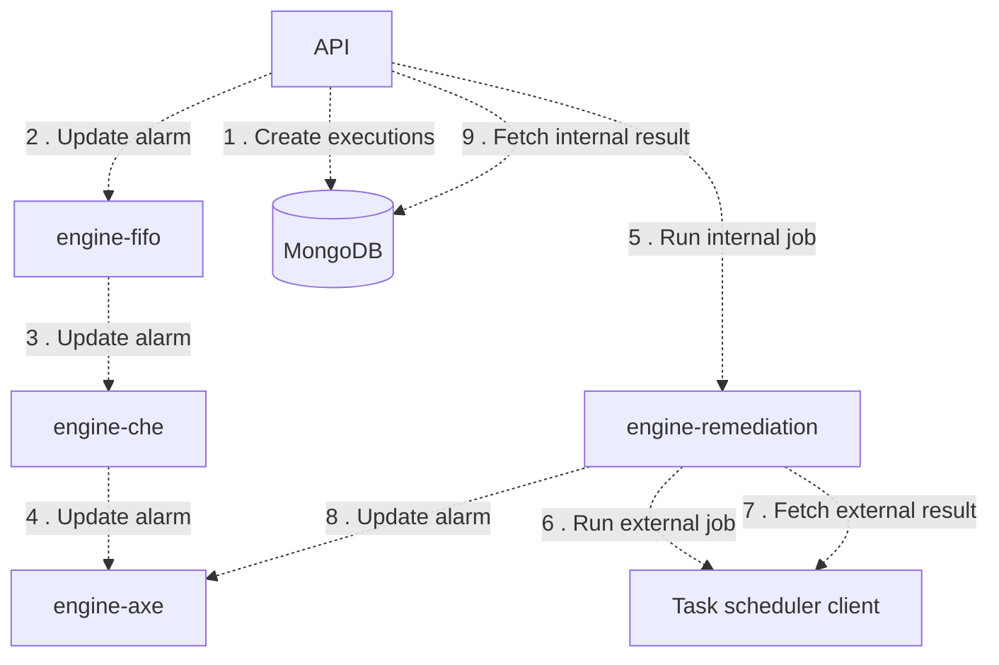
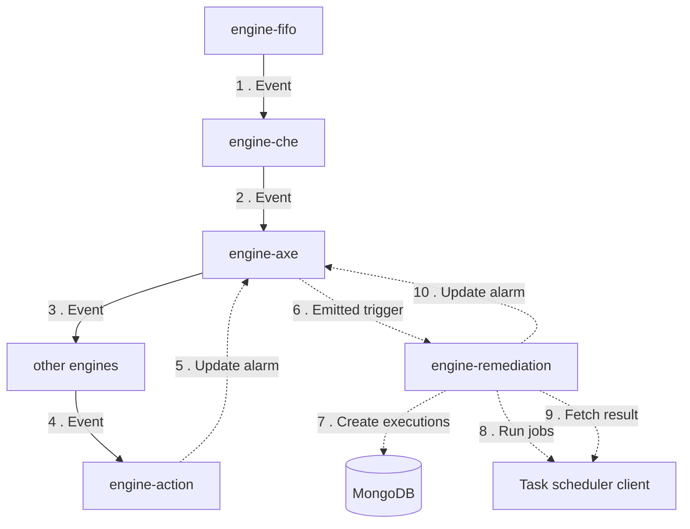
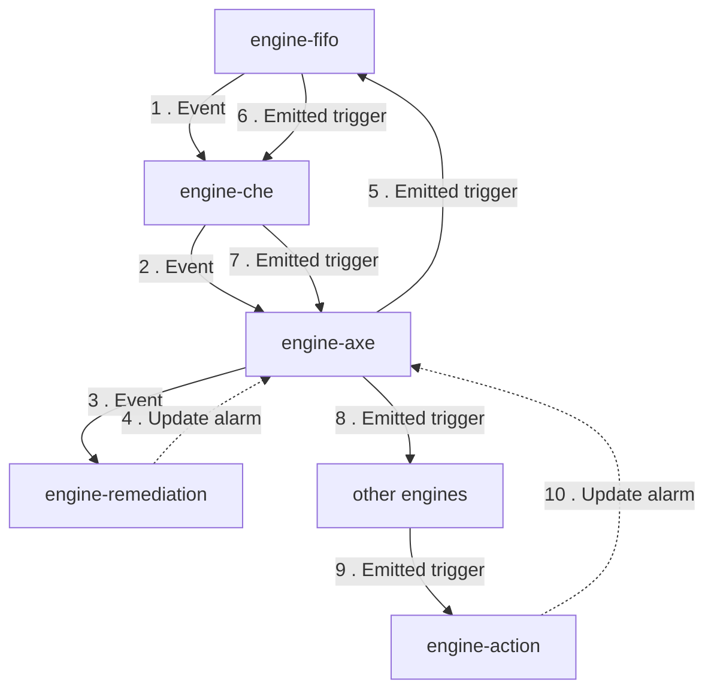

# Engine-remediation

## Services interactions

A simple schema which only displays direct interactions with all databases, RMQ, external APIs, etc.

## Detailed schemas

The following schemas display flows of events by each use-case of business logic.

### Run an auto instruction on an event.

### Run a simplified manual instruction.

### Run a manual instruction.

### Run an auto instruction on a scenario emitted trigger.

### Run a scenario on an instruction emitted trigger.

