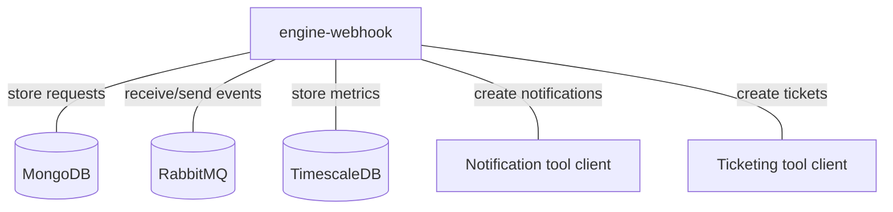
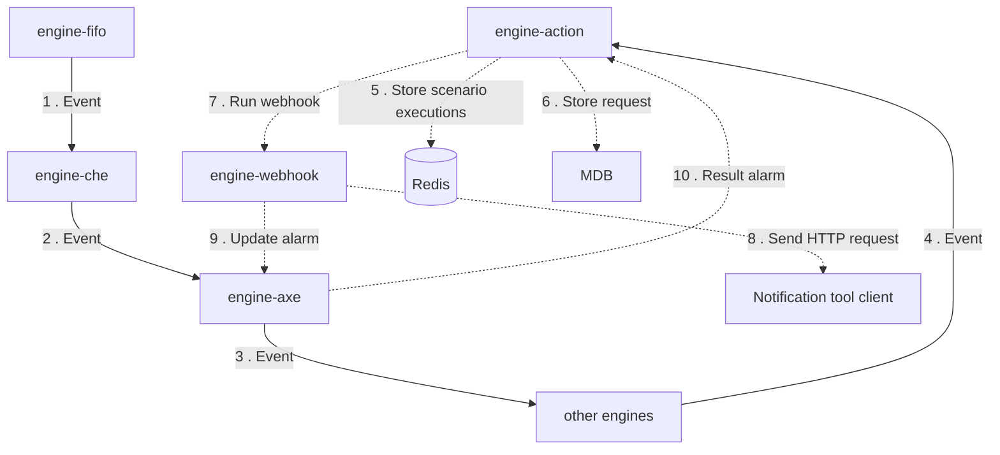
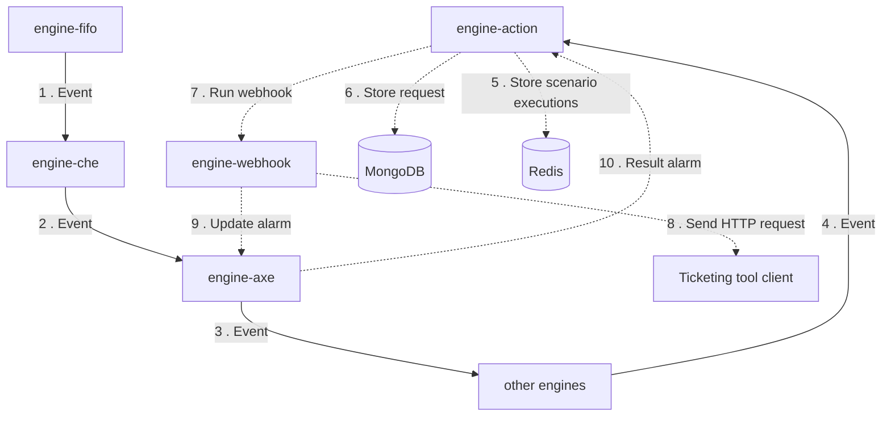
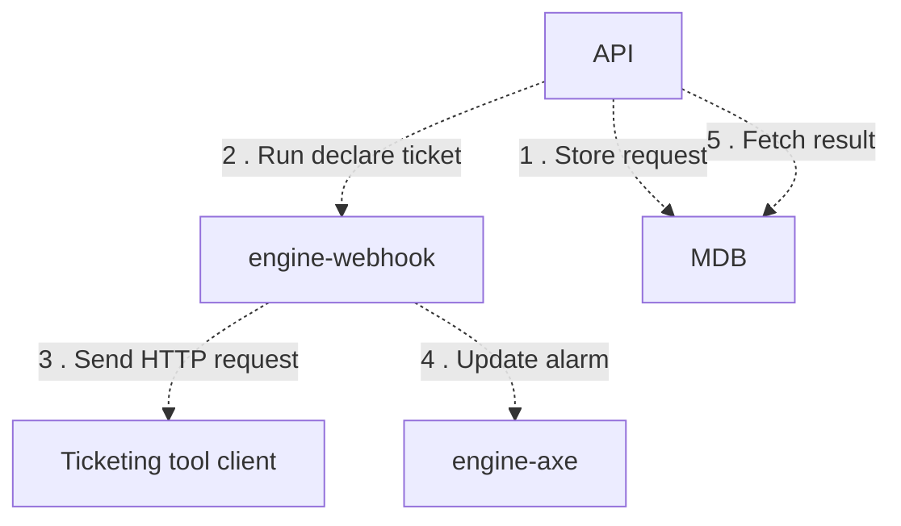

# Engine-webhook

## Services interactions

A simple schema which only displays direct interactions with all databases, RMQ, external APIs, etc.

## Detailed schemas

The following schemas display flows of events by each use-case of business logic.

### Send a notification by a webhook.

### Create a ticket by a webhook.

### Create a ticket by a declare ticket rule.

