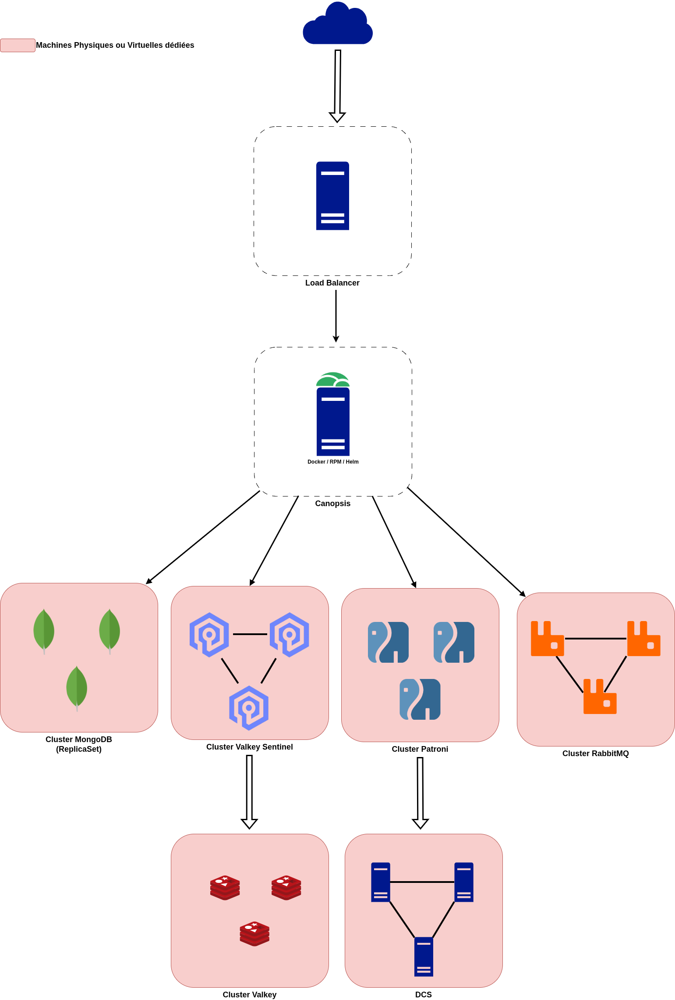
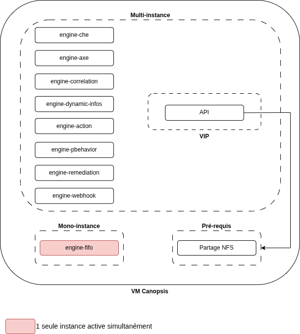
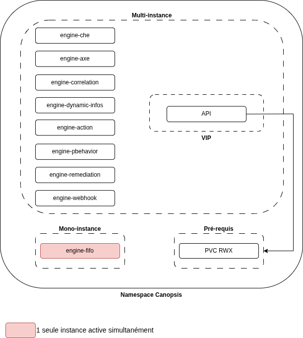
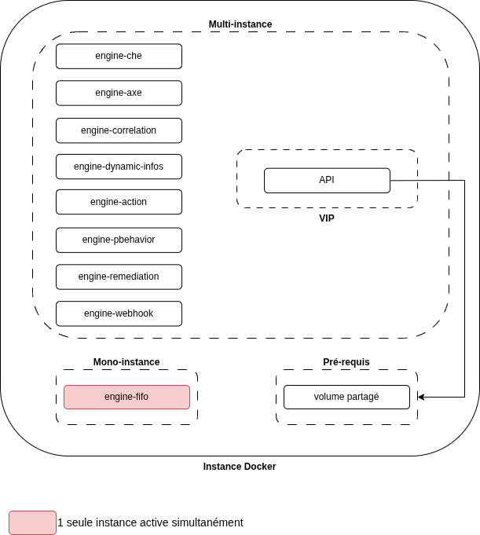

# Architecture et recommandations de haute disponibilité

Afin de garantir la haute disponibilité (HA) et la résilience de Canopsis, il est nécessaire de déployer les composants critiques en mode cluster ou réplication.

L’objectif est d’éviter tout point de défaillance unique (SPOF) et d’assurer la continuité du service même en cas de panne d’un nœud.

## Architecture globale type supportée

## Détails par composant

=== "Canopsis (applicatif)"

    - L’application peut être déployée sur plusieurs nœuds afin de répartir la charge ;
    - L'accès applicatif se fait via un Load Balancer ;
    - Il est également possible de multiplier les instances des moteurs.

    !!! warning "Important"
        **Le moteur FIFO doit être déployé en mono-instance uniquement.**

=== "MongoDB"

    !!! info "Information"
        Replicaset : Pré-requis pour le bon fonctionnement de l'applicatif
    
    - Déployé en ReplicaSet avec un **nombre impair de nœuds**, 3 minimum ;
    - Permet la réplication des données et la bascule automatique en cas de panne d’un nœud ;
    
    !!! warning "Attention"
        **Cette configuration permet uniquement la tolérance à la panne d’un seul nœud.**
        **Chaque nœud doit être hébergé sur une machine distincte.**

=== "RabbitMQ"

    !!! info "Information"
        Cluster RabbitMQ : Pré-requis pour garantir la non perte d'évènement couplé à l'API

    - Déployé en cluster avec un nombre impair de nœuds afin d’assurer la haute disponibilité et la tolérance aux pannes ;
    - Il est recommandé d’avoir **au minimum 3 nœuds** RabbitMQ pour garantir la redondance et éviter tout point de défaillance ;
    - Avec une configuration à 3 nœuds, le cluster permet uniquement la tolérance à la panne d’un seul nœud simultanément ;
    - Les files (queues) doivent être configurées en mode “quorum queues” pour assurer la réplication des messages entre les nœuds du cluster ;
    - Tous les nœuds RabbitMQ doivent partager la même configuration et être répartis sur des machines distinctes.

=== "Valkey/Sentinel"

    - Déployé en cluster avec un **nombre impair de nœuds** (3 minimum) ;
    - Ajout de 3 sentinels pour la supervision et la gestion automatique du failover ;

    !!! warning "Attention"
        Cette architecture tolère la perte d’un seul nœud à la fois.  
        Les nœuds Redis et les sentinels doivent être répartis sur des machines différentes pour garantir la tolérance aux pannes.

=== "TimescaleDB/PostgreSQL"

    - Utiliser une [solution de HA pour PostgreSQL](https://patroni.readthedocs.io/en/latest/) comme [Patroni](https://patroni.readthedocs.io/en/latest/) pour mettre en place un cluster haute disponibilité (1 primaire + 1 secondaire) ; 
    - Patroni gère automatiquement les bascules (failover) en coordination avec un Distributed Config Store (DCS), comme par exemple **Etcd** ou **Consul** ;
    - Les deux instances de TimescaleDB/PostgreSQL doivent être sur des machines séparées.

===! "Distributed Config Store (DCS)"

    - Déployé en cluster 3 nœuds ;
    - Fournit les services suivants :
        - Coordination pour Patroni et le cluster PostgreSQL ;
        - Stockage clé/valeur distribué ;
    - Le DCS est utilisé par Patroni pour gérer l’élection du primaire et les opérations de bascule (failover) du cluster PostgreSQL ;
    - Les nœuds du DCS doivent être répartis sur 3 machines distinctes ;

=== "Load Balancer"

    - Placé en frontal des serveurs web Canopsis (Nginx).
    - Réalise la répartition de charge et la détection automatique des nœuds indisponibles.

    !!! info "Information"
        Vous pouvez prévoir plusieurs Load Balancer en mode actif/passif (keepalived ou VRRP) pour supprimer ce point de défaillance.

## Zoom sur les types d'installation

=== "RPM"

    

    <h4>FIFO</h4>

    Le moteur FIFO ne doit fonctionner que sur une seule instance simultanément.

    Pour des raisons de haute disponibilité, il est toutefois recommandé de le déployer sur plusieurs nœuds. 

    Dans ce cas, une seule instance doit être active, les autres restant passives et prêtes à prendre le relais en cas de défaillance (bascule manuelle ou via un logiciel de clustering tel que Pacemaker/Corosync).

     <h4>Partage NFS</h4>

    Sur une installation de type RPM et en mode multi-instance, il est indispensable de disposer d’un partage NFS pour le répertoire `/opt/canopsis/var/lib`. 

    En effet, ce dossier contient des fichiers qui doivent être accessibles et partagés entre les différentes instances de l’API.

    Les droits d’accès à ce partage doivent être configurés pour l’utilisateur **canopsis**, afin de garantir le bon fonctionnement des instances et l’accès en lecture/écriture aux fichiers partagés.

=== "Helm"

    

    <h4>FIFO</h4>

    Le moteur FIFO doit impérativement être déployé en une seule instance, c’est-à-dire un seul replica.

    Dans un environnement Kubernetes, c’est le cluster lui-même qui garantit cette unicité en maintenant le Deployment à 1 replica. 

    En cas de redémarrage ou de rescheduling, Kubernetes se charge automatiquement de recréer le pod sur un autre nœud si nécessaire, sans nécessiter d’outil de bascule externe.

    <h4>PVC RWX</h4>

    Dans un déploiement Kubernetes en mode multi-instance, il est indispensable d’utiliser un **PersistentVolumeClaim** (PVC) disposant d’un mode d’accès **ReadWriteMany** (RWX) pour le répertoire équivalent à `/opt/canopsis/var/lib`.

    Ce volume doit être partagé entre toutes les instances de l’API, car il contient des fichiers nécessaires à leur bon fonctionnement et devant être accessibles simultanément par l’ensemble des pods.

    Les droits d’accès sur ce volume doivent être configurés pour l’utilisateur **canopsis**, afin de garantir un accès en lecture/écriture depuis toutes les instances.

    <h4>Backends</h4>

    Pour rappel, il est recommandé d’héberger les différents backends utilisés par Canopsis :

    - **MongoDB** ;
    - **TimescaleDB** ;
    - **RabbitMQ** ;
    - **Valkey**.

    **en dehors du cluster Kubernetes**, sur des **machines dédiées**.

    Cette approche garantit une meilleure stabilité, facilite la gestion des données persistantes, évite les problématiques liées au stockage distribué dans Kubernetes, et permet d’appliquer plus finement les bonnes pratiques propres à chaque backend (haute disponibilité, réplication, sauvegardes, montée en charge, etc.).

=== "Docker"

    

    <h4>FIFO</h4>

    Le moteur FIFO doit impérativement être déployé en une seule instance, c’est-à-dire avec un seul conteneur actif.

    Dans un environnement Docker, cette unicité doit être garantie manuellement ou via l’orchestrateur utilisé (Docker Compose, Swarm, ou tout système externe).

    En cas d’arrêt inopiné ou de redémarrage du conteneur, il appartient à l’orchestrateur mise en place de relancer automatiquement l’unique instance.

    <h4>Volume partagé</h4>

    Dans une installation Docker en mode multi-instance, il est indispensable d’utiliser un volume partagé pour le répertoire équivalent à `/opt/canopsis/var/lib`.

    Ce volume doit être accessible en lecture/écriture par l’ensemble des conteneurs.

    Ce stockage commun est nécessaire car le répertoire contient des fichiers qui doivent être partagés et synchronisés entre toutes les instances de l’API.

    Les droits d’accès sur ce volume doivent être configurés pour l’utilisateur **canopsis**, afin de garantir un accès en lecture/écriture depuis toutes les instances.

    <h4>Backends</h4>

    Pour rappel, tout comme une installation Helm, en Docker il est recommandé d’héberger les différents backends utilisés par Canopsis :

    - **MongoDB** ;
    - **TimescaleDB** ;
    - **RabbitMQ** ;
    - **Valkey**.

    sur des **machines dédiées**.

    Cette approche garantit une meilleure stabilité, facilite la gestion des données persistantes et permet d’appliquer plus finement les bonnes pratiques propres à chaque backend (haute disponibilité, réplication, sauvegardes, montée en charge, etc.).