# Méthodes d'authentification avancées (LDAP, CAS, SAML2, OAUTH2, OPENID)

!!! information "Information"

    Quelque soit le mécanisme d'authentification utilisé, vous pouvez configurer 2 paramètres concernant les expirations d'authentification : `inactivity_interval` et `expiration_interval`.
    
    * `inactivity_interval` : Délai de session utilisateur avant expiration sur inactivité
    * `expiration_interval` : Délai de session utilisateur avant expiration
    
    Exemple : si `expiration_interval` vaut **1 mois** et que `inactivity_interval` vaut **24 heures**
    
    Cas 1:
    
    * L'utilisateur se loggue
    * L'utilisateur ouvre son interface Canopsis chaque jour
    * L'utilisateur sera déloggué après 1 mois
    
    Cas 2:
    
    * L'utilisateur se loggue
    * L'utilisateur ouvre son interface Canopsis chaque jour ouvré
    * L'utilisateur sera déloggué dimanche
    * L'utilisateur se loggue à nouveau lundi

## Authentification LDAP

Les fonctionnalités actuellement implémentées permettent l'authentification des utilisateurs sur n'importe quel annuaire LDAP, tant que celui-ci respecte la [RFC 4510](https://tools.ietf.org/html/rfc4510) et ses déclinaisons.


### Configuration de LDAP

La configuration de l'authentification se fait au travers du fichier de configuration de l'API `/opt/canopsis/share/config/api/security/config.yml`.  

Tout d'abord, vous devez activer le mécanisme d'authentification LDAP en lui-même :

```yaml
security:
  auth_providers:
    - ldap
    ...
```

Puis vous devez renseigner les différents paramètres d'authentification LDAP.

```yaml
  ldap:
    inactivity_interval: 24h
    expiration_interval: 1M
    url: ldap://ldap.local
    admin_dn: uid=svccanopsis,ou=Special,dc=example,dc=com
    admin_passwd:
    user_dn: ou=People,dc=example,dc=com
    ufilter: uid=%s
    username_attr: uid
    attrs:
      mail: mail
      firstname: givenName
      lastname: sn
    default_role: Visualisation
    insecure_skip_verify: false
    max_tls_ver:
    min_tls_ver:
```

Définition des paramètres :

| Attribut        | Description                                        | Exemple                                                         |
|-----------------|----------------------------------------------------|-----------------------------------------------------------------|
| `url`        | Chaîne de connexion LDAP                                | `ldaps://ldap.example.com`                                      |
| `admin_dn`        | Bind DN : DN du compte utilisé pour lire l'annuaire | `uid=svccanopsis,ou=Special,dc=example,dc=com`                 |
| `admin_passwd`    | Bind password : mot de passe pour authentifier le Bind DN sur l'annuaire  |                                          |
| `user_dn`         | DN de base où rechercher les utilisateurs          | `ou=People,dc=example,dc=com`                                   |
| `ufilter`         | Filtre de recherche pour les utilisateurs <br> La valeur de l'utilisateur est présentée dans une variable notée `%s` | `uid=%s`    |
| `username_attr`   | Attribut portant l'identifiant utilisateur dans l'objet de l'annuaire  | `uid`                                       |
| `attrs`           | Association d'attributs pour les infos de l'utilisateur <br> Un utilisateur Canopsis dispose des attributs `firstname`, `lastname`, `mail` | `{"mail": "mail", "firstname": "givenName", "lastname": "sn"}` |
| `default_role`    | Rôle Canopsis par défaut au moment de la première connexion   | `Visualisation`                                      |
| `insecure_skip_verify` | Permet de ne pas vérifier la validité d'un certificat TLS fourni par le serveur (auto-signé, etc.)   | `true`   |
| `max_tls_ver` (optionnel) | La version maximale de TLS qui est acceptable      | `tls10` ou `tls11` ou `tls12` ou `tls13`                        |
| `min_tls_ver` (optionnel) | La version minimale de TLS qui est acceptable      | `tls10` ou `tls11` ou `tls12` ou `tls13`                        |

Vous devez ensuite **obligatoirement** redémarrer le service API.

* Installation via Docker Compose

=== "Canopsis Pro"
	```sh
	CPS_EDITION=pro docker compose restart api
	```

=== "Canopsis Community"
	```sh
	CPS_EDITION=community docker compose restart api
	```

* Installation Paquets

```sh
systemctl restart canopsis-service@canopsis-api.service
```

### Utilisation de LDAP

À ce stade, vous êtes en mesure de vous authentifier sur l'interface de Canopsis. Le profil d'affectation sera celui spécifié dans la configuration.

## Authentification CAS ( édition community )

Les fonctionnalités actuellement implémentées permettent l'authentification des utilisateurs via WebSSO.

### Configuration de CAS

La configuration de l'authentification se fait au travers du fichier de configuration de l'API `/opt/canopsis/share/config/api/security/config.yml`.  

Tout d'abord, vous devez activer le mécanisme d'authentification CAS en lui-même :

```yaml
security:
  auth_providers:
    - cas
    ...
```

Puis vous devez renseigner les différents paramètres d'authentification CAS.

```yaml
  cas:
    inactivity_interval: 24h
    expiration_interval: 1M
    # title defines label of UI login form.
    title: Connexion
    # login_url defines CAS login url to which UI is redirected to authenticate.
    login_url: http://cas.local/login
    # validate_url defines CAS validate url which is used to validate received ticket.
    validate_url: http://cas.local/serviceValidate
    # default_role defines role of new users which are created on successful CAS login.
    default_role: Visualisation
```

Définition des paramètres :

| Attribut       |                    Description                               |            Exemple             |
| -------------- | ------------------------------------------------------------ | ------------------------------ |
| `login_url`    | URL du serveur CAS sur laquelle le navigateur web va être redirigé pour s'authentifier        |   http://canopsis.info.local/  |
| `default_role` | Rôle par défaut au moment de la première connexion           | Visualisation                  |
| `title`        | Label sur le formulaire de connexion                         | Connexion                      |
| `validate_url`  | URL de validation du serveur CAS à laquelle l'API va accéder | https://cas.info.local/websso/ |

Vous devez ensuite **obligatoirement** redémarrer le service API.

* Installation via Docker Compose

=== "Canopsis Pro"
	```sh
	CPS_EDITION=pro docker compose restart api
	```

=== "Canopsis Community"
	```sh
	CPS_EDITION=community docker compose restart api
	```

* Installation Paquets

```sh
systemctl restart canopsis-service@canopsis-api.service
```

### Utilisation de CAS

À ce stade, vous êtes en mesure de vous authentifier sur l'interface de Canopsis.
Le profil d'affectation sera celui spécifié dans la configuration.


## Authentification SAMLv2

Intégration de l’authentification avec le protocole SAMLV2

### Configuration et Paramétrage en lien avec l'Identity Provider (IDP )

La configuration de l'authentification se fait au travers du fichier de configuration de l'API `/opt/canopsis/share/config/api/security/config.yml`.  

Tout d'abord, vous devez activer le mécanisme d'authentification SAML en lui-même :

```yaml
security:
  auth_providers:
    - saml
    ...
```

Puis vous devez renseigner les différents paramètres d'authentification SAML.

```yaml
  saml:
    x509_cert: /certs/saml.cert
    x509_key:  /certs/saml.key
    idp_metadata_url: <http(s)://IDP_METADATA_URL>
  # idp_metadata_xml: </path/to/xml>
    idp_attributes_map:
       # Type: string
       email: email
       # Type: string
       name: uid
       # Type: string
       firstname: uid
       # Type: string
       lastname: uid
       # Type: string or array
       role: role
    canopsis_saml_url: http(s)://<IP_MACHINE>/api/v4/saml
    default_role: "admin" 
    insecure_skip_verify: false
    canopsis_sso_binding: redirect
    canopsis_acs_binding: redirect
    sign_auth_request: false
    name_id_format: urn:oasis:names:tc:SAML:2.0:nameid-format:persistent
    skip_signature_validation: true
    acs_index: 1
    auto_user_registration: true
```

La paire de certificats relatifs aux directives `x509_cert` et `x509_key` doit être générée en amont.

Exemple pour des certificats auto-signés :

```shell
$ openssl req -x509 -newkey rsa:2048 -keyout saml.key -out saml.cert -days 365 -nodes -subj "/CN=canopsis-saml.example.com"
```

Définition des paramètres :

| Directive                   | Définition                                                   |
| --------------------------- | ------------------------------------------------------------ |
| `idp_metadata_url`          | URL permettant de récupérer les Metadatas XML de l'IDP ( si les metadatas XML sont fournies via un service accessible ) |
| `idp_metadata_xml`          | Fichier XML contenant les Metadatas XML de l'IDP ( si les metadatas XML ne sont pas fournies via un service accessible ) |
| `idp_attributes_map`        | Tableau de correspondance entre les attributs utilisateurs de Canopsis ( colonne de gauche ) et les attributs fournis par l'IDP ( colonne de droite ) |
| `canopsis_saml_url`         | URL du service SAML fourni par Canopsis qui sera configuré côté IDP |
| `insecure_skip_verify`      | Permet de bypasser la vérification du certification de l'IDP si configuré à `true` |
| `canopsis_sso_binding`      | Type de binding HTTP pour le service SSO parmi `redirect` ou `post` |
| `canopsis_acs_binding`      | Type de binding HTTP pour le service ACS parmi `redirect` ou `post` |
| `sign_auth_request`         | Permet de signer les requêtes authentification si positionné à `true` |
| `name_id_format`            | Format du `NameIDPolicy`                                     |
| `skip_signature_validation` | Permet de bypasser la validation de la signature de l'idp lors du décodage des réponses envoyées par l'idp si positionné à `true` |
| `acs_index`                 | Valeur entière à utiliser lorsque l'on configure le service ACS Index dans les Metadata XML |
| `auto_user_registration`    | Permet de créer automatiquement les utilisateurs dans Canopsis ( s'ils n'existent pas déjà ) si cette valeur est mise à `true`|
| [`default_role`](#multi-role)              | Rôle Canopsis par défaut à attribuer pour l'utilisateur à sa création |
| `insecure_skip_verify`      | Permet de ne pas vérifier la validité d'un certificat TLS fourni par le serveur (auto-signé, etc.)   | `false`   |

Depuis la version `24.04.1`
  - Il n'est plus nécessaire de mettre le `default_role`. Par défaut, si un utilisateur n'est dans aucun des groupes autorisés à ce connecter à Canopsis, sa connexion lui sera refusée.


Vous devez ensuite **obligatoirement** redémarrer le service API.

* Installation via Docker Compose

=== "Canopsis Pro"
	```sh
	CPS_EDITION=pro docker compose restart api
	```

=== "Canopsis Community"
	```sh
	CPS_EDITION=community docker compose restart api
	```

* Installation Paquets

```sh
systemctl restart canopsis-service@canopsis-api.service
```

### Test de connexion

La mire de connexion de Canopsis doit maintenant proposer un nouveau menu de login SAML qui devra vous rediriger vers l'IDP configuré.

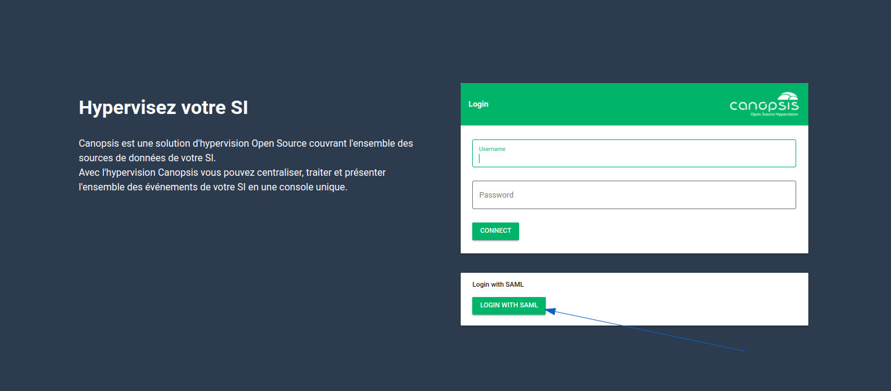

Pour tester l’authentification, il faudra vous authentifier avec un compte valide de votre IDP et ainsi arriver dans Canopsis sans erreur.

## Authentification OAUTH2 / OPENID

Intégration de l’authentification avec le protocole OAUTH2 

### Configuration et Paramétrage 

La configuration de l'authentification se fait au travers du fichier de configuration de l'API `/opt/canopsis/share/config/api/security/config.yml`. 

Tout d'abord, vous devez activer le mécanisme d'authentification OAUTH2 en lui-même :

```yaml
security:
  auth_providers:
    - oauth2
    ...
```

Puis vous devez renseigner les différents paramètres d'authentification oauth2.

```yaml
  oauth2:
    providers:
      votre-nom-de-provider:
        # if open_id is set to true, then the provider is considered as OpenID connect provider and requires the issuer field to be set.
        open_id: true
        # issuer field defines OpenID url for a discovery mechanism, if open_id is set to false, the issuer is ignored.
        issuer: your-openid-provider-url
        # fields to setup inactivity interval for canopsis api tokens.
        inactivity_interval: 24h
        # some providers have too long or too short expiration time, set expiration_interval to override token's expiration time.
        expiration_interval: 48h
        # some oauth2 tokens may have a very short expiration time or have undefined expiration time,
        # it's possible to define min_expiration_interval for those cases.
        min_expiration_interval: 1h
        # oauth2 client_id and client_secret pair defined by your oauth2 provider for your application.
        client_id: your-client-id
        client_secret: your-client-secret
        # redirect_url defines an api callback route to the canopsis api, which should be added to your oauth2 provider.
        redirect_url: your-canopsis-api-url/api/v4/oauth/your-provider-name/callback
        # PKCE is an extension to the Authorization Code flow to prevent CSRF and authorization code injection attacks,
        # some oauth2 provider might not support it, set it to false if it's your case.
        pkce: true
        # default role for user.
        default_role: users
        # attributes map allows to fill canopsis user fields from the OpenID token and user claims,
        # use token.claim_name for token claims and user.claim_name for user claims,
        # token claims are only supported if open_id is set to true.
        attributes_map:
          email: token.your_id_field
          name: user.your_user_name
        # requested scopes.
        scopes:
          - scope_1
          - scope_2
          - scope_3
        # the following urls are required if open_id is set to false,
        # you need to manually define those routes according to your oauth2 provider,
        # if open_id is set to true, those urls are ignored.
        auth_url: your-oauth-2-provider-auth-url
        token_url: your-oauth-2-provider-token-url
        user_url: your-oauth-2-provider-user-url
        # the user_id is required if open_id is set to false,
        # response is taken from user_url response, use "user.your_id_field" for user's id path,
        # if open_id is set to true, those urls are ignored.
        user_id: user.your_id_field
```

Définition des paramètres :

| Attribut       |                    Description                               |            Valeur             |
| -------------- | ------------------------------------------------------------ | ------------------------------ |
| `open_id`    | Définit si le provider est de type open_id ou non        |   true / false  |
| `issuer` | Doit être définie dans le cas où le champ `open_id` est à `true`. Permet de vérifier l'identité du provider; elle est fournie par votre provider            | URL                  |
| `auth_url`  | Adresse d'authentification. A definir uniquement si `open_id` est à `false`; elle est fournie par votre provider  | URL |
| `token_url`  | Adresse de gestion de token. A definir uniquement si `open_id` est à `false`; elle est fournie par votre provider | URL |
| `user_url`  | Adresse des profils utilisateurs. A definir uniquement si `open_id` est à `false`; elle est fournie par votre provider | URL |
| `client_id`        | Identifiant du client oauth/openid                         | Chaîne de caractères                       |
| `client_secret`  | Chaîne secrète du client oauth/openid | Chaîne de caractères |
| `redirect_url`  | Définit une route de rappel vers l'api de Canopsis; doit être ajoutée dans votre provider oauth2  | votre.canopsis/api/v4/oauth/votre-nom-de-provider/callback |
| `pkce`  | Mécanisme qui permet de prévenir des attaques à injections de code d'authentifications. A definir sur `false` si votre provider ne le supporte pas | true / false |
| [`default_role`](#multi-role)  | Rôle par défaut attribué aux utilisateurs de votre Canopsis lorsqu'ils se connectent avec oauth2 | Chaîne de caractères |
| `user_id`  | Permet de définir l'identifiant dans Canopsis. A definir uniquement si `open_id` est à `false` | users.votre_champs_id |
| `attributes_map`  | Permet de remplir les champs d'informations utilisateurs sur votre Canopsis avec les informations fournies par le provider. Récupérer des informations depuis le token OpenID n'est possible que si `open_id` est défini à `true` (Exemple plus bas) | Liste au format `champ: valeur` |
| `scopes`  | Les scopes sont utiliséés par une application lors de l'authentification pour autoriser l'accès à certaines données. Ces accès sont à définir côté provider. Doit être défini dans le cas où le champ `open_id` est à `true` (Ex: Le scope `openid` indique au serveur d’interpréter les requêtes faites aux points d’entrée selon les spécifications d’OpenID Connect.) | Liste |

Depuis la version `24.04.1`
  - Il n'est plus nécessaire de mettre le `default_role`. Par défaut, si un utilisateur n'est dans aucun des groupes autorisés à ce connecter à Canopsis, sa connexion lui sera refusée.

Vous devez ensuite **obligatoirement** redémarrer le service API.

### Mettre en place l'attribute_map

Il est possible de mapper des champs utilisateurs `Canopsis` avec des informations provenant des champs utilisateurs `OAuth2/OpenID`. 

    - user_id
    - name
    - email
    - firstname
    - lastname
    - role (Supporte le multi role)

=== Mapper avec "OAuth2"

    Pour OAuth2, il faut explicitement définir le chemin vers l'identifiant utilisateur en utilisant le champ `user_id`. Les autres champs sont optionnels.
    L'API fait une requête à l'adresse définie dans le `user_url` pour récupérer les informations utilisateurs. Les informations sont utilisables dans le mapping en utilisant comme prefix `user.`.

    Un exemple de réponse:

    ```json
    {
      "_id": 123,
      "profile": {
          "email": "test@test.com",
          "name": "test_name",
          "first_name": "test_first_name",
          "last_name": "test_last_name"
      },
      "role": [ "test_role", "test_role2" ]
    }
    ```

    Ce qui donnerait pour le mapping:
    - user.id
    - user.profile.email
    - user.profile.name
    - user.profile.first_name
    - user.profile.last_name
    - user.role

    Une fois récupérés, vous pouvez les utiliser dans votre configuration :

    ```yaml
      oauth2:
        providers:
          your-oauth2-provider:
            user_id: user.id
            attributes_map:
              email: user.profile.email
              name: user.profile.name
              firstname: user.profile.first_name
              lastname: user.profile.last_name
              role: user.role
    ```

=== Mapper avec "OpenID"

    Pour OpenID, il n'est pas possible de définir le `user_id` car l'ID est contenu directement dans le token JWT OpenID `id_token`. 
    **Note**: le champ `user_id` est ignoré si le champ `open_id` est défini à `true`.
    La plus grande différence entre OpenID et OAuth2 est la manière dont les informations sont récupérables. Il est possible de récupérer les informations de deux manières; via l'api `token` ou via l'api `user`.

    **Attention:** Pour être en mesure de récupérer les informations de profil, il est important qu'il soit défini dans les `scopes`
    Pour les exemples ci-dessous, les scopes utilisaient sont:

    ```yml
      scopes:
        - openid
        - email
        - profile
    ```

    Un exemple de réponse:

    Token:

    ```json
      {
          "sub": 123,
          "name": "test_name",
          "email": "test@test.com",
          "role": "test_role"
      }
    ```

    User:

    ```json
      {
        "first_name": "test_first_name",
        "last_name": "test_last_name"
      }
    ```

    Ce qui donnerait pour le mapping:
    - token.sub
    - token.email
    - token.name
    - token.role
    - user.first_name
    - user.last_name

    Une fois récupérés, vous pouvez les utiliser dans votre configuration :

    ```yaml
      oauth2:
        providers:
          your-openid-provider:
            open_id: true
            issuer: your-openid-issuer-url
            attributes_map:
              email: token.email
              name: token.name
              firstname: user.first_name
              lastname: user.last_name
              role: token.role
    ```


### Exemple de mise en place

=== "GitHub (oauth2)"

    Pour cet exemple, nous allons nous servir de GitHub comme provider.

    ### Configuration avec GitHub

    RDV sur la page [`Developer Settings`](https://github.com/settings/developers) puis appuyer sur `Register a new application`

    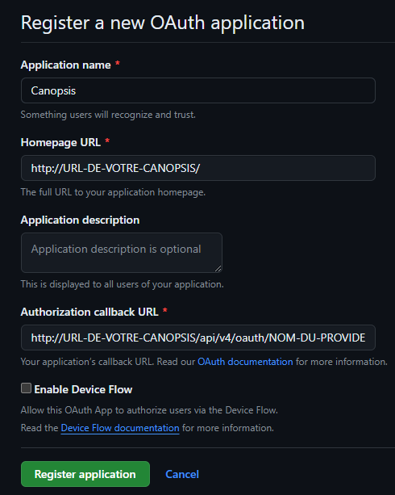

    Une fois celà fait, il faut remplir les différents champs:

    | Attribut       |                    Valeur                               |
    | -------------- | ------------------------------------------------------- |
    | `Application name` | Le nom de votre application |
    | `Homepage URL` | L'URL de la page d'accueil de Canopsis |
    | `Authorization callback URL` | http://URL-DE-VOTRE-CANOPSIS/api/v4/oauth/NOM-DU-PROVIDER/callback |

    Puis vous pouvez appuyer sur `Register application` 

    Une fois cela fait, vous allez pouvoir récupérer le `Client ID` et le `Client Secrets`

    Vous pourrez ensuite remplir le fichier de configuration avec vos informations :

    ```yaml
        oauth2:
          providers:
            github:
              auth_url: https://github.com/login/oauth/authorize
              token_url: https://github.com/login/oauth/access_token
              user_url: https://api.github.com/user
              client_id: CLIENT ID
              client_secret: CLIENT SECRET
              redirect_url: http://URL-DE-VOTRE-CANOPSIS/api/v4/oauth/github/callback
              pkce: false
              default_role: ROLE PAR DEFAUT SUR VOTRE CANOPSIS
              user_id: user.id
              attributes_map:
                email: user.email
                name: user.name
    ```

    Une fois que vous avez redémarré l'API de Canopsis, vous pourrez voir apparaître un nouveau bouton sur la page d'accueil: 

    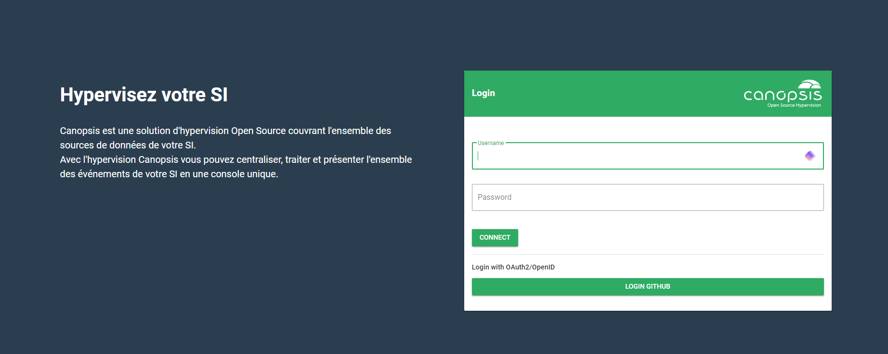

    En cliquant dessus vous serez redirigé vers GitHub qui vous proposera de vous connecter avec votre compte.

    Une fois que l'utilisateur s'est connecté, on peut le voir apparaître dans la liste des utilisateurs ainsi que sa méthode d'authentification

    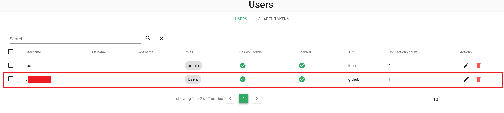

=== "Gitlab (OpenID)"

    Pour cet exemple, nous allons nous servir de GitLab comme provider.

    ### Configuration avec Gitlab
    
    RDV sur la page [`Applications`](https://votre-gitlab/oauth/applications) puis appuyer sur `Register a new application`

    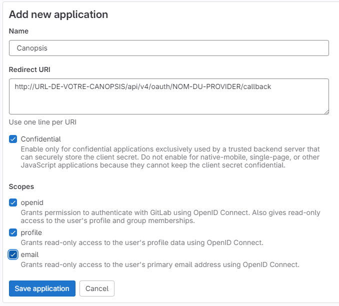

    Remplissez les différents champs :

    | Attribut       |                    Valeur                               |
    | -------------- | ------------------------------------------------------- |
    | `Name` | Le nom de votre application |
    | `Redirect URL` | http://URL-DE-VOTRE-CANOPSIS/api/v4/oauth/NOM-DU-PROVIDER/callback |
    | `Scopes` | Dans le cas d'une connexion OpenID il faut donner les scopes: `openid`, `profile` et `email` |

    Puis vous pouvez appuyer sur `Save application` 

    Une fois cela fait, vous allez pouvoir récupérer le `Client ID` et le `Client Secrets`

    Vous pourrez ensuite remplir le fichier de configuration avec vos informations :

    ```yaml
        oauth2:
          providers:
            gitlab:
              open_id: true
              issuer: https://votre-gitlab
              client_id: CLIENT ID
              client_secret: CLIENT SECRET
              redirect_url: http://URL-DE-VOTRE-CANOPSIS/api/v4/oauth/NOM-DU-PROVIDER/callback
              pkce: true
              default_role: ROLE PAR DEFAUT SUR VOTRE CANOPSIS
              scopes:
                - openid
                - email
                - profile
              attributes_map:
                email: token.email
                name: user.name
                role: user.groups
    ```

    Une fois que vous avez redémarré l'API de Canopsis, vous pourrez voir apparaître un nouveau bouton sur la page d'accueil: 

    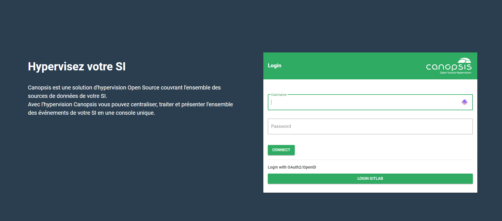

    En cliquant dessus vous serez redirigé vers votre GitLab qui vous proposera de vous connecter avec votre compte.

    Une fois que l'utilisateur s'est connecté, on peut le voir apparaître dans la liste des utilisateurs ainsi que sa méthode d'authentification

    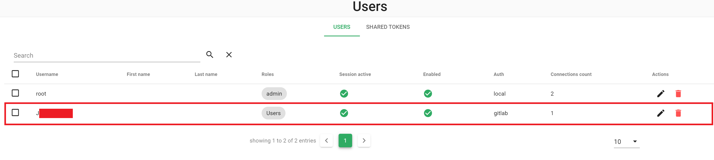

=== "Google (OpenID)"

    Pour cet exemple, nous allons nous servir de Google comme provider.

    ### Configuration avec Google
    
    RDV sur [`la console Google Cloud`](https://console.cloud.google.com/) puis créer un projet.

    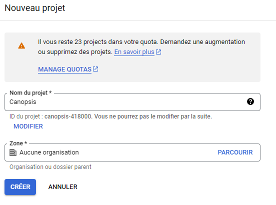

    Une fois le projet créé, il faut se rendre dans la catégorie [`la console Google Cloud`](https://console.cloud.google.com/apis/dashboard) puis dans `Identifiants`, en haut de la page appuyer sur le bouton `Créer des identifiants` puis sélectionner l'option `ID client OAuth`

    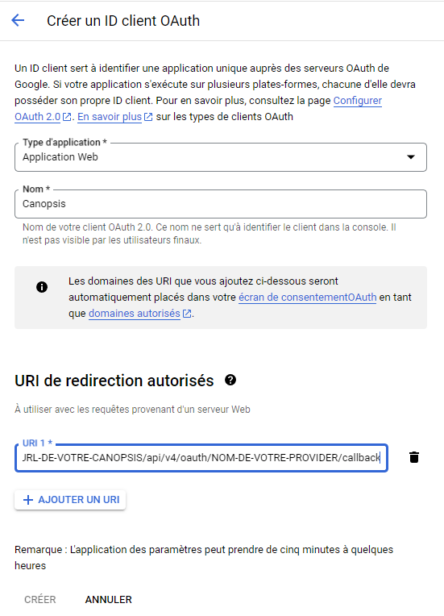

    Remplissez les différents champs :

    | Attribut       |                    Valeur                               |
    | -------------- | ------------------------------------------------------- |
    | `Type d'application` | Sélectionner `Application web` |
    | `Nom` | Le nom de votre application |
    | `URI de redirection autorisés` | http://URL-DE-VOTRE-CANOPSIS/api/v4/oauth/NOM-DU-PROVIDER/callback |

    Puis vous pouvez appuyer sur `Créer` 

    Une fois cela fait, vous allez pouvoir récupérer le `Client ID` et le `Client Secrets`

    Vous pourrez ensuite remplir le fichier de configuration avec vos informations :

    ```yaml
        oauth2:
          providers:
            google:
              open_id: true
              issuer: https://accounts.google.com
              client_id: CLIENT ID
              client_secret: CLIENT SECRET
              redirect_url: http://URL-DE-VOTRE-CANOPSIS/api/v4/oauth/NOM-DU-PROVIDER/callback
              pkce: true
              default_role: ROLE PAR DEFAUT SUR VOTRE CANOPSIS
              scopes:
                - openid
                - email
                - profile
              attributes_map:
                email: token.email
                name: token.name
    ```

    Une fois que vous avez redémarré l'API de Canopsis, vous pourrez voir apparaître un nouveau bouton sur la page d'accueil: 

    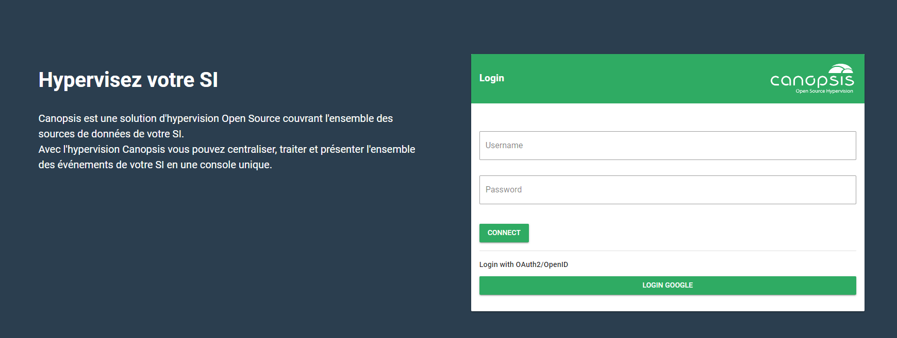

    En cliquant dessus vous serez redirigé vers votre GitLab qui vous proposera de vous connecter avec votre compte.

    Une fois que l'utilisateur s'est connecté, on peut le voir apparaître dans la liste des utilisateurs ainsi que sa méthode d'authentification

    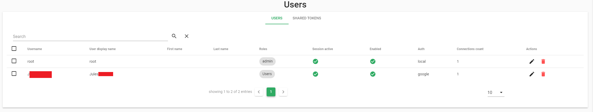


* Installation via Docker Compose

=== "Canopsis Pro"
	```sh
	CPS_EDITION=pro docker compose restart api
	```

=== "Canopsis Community"
	```sh
	CPS_EDITION=community docker compose restart api
	```

* Installation Paquets

```sh
systemctl restart canopsis-service@canopsis-api.service
```

### Test de connexion

La mire de connexion de Canopsis doit maintenant proposer un nouveau menu de login oauth, avec la liste de tous les providers configurés.

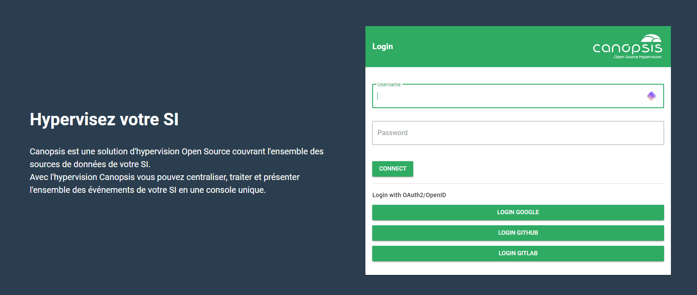

Pour tester l’authentification, il faudra vous authentifier avec un compte valide sur l'un des providers configurés précédement.


### Multi-role

Depuis la version `24.04.1`, les méthodes d'authentifications `SAML` et `OAUTH2/OPENID` supportent le multi-roles.  

Quand un utilisateur va se connecter pour la première fois sur Canopsis, et dans le cas où le champ "rôle" est demandé dans la configuration du provider d'authentification alors Canopsis lui attribura ses rôles.

Attention cependant, Canopsis ne créera pas les rôles manquant, il est nécessaire de les créer au préalable.  

Si dans votre configuration il n'y a pas de `default_role` alors les utilisateurs n'ayant aucun rôle existant dans Canopsis ne pourront pas se connecter. A l'inverse, si le `default_role` est configuré alors le rôle en question leur sera attribué si aucun des rôles fournis par le provider d'authentification ne correspond.


### Troubleshooting

Observez les logs du service `api` et vérifiez la non présence de pattern de type `ERR`

Redémarrer le service `api` de Canopsis

* Installation via Docker Compose
=== "Canopsis Pro"
	```sh
	CPS_EDITION=pro docker compose logs -f api
	```

=== "Canopsis Community"
	```sh
	CPS_EDITION=community docker compose logs -f api
	```

* Installation Paquets

```sh
$ journactl -fu canopsis-service@canopsis-api.service
```
