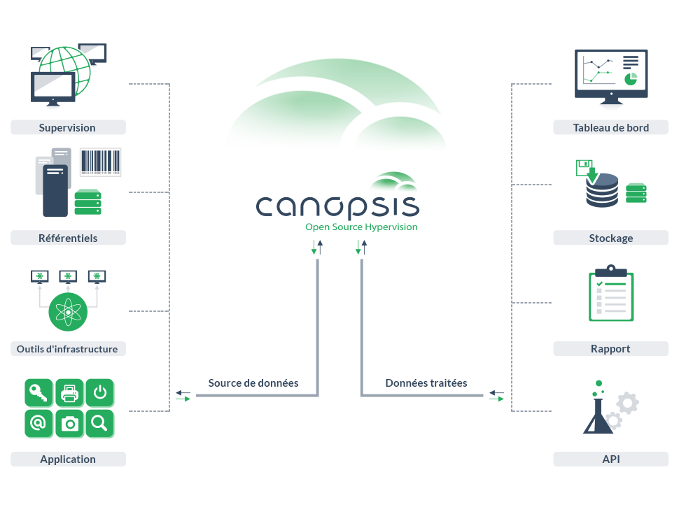
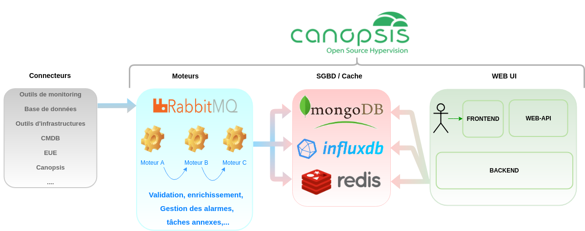

# Architecture interne de Canopsis

## Fonctionnement général de Canopsis

Voici le schéma du fonctionnement général de Canopsis.

Vous y trouvez les principales briques logicielles de l'hyperviseur ainsi que les moteurs faisant fonctionner Canopsis.  

!!! note
    Certains moteurs sont des moteurs propriétaires non disponibles dans la version communautaire de Canopsis.

## Schéma Macro

## Documentation des différentes parties

*  [Documentation interconnexions](../../interconnexions/index.md)
*  [Documentation moteurs](../moteurs/index.md)
*  [Documentation base de données](../../guide-de-depannage/bdd-requetes-de-base.md)
*  [Documentation Web UI](../../guide-utilisation/interface/index.md)

## Documentation des mécaniques spécifiques internes à Canopsis

* [Templates Golang](templates-golang.md)
* [Triggers](triggers.md)

Plus de détails sur [l'enchaînement des moteurs](../moteurs/schema-enchainement-moteurs.md).
