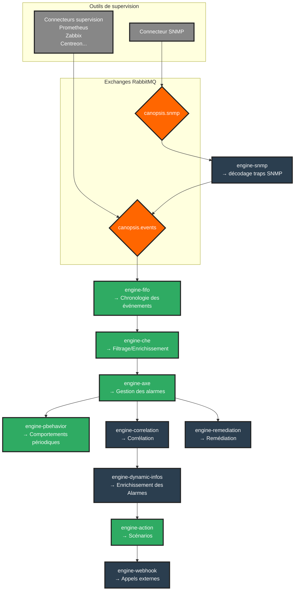

# Fonctionnement des moteurs et services Canopsis

Canopsis repose sur une chaîne de moteurs interconnectés qui assurent le traitement des événements depuis les sources de supervision jusqu’à l’exécution d’actions ou d’appels externes.

Chaque moteur a un rôle bien défini dans ce pipeline. Certains sont disponibles en version Community, d'autres en Pro uniquement, et certains sont hybrides.

D'autres `services` sont mis à disposition par Canopsis : API, Connecteur Junit, Import Context Graph, Recorder.

## Enchaînement des moteurs

!!! info "Informations techniques supplémentaires"

    Nous publions à titre d'informations des schémas d'interactions entre moteurs.  
    [EN - View Engine Interaction Schemas](../../../../guide-developpement/schemas/all-engines/)


