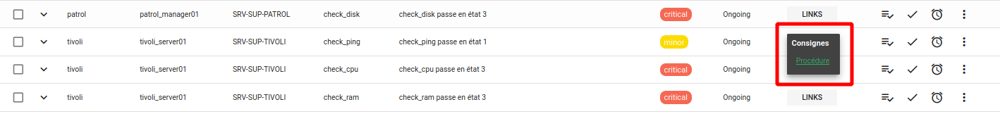
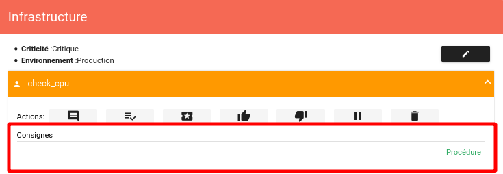
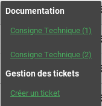
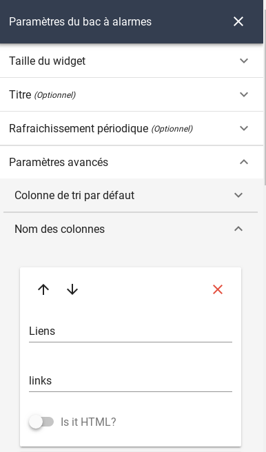
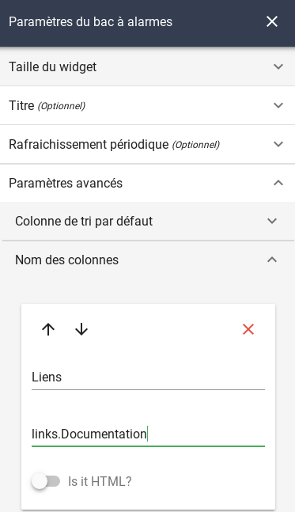
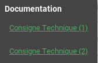
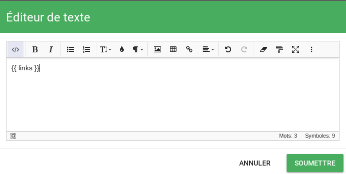
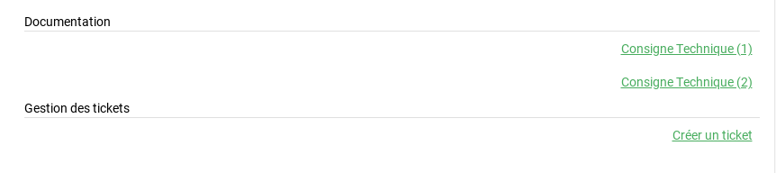
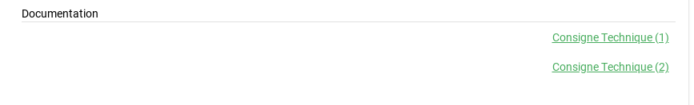

# Linkbuilder

## Objectif

L'objectif du `linkbuilder` est de mettre à disposition des liens hypertextes sur l'interface graphique Canopsis.  
Ces liens peuvent être visibles sur un bac à alarmes et une météo de services notamment.

Sur un bac à alarmes, les liens sont visibles de cette manière :



Sur une météo de services, les liens sont visibles de cette manière :



### Basic alarm link builder

La fonctionnalité `basic alarm linkbuilder` permet de générer un lien avec des paramètres qui peuvent provenir soit :

* de l'alarme
* de l'entité sur laquelle porte l'alarme

Par exemple, vous pouvez demander la génération d'un lien dont un paramètre est le nom du composant de l'alarme. La configuration de l'URL est dans ce cas :

**http://uneurl.local/?composant={alarm.v.component}**

La variable **{alarm.v.component}** sera remplacée par le composant impacté par l'alarme. Vous avez également la possibilité d'utiliser une variable en provenance de l'entité impactée. L'URL pourrait se présenter comme ceci :

**http://uneurl.local/?composant={alarm.v.component}&environnement={infos.env.value}**

!!! Note
    Notez que les variables attachées à l'alarme sont préfixées avec *alarm* tandis que les variables attachées à l'entité ne le sont pas.
    Par ailleurs, n'hésitez pas à utiliser le [mécanisme d'enrichissement](../../guide-utilisation/menu-exploitation/filtres-evenements.md) pour utiliser les variables dans le `linkbuilder`

Voici la configuration qui correspond aux captures d'écran visibles au début de cette documentation.

```json
{
    "basic_alarm_link_builder" : {
        "base_url" : "http://uneurl.local/?composant={alarm.v.component}&environnement={infos.env.value}",
        "category" : "Consignes",
        "label" : "Procédure"
    }
}
```

* L'attribut **base_url** contient l'URL avec les variables souhaitées.  
* L'attribut **category** va permettre de regrouper des URL entre elles.
* L'attribut **label** permet de donner un nom au lien généré.

!!! Attention
    La classe `basic_alarm_link_builder`, dans sa version livrée par défaut avec Canopsis, ne permet de créer qu'un seul lien.
    Pour pouvoir créer plusieurs liens et les regrouper par catégories il est nécessaire d'étendre la classe `BasicAlarmLinkBuilder` qui se trouve dans le fichier `basic_alarm_link_builder.py` de `canopsis-oldapi`.  
    L'image ci-dessous montre un exemple de liens multiples regroupés par catégories :  
    

### Linkbuilder personnalisé

Un [guide de développement](../../guide-developpement/linkbuilder/index.md)
traite de la conception de linkbuilders personnalisés.

### Mise en œuvre backend

La configuration préalablement établie doit être postée sur l'API de Canopsis.

**Envoi de la configuration :**

La configuration doit être insérée via l'API *associativetable*. Elle est stockée dans la collection **default_associativetable** de MongoDB.

```sh
curl -H "Content-Type: application/json" -X POST -u root:root -d'{
    "basic_alarm_link_builder" : {
        "base_url" : "http://uneurl.local/?composant={alarm.v.component}&environnement={infos.env.value}",
        "category" : "Consignes",
        "label" : "Procédure"
    }
}' 'http://localhost:8082/api/v2/associativetable/link_builders_settings'
```

Si une configuration existe déjà en base, remplacez `POST` par `PUT`.

!!! Attention
    1. Un redémarrage de `canopsis-service@canopsis-oldapi` est nécessaire après l'envoi de la configuration.
    2. Les liens sont générés à la volée et ne sont en aucun cas stockés.

## Visualisation frontend

Les liens sont mis à disposition de l'interface par l'intermédiaire du helper *links*. Il peut être appelé dans un bac à alarmes ou dans une météo de services.  

### Bac à alarmes

Dans les paramètres du widget, vous devez ajouter une colonne *links*.  



Le fait d'utiliser *links* affichera l'ensemble des liens disponibles, regroupés par catégorie (**uniquement si vous avez étendu la classe de base comme indiqué précédemment**).  


Vous pouvez également ne demander l'affichage que d'une catégorie en la nommant.  



**Résultat :**



### Météo des services

Dans la météo des services, vous devez modifier vos templates et utiliser le helper *links*. Voici un exemple pour le template d'entité.  



Le fait d'utiliser *links* affichera l'ensemble des liens disponibles, regroupés par catégorie (**uniquement si vous avez étendu la classe de base comme indiqué précédemment**).  



Vous pouvez également ne demander l'affichage que d'une catégorie en la nommant.  


**Résultat :**



## Droits associés aux liens

La visualisation des liens est soumise à [certains droits](#droits-associes-aux-liens)

Les droits `listalarm_links` et `serviceweather_links` donnent la permission de visualiser l'ensemble des liens présents sur l'entité respectivement sur le widget *Bac à alarmes* et *Météo des services*.  

Il existe en parallèle de cela la possibilité de limiter l'accès aux liens par l'intermédiaire de droits liés aux catégories de liens.  
Le nom des droits correspondants est fonction des catégories de liens; Ces droits ne peuvent donc pas être pré insérés par le système d'installation. Vous devez les insérer par l'intermédiaire du formulaire.  

Voici un récapitulatif des droits à appliquer.  


| Widget             | Droits associés                                              | Portée                                                       |
| ------------------ | ------------------------------------------------------------ | ------------------------------------------------------------ |
| Bac à alarmes      | listalarm_links                                              | Visualisation de l'ensemble des liens sur le bac à alarmes, quelle que soit la catégorie |
|                    | listalarm_links_Nom_de_la_Catégorie  (Ex : **listalarm_links_Documentation**) | Visualisation des liens de la catégorie donnée en suffixe (sur le bac à alarmes) |
| Météo des services | serviceweather_entityLinks                                   | Visualisation de l'ensemble des liens sur la météo des services, quelle que soit la catégorie |
|                    | serviceweather_entityLinks_Nom_de_la_Catégorie (Ex : **serviceweather_entityLinks_Gestion des tickets**) | Visualisation des liens de la catégorie donnée en suffixe (sur la météo des services) |
