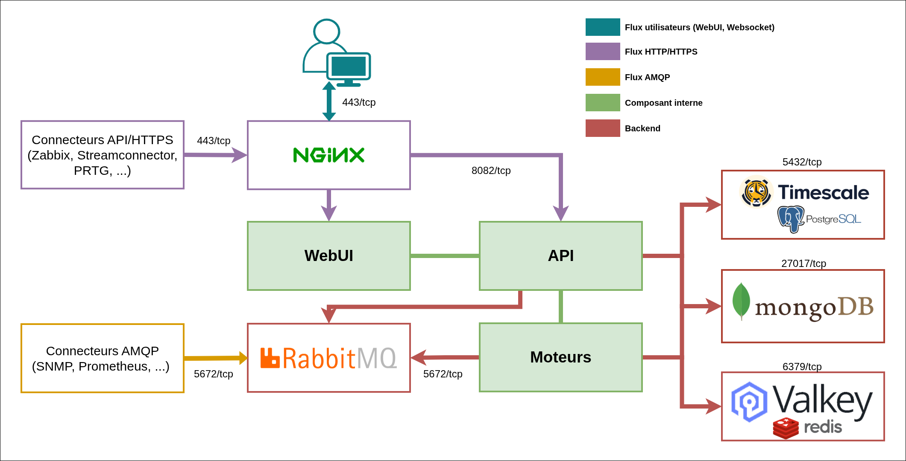

# Matrice des flux réseau

## Liste des ports Canopsis

Composant     | Description                                 | Port                  |
--------------|---------------------------------------------|-----------------------|
MongoDB       | Base de données                             | TCP/27017             |
Nginx         | Accès à l'interface web et API              | TCP/443 (installation via Docker) ou TCP/8443 (via paquets) |
RabbitMQ      | Passage de messages                         | TCP/5672              |
RabbitMQ UI   | Interface web de RabbitMQ                   | TCP/15672             |
API Canopsis  | API REST de Canopsis                        | TCP/8082              |
Valkey         | Serveur de cache                            | TCP/6739              |
Valkey Sentinel| Supervision et basculement de Valkey (optionnel) | TCP/26739         |
SNMP          | Passage des traps SNMP                      | UDP/162               |
PostgreSQL    | Base de données, métriques (TimescaleDB)    | TCP/5432              |

## Matrice des flux

Ci-dessous la matrice des flux réseaux commune, pour les différents composants
d'une plate-forme Canopsis.
Cette matrice ne comprend pas les différentes [interconnexions avec les autres
applications](../../interconnexions/index.md) avec lesquelles Canopsis peut
communiquer. Il faudra donc compléter cette liste avec les différents
composants additionnels, par exemple l'accès aux outils de remédiation ou de
ticketing (pour plus de précisions sur cela, voir [Interactions avec des services
extérieurs](#interactions-avec-des-services-exterieurs)).

Certains flux de cette liste sont nécessaires pour l'installation ou la mise à
jour de Canopsis. D'autres concernent l'administration de Canopsis ainsi que
les accès utilisateurs et sources d'évènements.

### Schéma des flux réseaux de Canopsis

### Installation / Accès aux livrables
| Source | Destination | Port | Description |
|-|-|-|-|
| Canopsis | git.canopsis.net, docker.canopsis.net, hub.docker.com | TCP 443 | Récupération des packages d'installation et de mise à jour |

### Fonctionnement interne
| Source | Destination | Port | Description |
|-|-|-|-|
| Canopsis | MongoDB | TCP 27017 | Permettre l'accès à la base de donnée MongoDB depuis Canopsis |
| Canopsis | TimescaleDB | TCP 5432 | Permettre l'accès aux bases de données TimescaleDB depuis Canopsis |
| Canopsis | Valkey | TCP 6379 | Permettre l'accès à Valkey depuis Canopsis |
| Canopsis | RabbitMQ | TCP 5672 | Permettre l'accès aux queues RabbitMQ pour les engines de Canopsis |

### Entrant
| Source | Destination | Port | Description |
|-|-|-|-|
| SNMP | Connecteur SNMP | UDP 162 | Permet la réception de trap SNMP par le connecteur SNMP de Canopsis |
| Connecteurs AMQP | Canopsis | TCP 5672 | Permet l'envoi des événements dans RabbitMQ |
| Utilisateurs | Canopsis | TCP 443 | Permet l'accès à l'interface web de Canopsis |
| Drivers (import-context-graph) | Canopsis | TCP 8082 / 443 | Permet l'import de données depuis une CMDB via l'import-context-graph |
| Connecteurs API | Canopsis | TCP 8082 / 443 | Permet l'envoi des événements via l'API de Canopsis |

### Sortant
| Source | Destination | Port | Description |
|-|-|-|-|
| Canopsis | Serveur LDAP | TCP 389 / 636 | Permet la connexion à un annuaire ldap |
| Canopsis | Provider CAS/SAML/OAUTH2/OPENID | TCP 80 / 443 | Permet la connexion à un provider d'authentification CAS/SAML/OAUTH2/OPENID |
| Canopsis | Remédiation | TCP 80 / 443 | Permet l'envoi d'informations à des outils de remédiation (AWX, Jenkins, Rundeck, etc..) |
| Canopsis | Webhook | TCP 80 / 443 | Permet la publication de webhook vers des outils externes. (Teams, Mattermost, etc..) |
| Canopsis | Declarative Tickets | TCP 80 / 443 | Permet la déclaration de tickets à des outils externes. (iTop, ServiceNow, Easyvista, etc..) |

## Interactions avec des services extérieurs

Dans de nombreux cas d'installation il est utile de savoir précisément quels
services applicatifs de Canopsis pourront joindre des services extérieurs à
Canopsis, voire extérieurs à votre réseau interne.

La réalité dépendra évidemment des fonctionnalités utilisées et des règles ou
configurations que vous mettez en place. Nous pouvons toutefois lister de
manière générale qu'au plus, les appels vers des services extérieurs auront
comme origine les processus suivants :

- Le moteur `engine-che` :
  pour de la récupération de données externes via API depuis des [règles
  d'enrichissement][gu-eventfilter] ;

- Le moteur `engine-webhook` :
  pour tous les appels HTTP effectués du fait de vos [Scénarios][gu-scenario]
  et [Règles de déclaration de tickets][gu-ticketrules], ainsi que pour les
  appels d'obtention et rafraîchissement de [jetons d'authentification
  externes][gu-authtokens] ;

- Le moteur `remediation` :
  pour tout appel à une API d'un outil d'automatisation utilisé dans le cadre
  de la [Remédiation][ga-remediation] ;

- Le service `api` :
  il est susceptible de joindre un service extérieur si vous configurez une des
  méthodes d'[authentification externe][ga-externalauth] (LDAP, CAS, SAML,
  OAuth 2.0 ou OpenID).

Cette liste précise vous permet ainsi d'anticiper :

- L'ouverture des différents flux réseau ;

- L'utilisation d'un proxy HTTP(S) à renseigner dans les [variables
  d'environnement][ga-envvars-proxy] appropriées (cas d'un outil de ticketing
  en SaaS par exemple : nécessite Internet, souvent via un proxy) ;

- L'installation de vos autorités de certification racine internes,
  nécessaires au bon établissement des communications vers des
  protocoles sécurisés (HTTPS, LDAPS) :

    Selon le mode d'installation retenu, il va s'agir…

    - sur des systèmes RHEL, d'ajouter le certificat au magasin de confiance
      système : ref. [Adding new certificates to the system-wide
      truststore][rhel-ca-trust] (documentation Red Hat) ;
    - sur des déploiements conteneurisés, de préparer et présenter un fichier
      complet de toutes les CA approuvées (celles par défaut de l'image Docker
      Alpine Linux + les vôtres) dans les conteneurs concernés – le fichier qui
      en résulte devra être monté en tant que volume au chemin
      `/etc/ssl/certs/ca-certificates.crt`.

- La mise en place des bonnes règles de trafic sortant dans certains systèmes
  conteneurisés (Egress).

[gu-eventfilter]: ../../../guide-utilisation/menu-exploitation/filtres-evenements/
[gu-scenario]: ../../../guide-utilisation/menu-exploitation/scenarios/
[gu-ticketrules]: ../../../guide-utilisation/menu-exploitation/regles-declaration-tickets/
[gu-authtokens]: ../../../guide-utilisation/menu-administration/jetons-authentification-externe/
[ga-remediation]: ../remediation/
[ga-externalauth]: ../administration-avancee/methodes-authentification-avancees/
[ga-envvars-proxy]: ../administration-avancee/variables-environnement/#utilisation-dun-proxy-http-ou-https
[rhel-ca-trust]: https://docs.redhat.com/en/documentation/red_hat_enterprise_linux/9/html/securing_networks/using-shared-system-certificates_securing-networks#adding-new-certificates_using-shared-system-certificates
