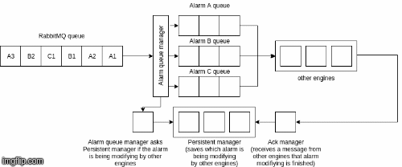
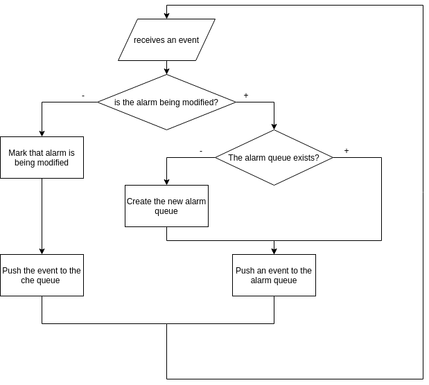
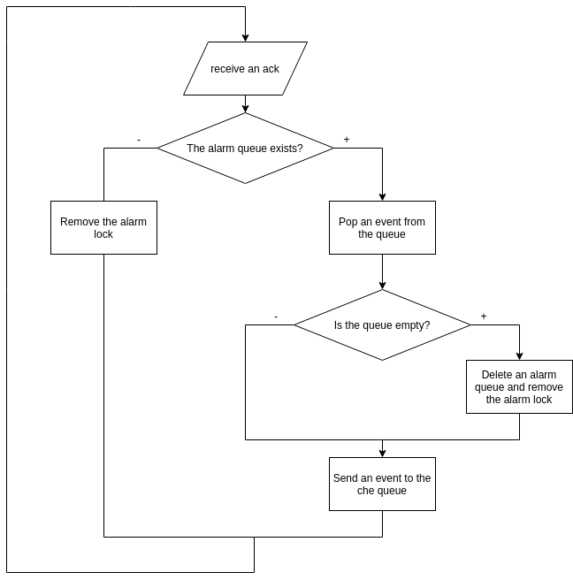

# Moteur `engine-fifo` (Community)

La possibilité de pouvoir démarrer plusieurs instances des moteurs [`engine-che`](moteur-che.md), [`engine-axe`](moteur-axe.md) et [`engine-correlation`](moteur-correlation.md) amène une problématique d'ordre de traitement des [événements](../../../guide-utilisation/vocabulaire/#evenement). Le moteur `engine-fifo` permet de répondre à cela en conservant l'ordre des événements entrants.

## Utilisation

### Options du moteur

La commande `engine-fifo -help` liste toutes les options acceptées par le moteur.

## Fonctionnement

À l'arrivée d'un événement, le moteur `engine-fifo` en extrait l'entité. Il y a ensuite deux cas de figure possibles :

1. **Il n'existe pas de traitement en cours (changement d'état, exécution d'une action, exécution d'un webhook…) sur cette entité.**
    * Dans ce cas, le moteur `engine-fifo` transmet l'événement directement au moteur `engine-che`.  
2. **Il existe déjà un traitement en cours sur cette entité.**  
    * Dans ce cas, le moteur crée une file d'attente temporaire dans Redis et stocke l'événement dans cette file. À la fin de la chaîne de traitement, les autres moteurs déposent un acquittement dans un `ack manager` géré par le moteur `engine-fifo`. Si cet acquittement concerne l'entité de l'événement stocké dans la file temporaire, celui-ci est libéré et transmis au moteur `engine-che`.

Dans les deux cas, le moteur créé un verrou concernant l'entité en cours de traitement et le stocke dans Redis. C'est ce verrou qui lui permettra de savoir si un événement existe déjà pour cette entité. Le verrou est supprimé lors de la réception d'un acquittement ou après un certain délai. Ce délai est de 10 secondes par défaut et peut être configuré au moyen de l'option `-lockTtl` du moteur.

## Haute-disponibilité

Étant donné que ce moteur est le premier dans la chaîne de traitement des événements, il est nécessaire de pouvoir s'assurer qu'il est toujours disponible. Il est donc possible de démarrer 2 instances en parallèle. La première instance stocke un jeton dans Redis et effectue les tâches décrites ci-dessus. Le moteur `engine-fifo` vérifie périodiquement la présence du jeton dans Redis. Si celui-ci est absent, la deuxième instance prend le relai.

!!! Attention
    Pour garantir un fonctionnement optimal de ce moteur, il est nécessaire d'appliquer [la configuration avancée de Redis](../administration-avancee/configuration-composants/serveur-cache-redis.md).

Si vous souhaitez obtenir des informations plus techniques sur le fonctionnement de ce moteur vous pouvez consulter la section ci-dessous.

## Fonctionnement détaillé

Cette animation illustre le fonctionnement global du moteur `engine-fifo` avec les files temporaires, le `persistent manager` et l'`ack manager` dont le fonctionnement est décrit dans la première partie de cette documentation.

Le diagramme ci-dessous représente le comportement du moteur lors de la réception d'un événement.

Cet organigramme décrit le fonctionnement de l'`ack manager` du moteur.

