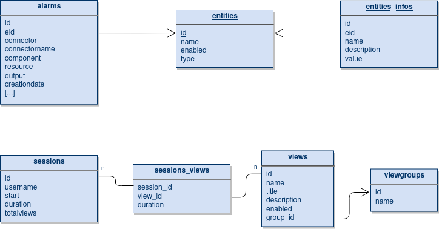
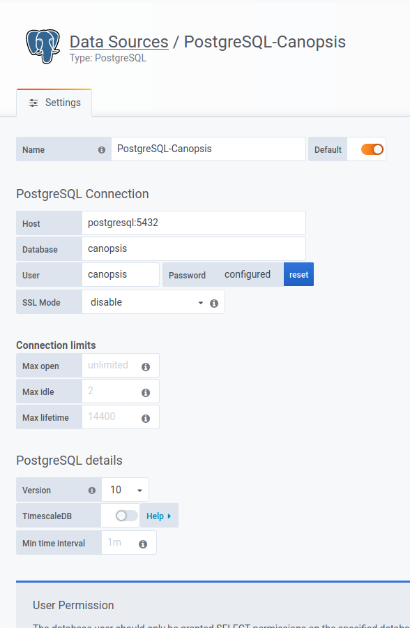
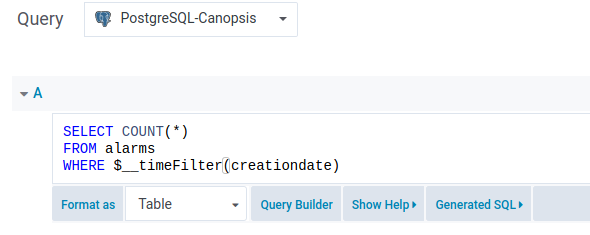
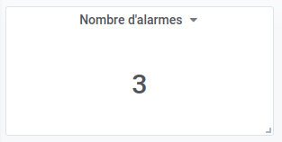

# Moteur `kpi` (Python, Pro)

!!! info
    Disponible uniquement en édition Pro.

!!! attention
    Ne sera plus maintenu au-delà de Canopsis 4.5.

Le moteur `kpi` copie certaines données depuis la base MongoDB de Canopsis vers
une base de données relationnelle PostgreSQL.

La base de données relationnelle ainsi alimentée constitue le « puits de
données » qui peut ensuite être exploité par des outils de visualisation comme
[Grafana][grafana] ou [Apache Superset][apache-superset].

Les données à disposition permettent alors de réaliser, au moyen de requêtes
SQL, des statistiques simples ou avancées à propos des sujets suivants :

- alarmes
- entités
- sessions utilisateur

[grafana]: https://grafana.com/
[apache-superset]: https://superset.incubator.apache.org/

## Fonctionnement

Au démarrage du moteur, celui-ci établit ses connexions à MongoDB et à la base
de données PostgreSQL puis il s'assure que les tables sont créées dans
PostgreSQL.

À chaque « beat » (intervalle de temps régulier), la synchronisation des données
de MongoDB vers PostgreSQL a lieu. Un verrou est placé durant la synchronisation
pour éviter le risque d'exécutions parallèles.

La routine de synchronisation des données comprend :

1. la synchronisation des entités et de leurs infos
2. la synchronisation des alarmes

    * lors de la première exécution, la synchronisation inclut la totalité des
    alarmes
    * lors des exécutions suivantes, la synchronisation concerne les alarmes
    non résolues et les alarmes résolues depuis la dernière alarme résolue
    connue dans la table `alarms` de PostgreSQL

3. la synchronisation des groupes de vues, vues et sessions

## Modèle de données

La base de données maintenue par le moteur `kpi` comporte ces tables :

| Nom            | Description                                                                                          |
| -------------- | ---------------------------------------------------------------------------------------------------- |
| alarms         | Table des alarmes, informations prises et calculées depuis les collections MongoDB des alarmes *(a)* |
| entities       | Table des entités, importées de la collection MongoDB default_entities                               |
| entities_infos | Données de la structure "infos" pour chaque entité                                                   |
| sessions       | Table des statistiques de session utilisateur, de la collection MongoDB default_session              |
| sessions_views | Table de liaison n-n sessions/views, avec le temps passé dans la vue                                 |
| viewgroups     | Table des groupes de vues de l'UI Canopsis, reprend la collection MongoDB viewgroups                 |
| views          | Table des vues de l'UI Canopsis, reprend la collection MongoDB views                                 |

*(a)* : collections periodical_alarm et resolved_alarms.

Le diagramme ci-dessous représente les relations entre les tables :



Les sous-sections suivantes décrivent chaque table afin de fournir une référence
complète des données exploitables.

Remarques générales sur les indications de ces tableaux :

- « PK » désigne une contrainte `PRIMARY KEY` (clef primaire) ;
- « FK » désigne une contrainte `FOREIGN KEY` (clef étrangère) et indique la
table et la colonne en référence ;
- Le type de donnée abrégé « timestamp » est `timestamp without time zone`
(ref. : [documentation PostgreSQL][pgsql-datetime]). Ce type stocke la date et
l'heure en utilisant le seul fuseau horaire local.

[pgsql-datetime]: https://www.postgresql.org/docs/10/datatype-datetime.html

#### Table alarms

|       Colonne       |     Type     |    Contraintes    |                                   Description                                   |
|---------------------|--------------|-------------------|---------------------------------------------------------------------------------|
| id                  | varchar(200) | PK                | UUID de l'alarme, comme dans MongoDB                                            |
| eid                 | varchar(200) | FK -> entities.id | Id de l'entité concernée (clef "d" de l'alarme)                                 |
| connector           | varchar(200) | not null          | Type de connecteur                                                              |
| connectorname       | varchar(200) | not null          | Identifiant/instance de connecteur                                              |
| component           | varchar(200) | not null          | Nom du composant concerné                                                       |
| resource            | varchar(200) |                   | Nom de la ressource concernée (le cas échéant)                                  |
| output              | varchar(512) |                   | Message de sortie actuel                                                        |
| creationdate        | timestamp    | not null          | Horodatage de la création de l'alarme                                           |
| activationdate      | timestamp    | not null          | Horodatage spécial « date d'activation » (dans la section "extra" de l'alarme)  |
| resolved            | timestamp    |                   | Horodatage de la résolution de l'alarme                                         |
| initialstate        | smallint     | not null          | Criticité de l'alarme à son apparition                                          |
| ackauthor           | varchar(200) |                   | Nom de l'utilisateur ayant acquitté l'alarme (MongoDB: v.ack.a)                 |
| ackdate             | timestamp    |                   | Horodatage de l'acquittement de l'alarme (MongoDB: v.ack.t)                     |
| acktime             | integer      |                   | Temps écoulé avant acquittement (ackdate - creationdate) en secondes (s)        |
| resolvedtime        | integer      |                   | Temps écoulé entre l'apparition et la résolution (resolved - creationdate) en s |
| ackresolvedtime     | integer      |                   | Temps écoulé entre l'acquittement et la résolution (resolved - ackdate) en s    |
| ack                 | boolean      |                   | L'alarme a-t-elle été acquittée ?                                               |
| ticket              | boolean      |                   | L'alarme a-t-elle un ticket associé ?                                           |
| snooze              | boolean      |                   | L'alarme a-t-elle subi une mise en veille ?                                     |
| changestate         | boolean      |                   | L'alarme a-t-elle subi un changement (administratif) de criticité ?             |
| cancelled           | boolean      |                   | L'alarme a-t-elle été annulée ?                                                 |
| lastalarmtime       | timestamp    |                   | (inutilisé)                                                                     |
| tis_1               | integer      | not null          | Temps passé en criticité 1 (minor) en secondes                                  |
| tis_2               | integer      | not null          | Temps passé en criticité 2 (major) en secondes                                  |
| tis_3               | integer      | not null          | Temps passé en criticité 3 (critical) en secondes                               |
| tis_with_downtime_1 | integer      | not null          | Idem tis_1, en retranchant les *downtimes* (comportements périodiques)          |
| tis_with_downtime_2 | integer      | not null          | Idem tis_2, en retranchant les *downtimes* (comportements périodiques)          |
| tis_with_downtime_3 | integer      | not null          | Idem tis_3, en retranchant les *downtimes* (comportements périodiques)          |

#### Table entities

| Colonne |    Type      | Contraintes | Description                                             |
|---------|--------------|-------------|---------------------------------------------------------|
| id      | varchar(200) | PK          | Id de l'entité                                          |
| name    | varchar(200) | not null    | Nom de l'entité                                         |
| enabled | boolean      | not null    | L'entité est-elle activée ?                             |
| type    | varchar(100) | not null    | Type d'entité (connector, component, resource, service) |

!!! Note
    Une entité arbitraire « [NOT FOUND] » est créée dans cette table par le
    moteur `kpi` afin de rattacher les éventuelles alarmes présentes dans MongoDB
    faisant référence à des entités qui n'existent plus.

    Cette fausse entité est ainsi renseignée :

    - id: "[NOT FOUND]"
    - name: "[Entity not found]"
    - enabled: false
    - type: "n/a"

#### Table entities_infos

|   Colonne   |     Type      |    Contraintes    |                      Description                           |
|-------------|---------------|-------------------|------------------------------------------------------------|
| id          | integer       | PK                | Id auto-incrémentant interne (non présent dans la source)  |
| eid         | varchar(200)  | FK -> entities.id | Id de l'entité portant l'info                              |
| name        | varchar(100)  | not null          | Nom de la clef info                                        |
| description | varchar(200)  | not null          | Description de l'info                                      |
| value       | varchar(3000) |                   | Valeur de l'info                                           |

!!! Note
    Si une info d'entité est dépourvue de champ `description`, le moteur `kpi`
    écrira pour cette info « [No description] » dans la colonne description.

#### Table sessions

|  Colonne   |     Type     |    Contraintes    |                 Description                                |
|------------|--------------|-------------------|------------------------------------------------------------|
| id         | uuid         | PK                | UUID de la session, comme dans MongoDB                     |
| username   | varchar(200) | not null          | Utilisateur de la session                                  |
| start      | timestamp    | not null          | Horodatage d'ouverture de la session                       |
| duration   | integer      | not null          | Temps passé dans la session                                |
| totalviews | integer      | not null          | Nombre de vues distinctes utilisées au cours de la session |

#### Table sessions_views

(table de liaison n à n, avec le paramètre de liaison : duration)

|  Colonne   |  Type   |   Contraintes    |             Description                                           |
|------------|---------|------------------|-------------------------------------------------------------------|
| session_id | uuid    | FK -> session.id |                                                                   |
| view_id    | uuid    | FK -> views.id   |                                                                   |
| duration   | integer | not null         | Temps passé dans cette vue au cours de cette session, en secondes |

Clef primaire composite sur le couple (session_id, view_id).

#### Table viewgroups

| Colonne |     Type     | Contraintes |              Description                   |
|---------|--------------|-------------|--------------------------------------------|
| id      | uuid         | PK          | UUID du groupe de vues, comme dans MongoDB |
| name    | varchar(200) | not null    | Nom d'affichage du groupe de vues          |

#### Table views

|   Colonne   |     Type     |     Contraintes     |           Description              |
|-------------|--------------|---------------------|------------------------------------|
| id          | uuid         | PK                  | UUID de la vue, comme dans MongoDB |
| name        | varchar(200) | not null            | Nom technique (id) de la vue       |
| title       | varchar(200) | not null            | Nom d'affichage de la vue          |
| description | varchar(500) | not null            | Texte de description de la vue     |
| enabled     | boolean      | not null            | La vue est-elle activée ?          |
| group_id    | uuid         | FK -> viewgroups.id | Relation au groupe de vues         |

## Configuration

Le fichier de configuration `etc/kpi/engine.conf` contient la chaîne de
connexion à PostgreSQL, exemple :

```ini
[ENGINE]
postgresql_uri=host=postgresql port=5432 dbname=canopsis user=canopsis password=canopsis
```

Le fichier `etc/amqp2engines.conf` doit contenir la section `[engine:kpi]`.
La fréquence de synchronisation des données peut y être modifiée avec le
paramètre `beat_interval` (valeur par défaut conseillée : 1 heure) :

```ini
[engine:kpi]
beat_interval=3600
```

## Logs

Ci-dessous un extrait de logs du moteur `kpi` montrant le lancement et une
première exécution type :

```
[...] INFO kpi-1 [engine-launcher 181] Configuration loaded
[...] INFO kpi [core 138] Engine initialized
[...] INFO kpi [kpi 92] beat_interval: 3600
[...] INFO kpi [kpi 147] Create tables..
[...] INFO kpi [core 165] Start Engine with pid 28497
[...] INFO kpi-amqp [rabbitmq 207] Connect to AMQP Broker (192.168.56.66:5672)
[...] INFO kpi-amqp [rabbitmq 214] Connected to AMQP Broker.
[...] INFO kpi-amqp [rabbitmq 226] Channel openned. Ready to send messages
[...] INFO kpi [core 163]  + Ready!
[...] INFO kpi [kpi 127] Beat!
[...] INFO kpi [kpi 325] Truncate entities_infos
[...] INFO kpi [kpi 331] Sync entities...
[...] INFO kpi [kpi 338] Ensure "not found" entity exists
[...] INFO kpi [kpi 350] Sync entities infos...
[...] INFO kpi [kpi 364] Sync entities done! (8 entities)
[...] INFO kpi [kpi 234] Syncing alarms
[...] INFO kpi [kpi 342] Resolved alarms will be fetched since the beginning
[...] INFO kpi [kpi 322] Done syncing alarms! (3 alarms)
[...] INFO kpi [kpi 138] Sync user session stats related data
[...] INFO kpi [kpi 166] Syncing viewgroups
[...] INFO kpi [kpi 179] Done syncing viewgroups (2 sent).
[...] INFO kpi [kpi 182] Syncing views
[...] INFO kpi [kpi 199] Done syncing views (3 sent).
[...] INFO kpi [kpi 202] Syncing sessions
[...] INFO kpi [kpi 231] Done syncing sessions (2 sent).
[...] INFO kpi [kpi 143] Done with the user session stats transaction
```

Et à chaque synchronisation suivante :

```
[...] INFO kpi [kpi 127] Beat!
[...] INFO kpi [kpi 325] Truncate entities_infos
[...] INFO kpi [kpi 331] Sync entities...
[...] INFO kpi [kpi 338] Ensure "not found" entity exists
[...] INFO kpi [kpi 350] Sync entities infos...
[...] INFO kpi [kpi 364] Sync entities done! (8 entities)
[...] INFO kpi [kpi 234] Syncing alarms
[...] INFO kpi [kpi 342] Resolved alarms will be fetched since 1661983200.0
[...] INFO kpi [kpi 322] Done syncing alarms! (0 alarms)
[...] INFO kpi [kpi 138] Sync user session stats related data
[...] INFO kpi [kpi 166] Syncing viewgroups
[...] INFO kpi [kpi 179] Done syncing viewgroups (2 sent).
[...] INFO kpi [kpi 182] Syncing views
[...] INFO kpi [kpi 199] Done syncing views (3 sent).
[...] INFO kpi [kpi 202] Syncing sessions
[...] INFO kpi [kpi 231] Done syncing sessions (2 sent).
[...] INFO kpi [kpi 143] Done with the user session stats transaction
```

### Warnings potentiels

Le moteur `kpi` vérifie plusieurs points de cohérence de données sur les
entités et infos d'entités avant d'insérer les lignes dans les tables SQL.

Les messages de log de niveau WARNING suivants indiquent des problèmes de
cohérence dans les données (à la source, dans la base de données MongoDB) :

- Entité mal formée

    ```
    Skipping entity missing mandatory keys (_id, name, enabled, type): "{}"
    ```

    Le message signifie que le document représentant l'entité dans la
    collection MongoDB `default_entities` ne possède pas les quatre attributs
    obligatoires `_id`, `name`, `enabled`, `type`.

    L'entité en question sera ignorée par `kpi`.

- Info d'entité mal formée

    ```
    Skipping info without value: info id "{}" in entity "{}"
    ```

    L'info indiquée contenue dans l'entité n'a pas de champ `value`.

    Cette info est donc inutilisable et sera ignorée par `kpi`.

- Valeur d'info trop longue

    ```
    Skipping info with value too long: info id "{}" in entity "{}"
    ```

    L'info indiquée contenue dans l'entité, une fois transformée en chaîne de
    caractères, dépasse la taille de la colonne `value` dans le modèle de
    données défini sur PostgreSQL (3000).

- Id ou nom d'entité trop long

    ```
    Skipping entity with _id too long: "{}"
    ```

    ou

    ```
    Skipping entity with name too long: "{}" in entity id "{}"
    ```

    L'id ou le nom de l'entité dépasse la taille de la colonne associée dans le
    modèle de données défini sur PostgreSQL (200 caractères).

    L'entité entière sera ignorée par `kpi`.

## Exploitation des données

Une fois le moteur en place, vous pouvez vérifier le bon accès aux données en
configurant par exemple une instance Grafana pour utiliser la base de données
PostgreSQL et en réalisant une requête.

Configuration type de la source de données PostgreSQL de Canopsis :



Une première utilisation simple peut consister à afficher le nombre d'alarmes
créées sur la période sélectionnée dans un tableau de bord Grafana.

Pour ce faire, créez un tableau de bord, placez-y un *panel* « Singlestat » et
faites-lui afficher le résultat de la requête SQL suivante :

```sql
SELECT COUNT(*)
FROM alarms
WHERE $__timeFilter(creationdate)
```



Votre *panel* « Nombre d'alarmes » présente la statistique désirée :



!!! note
    Le moteur `kpi` copie volontairement les données de Canopsis de façon
    plutôt « brute », sans résumé ou agrégation préalable. Chaque structure
    utilisant Canopsis a ainsi la liberté d'établir ses requêtes pour visualiser
    ses propres statistiques, plus ou moins complexes, à partir des données
    brutes.

    Il est néanmoins prévu, dans de futures versions de Canopsis, de livrer
    quelques exemples de tableaux de bord Grafana avec des statistiques
    génériques.

## Purge des données

La routine de purge des données de statistiques (vidage des tables PostgreSQL
alimentées par le moteur `kpi`) peut être déclenchée en envoyant l'évènement
`initkpi` à Canopsis :

```json
{
    "event_type": "initkpi",
    "source_type": "component",
    "connector": "manual",
    "connector_name": "manual",
    "component": "kpi"
}
```

En conséquence, le moteur exécute sa procédure de purge qui consiste en une
succession de requêtes SQL `TRUNCATE` sur les tables de statistiques.

Le log du moteur `kpi` mentionne cette opération :

```
[...] INFO kpi [kpi 119] Work!
[...] INFO kpi [kpi 123] received initkpi event
[...] INFO kpi [kpi 157] Truncate tables..
```
