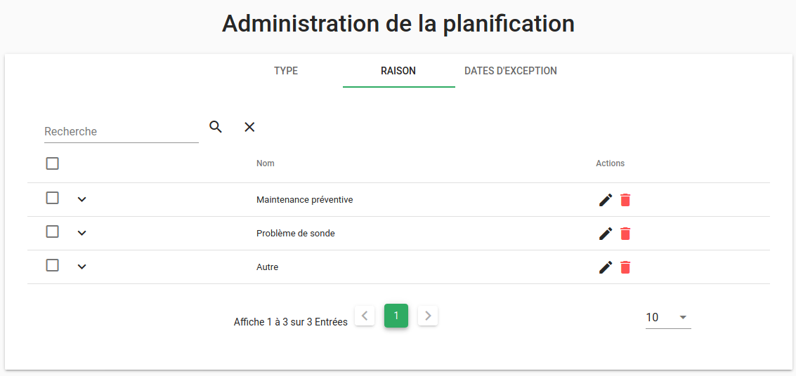

# Moteur `engine-pbehavior` (Community)

Les comportements périodiques (*pbehaviors*, pour *periodical behaviors*) sont des évènements de calendrier, récurrents ou non, qui permettent de modifier la surveillance d'une alarme pendant une période donnée (pour des maintenances ou des astreintes, par exemple).

Ils permettent notamment de :

- Déclarer des périodes de maintenance sur des applications.
- Conditionner l'exécution de règles (ex : cette remédiation doit s'appliquer uniquement la nuit).
- Conditionner l'affichage d'alarmes (ex : ne pas montrer les alarmes dont l'entité est en maintenance).
- Déclarer des périodes de service sur des applications.

## Définitions

Un comportement périodique est défini par plusieurs éléments.

### Planning

Il permet de définir une plage horaire ou un intervalle de dates pendant lequel le comportement périodique sera actif.

Une règle de récurrence peut être ajoutée si l'on veut que le comportement s'active de façon périodique. L'intervalle défini précédemment se répétera alors de façon régulière.

Des dates d'exception viennent compléter le planning si l'on a besoin de préciser des intervalles de temps pendant lesquels le comportement ne devra pas s'activer.

### Type

Il indique la nature du comportement périodique, par exemple :

- La surveillance de l'entité a été mise en `pause`.
- Un `changement` est en cours sur l'application.
- Les entités sont en cours de `maintenance`.

### Raison

Elle permettra de préciser le motif de l'activation du comportement.

Par exemple, si une entité a été mise en `pause` la raison pourra préciser : `Problème de sonde` ou `Hors plage de maintenance`.

### Filtre

Le filtre est utilisé pour déterminer sur quelles entités le comportement va s'appliquer. Il prend en charge les opération `OR` et `AND`, et s'applique directement sur les variables de l'entité.

Pour plus d'information à propos des filtres, reportez-vous à [la documentation dédiée](../../guide-utilisation/interface/filtres/index.md).

### Commentaire

Vous pourrez également ajouter un commentaire à votre comportement périodique pour lui apporter une description détaillée.

## Exploitation

Consultez [la documentation sur les cas d'usage](../../guide-utilisation/cas-d-usage/comportements_periodiques.md) des comportements périodiques pour savoir comment accéder à leur interface de création et de gestion.

## Utilisation

### Options du moteur

La commande `engine-pbehavior -help` liste toutes les options acceptées par le moteur.

## Fonctionnement

Ce moteur doit toujours être présent.

Un comportement périodique est caractérisé par un type et une raison (voir ci-dessous). Il contient également un filtre (`filter`) qui est appliqué sur le référentiel des entités.

Les comportements périodiques existants sont appliqués immédiatement sur les nouvelles alarmes. De la même façon, les comportements périodiques nouvellement créés sont appliqués immédiatement sur les alarmes existantes.

Ensuite, chaque minute, le moteur calcule les comportements périodiques et leur application sur les entités.

Un seul comportement peut être actif, à un moment donné, sur une entité.

## Gestion des fuseaux horaires

Le fuseau horaire utilisé par défaut pour le calcul des pbehaviors est `Europe/Paris`, en prenant en compte les heures d'été et d'hiver.

Le fichier de configuration `/opt/canopsis/etc/canopsis.toml` vous permet de modifier cette valeur (au [format `tz`](https://en.wikipedia.org/wiki/List_of_tz_database_time_zones)), si nécessaire :

```ini
[Canopsis.timezone]
Timezone = "Europe/Paris"
```

!!! note
    Toute modification d'une de ces valeurs implique de suivre de le [Guide de modification du fichier `canopsis.toml`](../administration-avancee/modification-canopsis-toml.md).

## Administration de la planification

### Configuration des types de comportements périodiques

Rendez-vous dans le menu Administration puis dans Administration de la planification.


Les types par défaut s'affichent à l'écran : `actif`, `inactif`, `maintenance` et `pause`. Ils ne peuvent être ni supprimés, ni modifiés. La priorité des types est gérée dans l'ordre croissant : `0` est la priorité la plus faible et `3` est la plus forte et sera traitée avant les autres. Un seul type de comportement périodique peut être actif sur une entité à un moment donné.


### Création d'un type personnalisé

Cliquez sur le bouton `+` en bas à droite de la fenêtre pour ouvrir la fenêtre de création.


Renseignez les différents champs, choisissez un type parmi la liste et affectez-lui une priorité et une icône.

!!! Attention
    Deux types ne peuvent avoir la même priorité.


Cliquez sur le bouton Soumettre et votre type personnalisé apparaît dans la liste.


### Configuration des raisons

Cliquez sur l'onglet Raison. Par défaut, la liste des raisons est vide. Comme pour les types, vous pouvez cliquer sur le bouton `+` pour créer une nouvelle raison. Chaque raison doit avoir un nom et une description.

Voici, par exemple, une liste de raisons personnalisées :



## Configuration des dates d'exception

Il est également possible de configurer des dates d'exceptions dans l'onglet dédié. Pour cela, cliquez de nouveau sur le bouton `+` pour créer une liste d'exceptions.

Vous pourrez alors renseigner un nom, une description et ajouter des dates dans la liste. À chaque date vous pourrez associer un des types existants.


