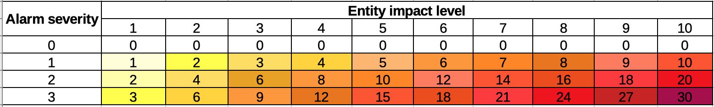
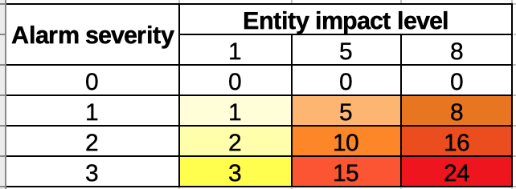

# Moteur `engine-service` (Community)

Les moteur `engine-service` permet de surveiller et de répercuter les états d'alarmes ouvertes sur des entités surveillées.

À partir de Canopsis 4.3.0, il remplace l'ancien moteur `engine-watcher`.

## Utilisation

### Options du moteur

La commande `engine-service -help` liste toutes les options acceptées par le moteur.

### Multi-instanciation

Il est possible, à partir de Canopsis 4.3.0, de lancer plusieurs instances du moteur `engine-service`, afin d'améliorer sa performance de traitement et sa résilience.

En environnement Docker, il vous suffit par exemple de lancer Docker Compose avec `docker-compose up -d --scale service=2` pour que le moteur `engine-service` soit lancé avec 2 instances.

Cette fonctionnalité sera aussi disponible en installation par paquets lors d'une prochaine mise à jour.

## Fonctionnement

### Concept d'un service

Un service (ou *service*) représente un groupe de surveillance : c'est-à-dire que la criticité d'une entité de type service dépendra de la criticité des entités surveillées, et des alarmes ouvertes sur ces entités.

Le but d'un service est de donner une visibilité accrue et claire sur l'état d'un groupe d'entités et de ses dépendances, afin de détecter un changement de criticité positif ou négatif sur les alarmes liées aux entités du groupe surveillé.

### Priorité et routage des alarmes

La liste des alarmes est triée par `priority`. Toutes les entités ont une propriété `impact_level`. Ainsi, les alarmes ont une `priority` définie en fonction de la criticité de l'alarme et du niveau d'impact de l'entité.

Le paramètre dérivé `alarm priority` est ajouté aux paramètres de l'alarme. Ce paramètre est égal à la valeur de l'état de l'alarme (`state.val`) multipliée par l'`impact_level` de l'entité liée à l'alarme.

!!! note
	`alarm priority` affecte la fonction de tri des alarmes ou le filtrage des alarmes par priorité, il n'affecte pas le paramètre `impact_state` d'une entité.

	`alarm priority` = criticité de l'alarme (`state.val`) * `impact_level`

	`impact_state` = service `state` * `impact_level`

	Le parametre d'état de service (`state`) est basé sur la criticité de l'alarme et non sur la priorité.

La priorité de l'alarme peut être modifiée et donc recomptée lorsque l'état de l'alarme est modifié ou que le niveau d'impact de l'entité concernée est modifié.

La liste d'alarmes est triée par priorité comme dans ce tableau :



L'`impact_level` de l'entité est un paramètre défini par l'utilisateur, et l'utilisateur peut utiliser n'importe quel ensemble de valeurs pour la hiérarchisation. L'ensemble de valeurs `impact_level` de l'entité peut ressembler à : `[1,5,8]` ou `[2,6]` ou `[1,2,3,4,5,6,7,8,10]`, etc.
La priorité de l'alarme doit être comptée en fonction de ces valeurs d'`impact_level`. Voici un exemple d'entités et de services avec pour ensemble de valeurs 1, 5 et 8.



### Définition d'un service

Un service est un document JSON contenant, entre autres, les paramètres suivants :

 - `_id` (optionnel): l'identifiant du service (généré automatiquement ou choisi par l'utilisateur).
 - `name` (requis) : Le nom du service, qui sera utilisé dans la météo de services.
 - `entities` (requis) : La liste des patterns permettant de filtrer les entités surveillées. Le format des patterns est le même que pour l'[event-filter](moteur-che-event_filter.md).
 - `output_template` (requis) : Le template utilisé par le service pour déterminer la sortie de l'alarme.
 - `category` (facultatif) : l'identifiant d'une catégorie d'entité qui peut être utilisée pour filtrer les alarmes ou les entités. Si elle n'est pas définie, la catégorie "par défaut" est utilisée.
 - `impact_level` (facultatif) : la valeur de l'importance ou du niveau d'impact de cette entité, de 1 à 10. Si elle n'est pas définie, la valeur 1 est utilisée.
 - `impact_state` : le paramètre dérivé, qui est égal à `impact_level` (1-10) multiplié par l'état (0 à 3) ou la criticité de l'alarme la plus sévère ouverte sur les entités surveillées.

Pour plus de paramètres, se référer à la rubrique `entityservices` dans la documentation de l'[API](https://doc.canopsis.net/guide-developpement/swagger/#/entityservices).

Le schéma en base est proche, puisqu'il s'agit de ces paramètres, ajoutés à ceux déjà présents pour une entitié.

### Templates

L'`output_template` est un [template](https://golang.org/pkg/text/template/) permettant d'afficher diverses informations dans l'output de l'alarme correspondant à l'service.

Les informations disponibles sont :

 - `{{.Alarms}}` : le nombre d'alarmes en cours sur les entités observées par l'service.
 - `{{.State.Info}}` : le nombre d'entités observées n'ayant pas d'alarmes, ou une alarme en criticité `Info`.
 - `{{.State.Minor}}` : le nombre d'alarmes mineures sur les entités observées.
 - `{{.State.Major}}` : le nombre d'alarmes majeures sur les entités observées.
 - `{{.State.Critical}}` : le nombre d'alarmes critiques sur les entités observées.
 - `{{.Acknowledged}}` : le nombre d'alarmes acquittées sur les entités observées.
 - `{{.NotAcknowledged}}` : le nombre d'alarmes non-acquittées sur les entités observées.

Par exemple, l'output d'un service avec l'`output_template` suivant :

```
Crit : {{.State.Critical}} / Total : {{.Alarms}}
```

sera

```
Crit : 12 / Total : 60
```

s'il y a 60 alarmes en cours dont 12 critiques sur les entités observées.

