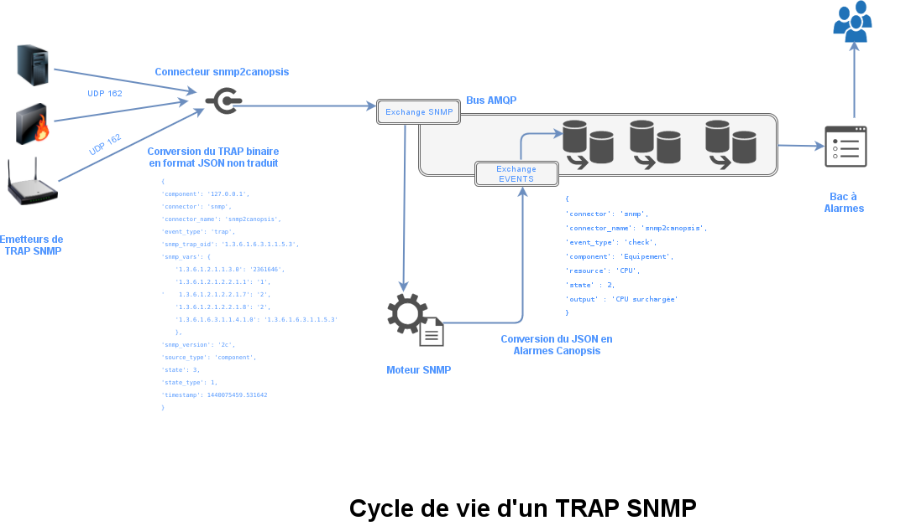
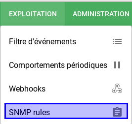
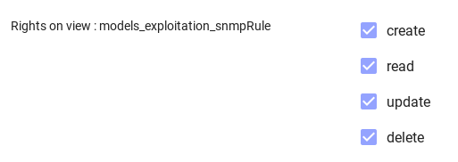
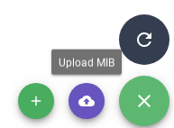
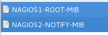
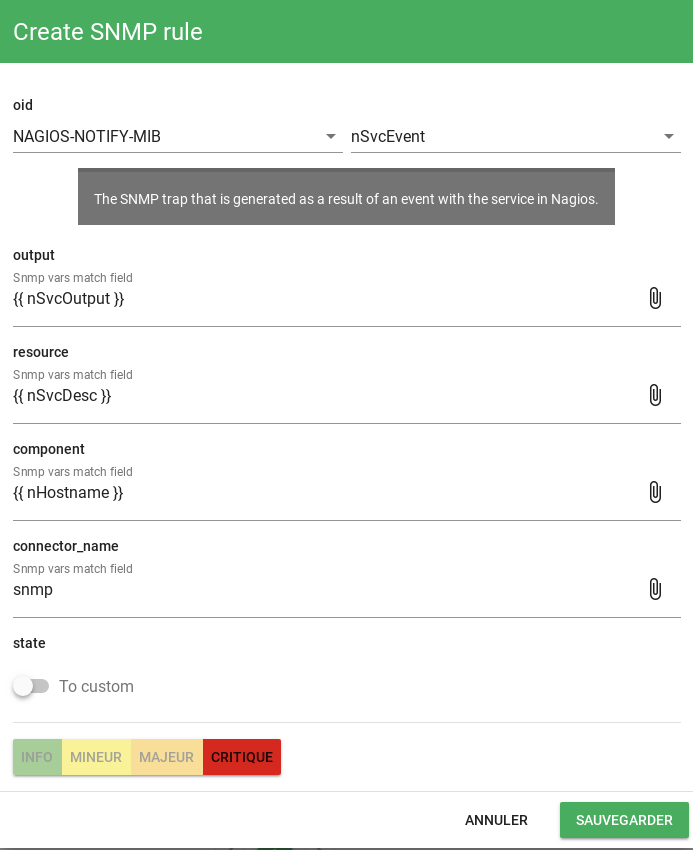
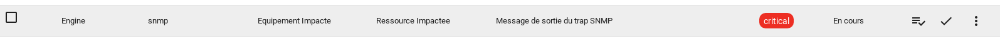

# Moteur `snmp` (Python, Pro)

!!! info
    Ce moteur n'est disponible que dans l'édition Pro de Canopsis.

Le moteur `snmp` permet de traiter les traps SNMP récupérés par le connecteur `snmp2canopsis` selon des règles prédéfinies par l'utilisateur.

## Fonctionnement

Ce schéma présente le cycle de vie d'un trap SNMP depuis son émission jusqu'à sa conversion en alarmes Canopsis.



Comme observé sur le schéma de cycle de vie, les traps SNMP bruts sont traduits par un moteur grâce à un jeu de règles à définir.

Pour rappel, le résultat de la traduction doit se concrétiser par la génération d'un message compréhensible par Canopsis.

Ce message doit comporter au minimum les informations suivantes :

*  `connector`
*  `connector_name`
*  `component`
*  `resource`
*  `state`
*  `output`

Le principal objectif est donc de déduire ces attributs à partir du tableau `snmp_vars` présent dans les traps bruts.

## Mise en place

### Activation du moteur

Sur le nœud des moteurs Canopsis :

```sh
systemctl enable canopsis-engine-cat@snmp
systemctl start canopsis-engine-cat@snmp
```

### Activation du service SNMP dans l'interface web

À la fin du fichier `/opt/canopsis/etc/oldapi.conf` (ou équivalent Docker), assurez-vous de la présence de la ligne suivante :

```ini
canopsis_cat.webcore.services.snmprule = 1
```

et redémarrer le serveur web Canopsis :

```sh
systemctl restart canopsis-service@canopsis-oldapi
```

### Traduction des traps

Pour créer des règles de transformations il faut se logger sur la page dédiée accessible par le menu d'exploitation.



!!! note
    L'accès à cette page est régi par le droit `models_exploitation_snmpRule` de type CRUD.
    Veillez à octroyer les permissions dans la matrice des droits 

Une règle de transformation consiste à convertir des `OID` en valeurs compréhensibles et associer les attributs nécessaires à un message Canopsis.

Dans l'exemple du connecteur [`snmp2canopsis`](../../interconnexions/Supervision/SNMPtrap.md), nous souhaitons obtenir le message suivant :

```json
{
  "connector" : "snmp",
  "connector_name" : "snmp",
  "component" : "Equipement Impacte",
  "resource" : "Ressource Impactee",
  "output" : "Message de sortie du trap SNMP",
  "state" : 3
}
```

Pour cela, nous devons :

*  Envoyer les MIB Nagios dans Canopsis
*  Créer une règle de transformation
*  Constater les résultats

### Envoi des MIB

Le paquet `snmp-mibs-downloader` peut être nécessaire. Il embarque lui-même une bibliothèque de MIB et permet, au besoin, d'en télécharger automatiquement des complémentaires depuis le web.

Lors de l'upload des MIB, Canopsis concatène les fichiers uploadés dans l'ordre dans lequel il les reçoit. Il faut donc être vigilant sur ce point. Par exemple, Firefox upload les fichiers dans l'ordre dans lequel ils ont été sélectionnés dans la fenêtre de sélection de fichiers. Chrome, quant à lui, upload les fichiers sélectionnés dans l'ordre alphabétique.

Par exemple, si le fichier `nagios-root.mib` doit être traité avant le fichier `NAGIOS-NOTIFY-MIB`. Vous devrez soit les uploader dans cet ordre soit les renommer respectivement en `NAGIOS1-ROOT-MIB` et `NAGIOS2-ROOT-MIB`.

On sélectionne les fichiers.





On vérifie que le traducteur a bien trouvé des objets de type `notification`


**Création de la règle**



### Vérification

On exécute à nouveau l'émisson du trap SNMP :

```sh
/usr/bin/snmptrap -v 2c -c public IP_RECEPTEUR_SNMP '' NAGIOS-NOTIFY-MIB::nSvcEvent nSvcHostname s "Equipement Impacte" nSvcDesc s "Ressource Impactee" nSvcStateID i 3 nSvcOutput s "Message de sortie du trap SNMP"
```

On contrôle le bac :



La remontée de l'alarme dans le bac s'opère :

- À chaque changement de criticité
- Lorsqu'un acquittement a été posé sur l'alarme et qu'elle remonte à nouveau.
