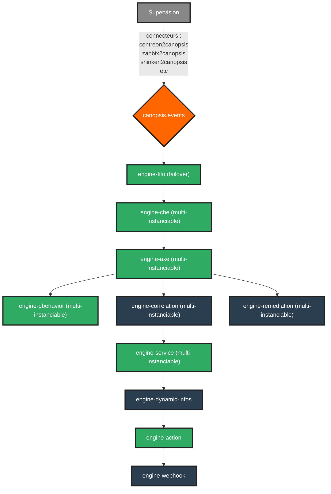
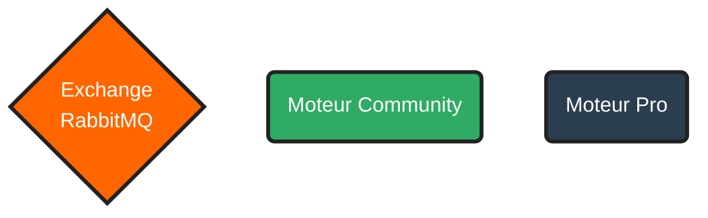

# Enchaînement des moteurs Canopsis

Canopsis est constitué d'un enchaînement de moteurs Go et Python. Vous trouverez sur cette page les détails de la configuration et une représentation visuelle de cet enchaînement.

Les informations sur le rôle des différents moteurs sont dans [la liste des moteurs](index.md#liste-des-moteurs).

## Enchaînement des moteurs Go

L'enchaînement des moteurs Go de Canopsis se configure à leur lancement via l'option `-publishQueue`.

## Enchaînement des moteurs Python

L'enchaînement des moteurs Python de Canopsis se configure dans le fichier `/opt/canopsis/etc/amqp2engines.conf`.

De façon générique sur un moteur Python, on aura :
```ini
[engine:nom_du_moteur]
event_processing = canopsis.[nom_du_moteur].process.event_processing
beat_processing = canopsis.[nom_du_moteur].process.beat_processing
next = [moteur_suivant],[moteur_suivant2]
```

Dans le fichier `amqp2engines.conf` il y a `event.processing` et `beat.processing` : le premier permet de lire les évènements, le second permet de configurer leur traitement périodique.

## Représentation de l'enchaînement des moteurs

*Vous pouvez cliquer sur le nom des moteurs pour être redirigé vers la page de documentation dédiée.*



Légende :


!!! Note
    Certains moteurs ne sont pas représentés sur ce diagramme car leur fonctionnement est indépendant de l'enchaînement des moteurs de base. Par exemple [`snmp`](moteur-snmp.md) ou `import_ctx`.
