# La remédiation et les jobs dans Canopsis

!!! abstract "Pages associées"
    Cette page fait partie d'une série de trois documentations au sujet de la
    remédiation dans Canopsis :
    
    1. La page [La remédiation dans Canopsis][remed-index] présente la
    fonctionnalité et montre l'exécution d'une consigne pour l'utilisateur
    final ;
    2. La page [Mise en œuvre de la remédiation][mise-en-oeuvre] décrit la
    configuration de la remédiation dans Canopsis pour la gestion des consignes
    et des jobs ;
    3. La page en cours traite de l'architecture technique et de la
    configuration à réaliser pour exécuter des jobs dans les ordonnanceurs
    supportés.

## Introduction


Comme précisé dans le
[guide d'utilisation](../../guide-utilisation/remediation/index.md), une opération de
consigne peut être liée à un ou des jobs.  
Le diagramme suivant vous présente cette possibilité.

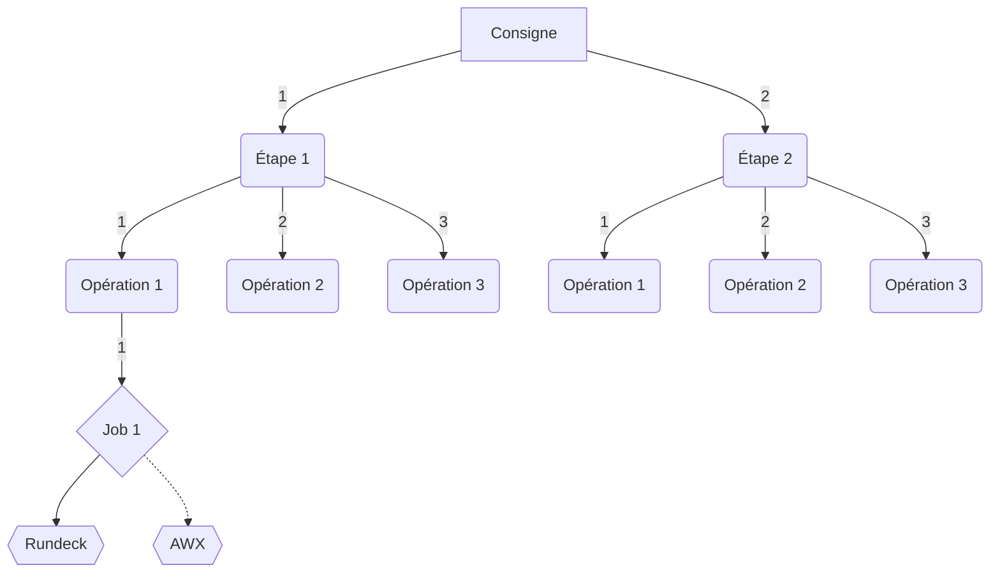
```mermaid
graph TD
    C[Consigne] -->|1| E1(Étape 1)
    C[Consigne] -->|2| E2(Étape 2)
    E1 -->|1| O1(Opération 1)
    O1 -->|1| J1{Job 1}
    E1 -->|2| O2(Opération 2)
    E1 -->|3| O3(Opération 3)
    E2 -->|1| O4(Opération 1)
    E2 -->|2| O5(Opération 2)
    E2 -->|3| O6(Opération 3)
    J1 --> Rundeck{{Rundeck}}
    J1 -.-> AWX{{AWX}}
```

Le Job 1, selon sa configuration, sera distribué à l'ordonnanceur Rundeck ou
AWX.

## Architecture

Lorsqu'un job est déclenché depuis une consigne dans Canopsis, il est placé
dans une file d'attente.  
Cette file d'attente est parcourue par le moteur `engine-remediation`.

## Configuration des ordonnanceurs

Cette section présente la configuration à réaliser dans l'ordonnanceur et la
liaison à ajouter dans Canopsis.

Les opérations sont décrites séparément pour les deux ordonnanceurs supportés :
Rundeck, AWX, jennkins, et Visual Tom. (La documentation `Visual Tom` est en cours de rédaction).

### Configuration pour Rundeck

#### Création d'un token d'authentification Rundeck

Dans le menu « Profile » de Rundeck, vous avez accès à la création d'un token
pour votre propre utilisateur.

[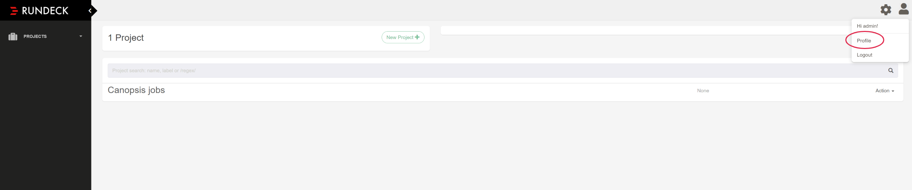](./img/remediation_rundeck1.png){target=_blank}

[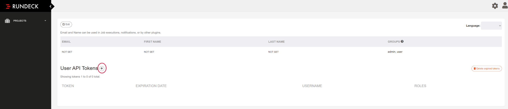](./img/remediation_rundeck2.png){target=_blank}

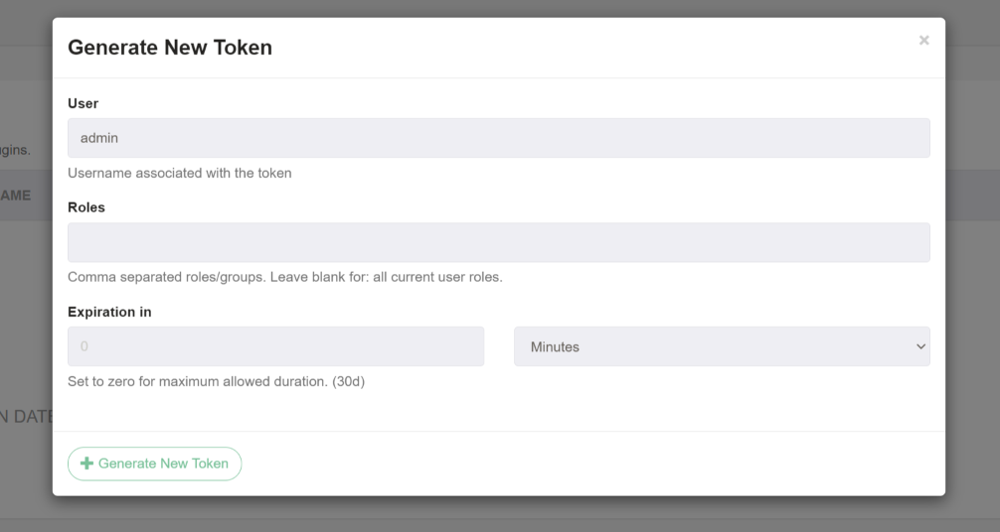

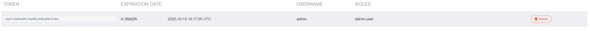

Vous disposez maintenant d'un token qui va être utilisé juste après dans la
configuration de la remédiation côté Canopsis.

#### Création d'une configuration associée dans Canopsis

Dans le menu d'administration de la remédiation, onglet « CONFIGURATIONS »,
cliquez sur « + » et renseignez les différents champs.

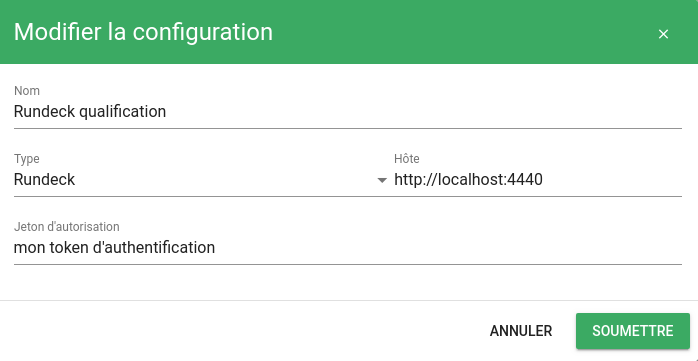

### Configuration AWX

#### Création d'un token d'authentification AWX

Dans le menu « Users » d'AWX, vous avez la possibilité de créer un token
associé à l'utilisateur de votre choix.

[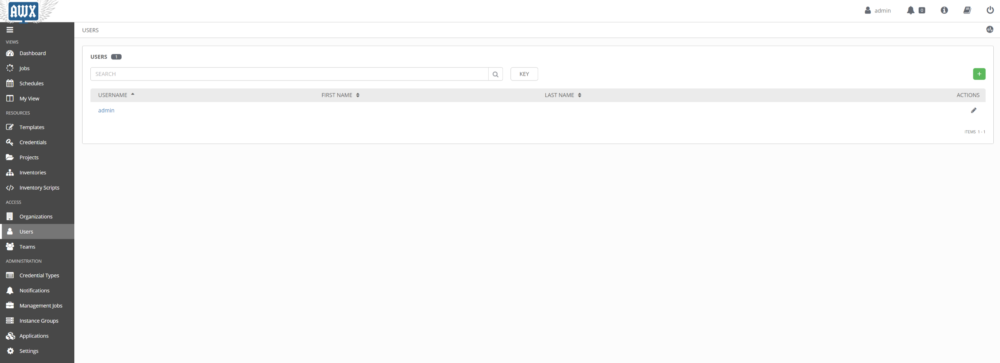](./img/remediation_awx1.png){target=_blank}

[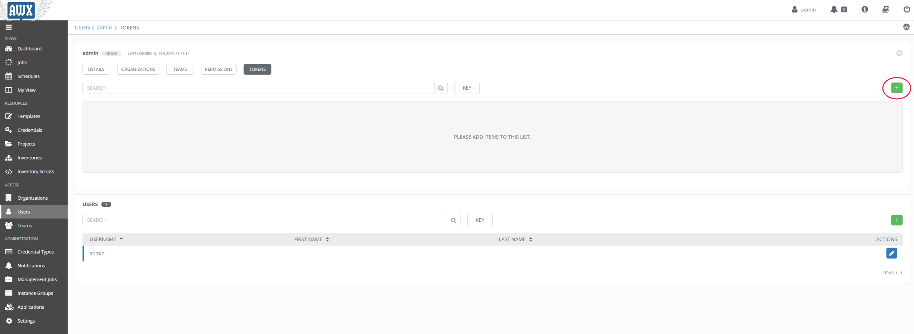](./img/remediation_awx2.png){target=_blank}

Le scope à sélectionner est `WRITE`.

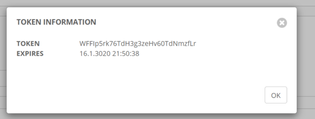

Vous disposez maintenant d'un token qui va être utilisé juste après dans la
configuration de la remédiation côté Canopsis.

#### Création d'une configuration associée dans Canopsis

Dans le menu d'administration de la remédiation, onglet « CONFIGURATIONS »,
cliquez sur « + » et renseignez les différents champs.

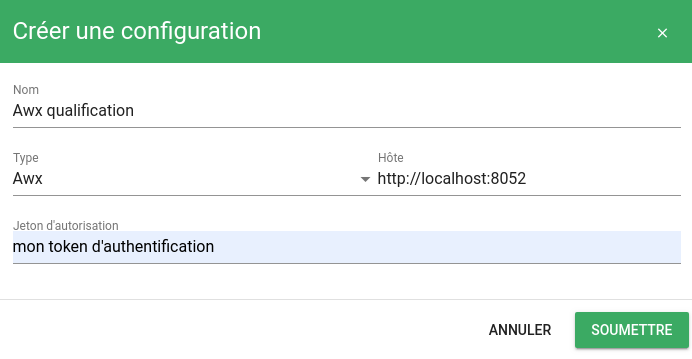

### Configuration pour Jenkins

#### Création d'un token d'authentification Jenkins

Dans le menu « Utilisateur->Configurer » de Jenkins, vous avez accès à la création d'un token
pour votre propre utilisateur.

[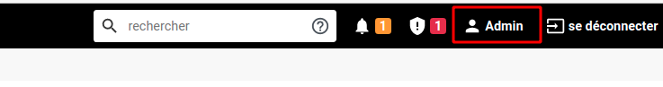](./img/remediation_jenkins1.png){target=_blank}

[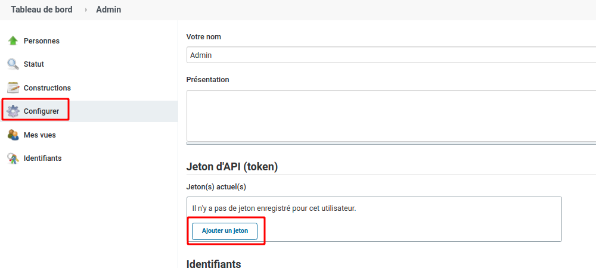](./img/remediation_jenkins2.png){target=_blank}

[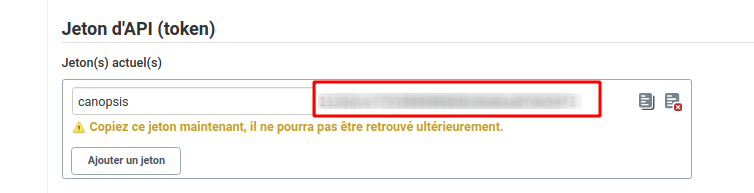](./img/remediation_jenkins3.png){target=_blank}


Vous disposez maintenant d'un token qui va être utilisé juste après dans la
configuration de la remédiation côté Canopsis.

#### Création d'une configuration associée dans Canopsis

Dans le menu d'administration de la remédiation, onglet « CONFIGURATIONS »,
cliquez sur « + » et renseignez les différents champs.

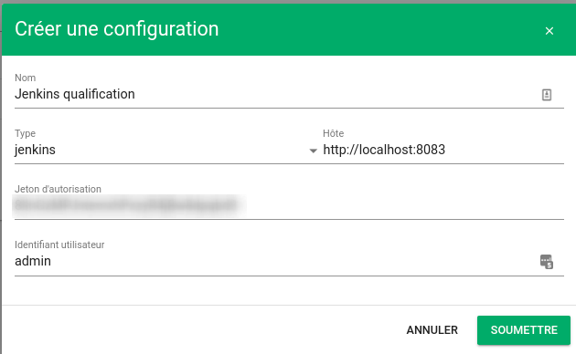


## Configuration des jobs

### Association de job Rundeck dans Canopsis

Coté Rundeck, dans le menu « Jobs », créez un job et récupérez son identifiant.

[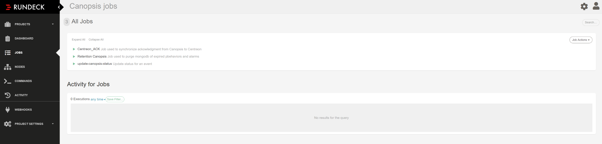](./img/remediation_rundeck6.png){target=_blank}

[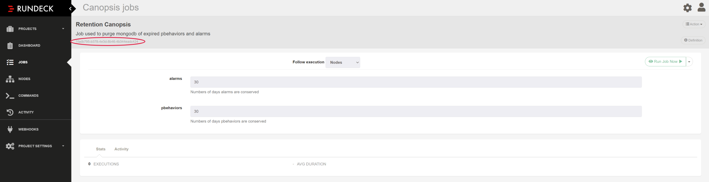](./img/remediation_rundeck7.png){target=_blank}

Coté Canopsis, dans le menu d'administration de la remédiation, onglet
« JOBS », cliquez sur « + » et renseignez les différents champs.

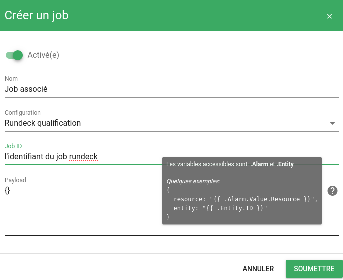

Le job est maintenant prêt à être utilisé dans des [opérations][doc-op] de
consignes.
Si vous devez passer des variables à votre job, suivez la section
[Payload](#utilisation-des-payloads) qui vous explique comment faire.

[doc-op]: ../../guide-utilisation/menu-administration/consignes.md#associer-un-job-à-une-opération

### Association de job AWX dans Canopsis

Coté AWX, dans le menu « Job templates », créez ou sélectionnez un job et
récupérez son identifiant dans l'URL :

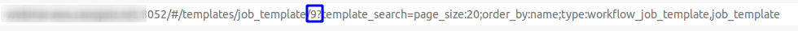

Coté Canopsis, dans le menu d'administration de la remédiation, onglet « JOBS »,
cliquez sur « + » et renseignez les différents champs.

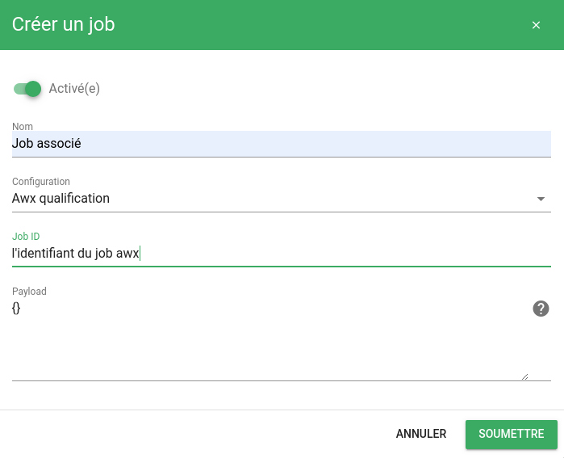

Le job est maintenant prêt à être utilisé dans des [opérations][doc-op] de
consignes.
Si vous devez passer des variables à votre job, la section suivante,
[Payload](#utilisation-des-payloads) vous explique comment faire.

### Association de job Jenkins dans Canopsis

Coté Jenkins, dans le menu « Jobs », créez un job et récupérez son identifiant.

[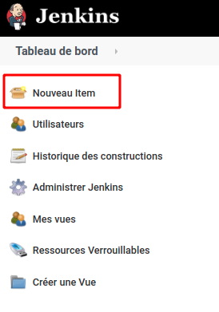](./img/remediation_jenkins5.png){target=_blank}

[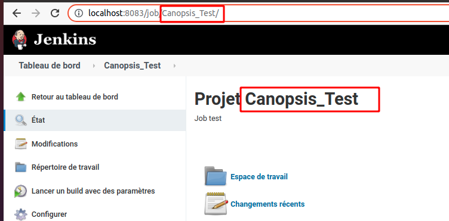](./img/remediation_jenkins6.png){target=_blank}

Coté Canopsis, dans le menu d'administration de la remédiation, onglet
« JOBS », cliquez sur « + » et renseignez les différents champs.

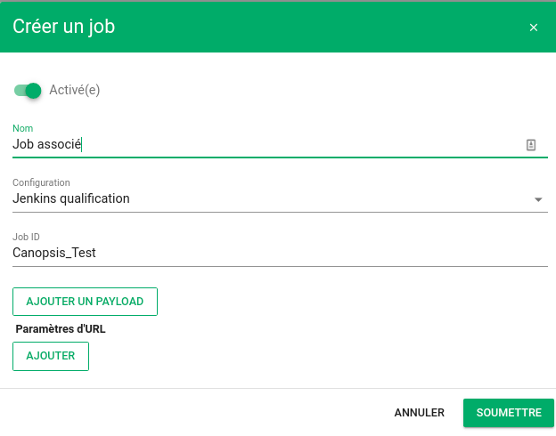

Le job est maintenant prêt à être utilisé dans des [opérations][doc-op] de
consignes.
Si vous devez passer des variables à votre job, suivez la section
[Payload](#utilisation-des-payloads) qui vous explique comment faire.

[doc-op]: ../../guide-utilisation/menu-administration/consignes.md#associer-un-job-à-une-opération


## Utilisation des `payloads`

Le module de remédiation de Canopsis permet de transmettre des variables à
l'ordonnanceur au moment de l'exécution d'un job.

!!! Note
    Vous avez accès aux variables `.Alarm` et `.Entity` dans ce payload.

    Les différentes valeurs sont [documentées ici](../../guide-utilisation/templates-go/index.md).

Cette section décrit la manière de procéder pour Rundeck, AWX, et Jenkins.

### Rundeck

L'ordonnanceur attend les variables pour un job dans une structure qui doit
être appelée `options`.
Ainsi, lorsque vous paramétrez le contenu du payload dans un job Canopsis, vous
devez préciser les variables en suivant cette structure :

```json
{
  "options": {
    "variable1" : "valeur1",
    "variable2" : "valeur2"
  }
}
```

Du coté de Rundeck, vous pourrez exploiter ces variables grâce aux notations suivantes :

* `@option.variable1@`
* `$RD_OPTION_VARIABLE2`

Voici un exemple complet de passage de variables de Canopsis vers Rundeck :

**Payload Job Canopsis**

```json
{
  "options": {
    "component": "{{.Alarm.Value.Component}}",
    "resource": "{{.Alarm.Value.Resource}}",
    "service_name": "{{.Alarm.Value.Resource}}"
  }
}
```


**Exploitation des variables dans un job Rundeck de type script**

```sh
#!/bin/bash

echo "Demande d'exécution de job reçue par Canopsis"
echo "Alarme concernée :"
echo -e "\tComposant : @option.component@"
echo -e "\tResource : @option.resource@"
echo "Service à redémarrer : $RD_OPTION_SERVICE_NAME"
echo "Terminé"
```


**Exploitation des variables dans un job Rundeck de type playbook Ansible**

En utilisant le playbook d'exemple suivant :

```yaml
- name: Hello World Sample
  hosts: all
  connection: local
  tasks:
    - name: Hello Message
      debug:
        msg: "Hello World component {{ component }} of resource {{ resource }} is down!"

```

Nous allons pouvoir créer un job dans Rundeck avec les informations suivantes :

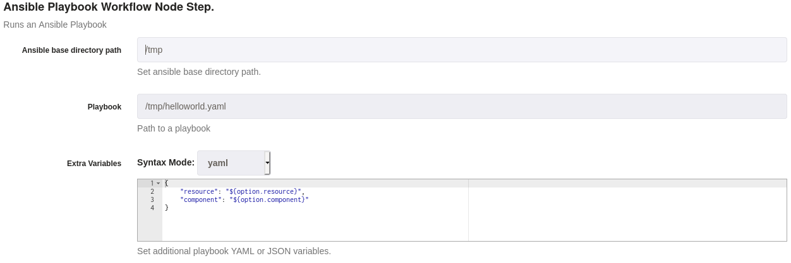

Le plus important ici est dans la partie `Extra Variables`.
Les variables passées depuis le payload Canopsis seront accessibles par le biais de `${option.MAVARIABLE}`.

La configuration ci-dessus donnera donc le résultat suivant dans Rundeck : 

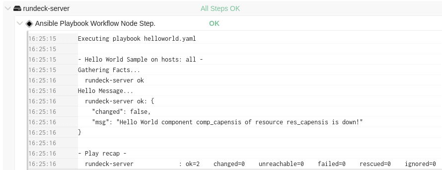

Il est possible de voir les valeurs des différentes options passées au job dans le coin supérieur gauche du rapport d´exécution.

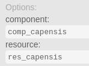


### AWX

L'ordonnanceur attend les variables pour un job dans une structure qui doit être
appelée `extra_vars`.
Ainsi, lorsque vous paramétrez le contenu du payload dans un job Canopsis, vous
devez préciser les variables en suivant cette structure :

```json
{
  "extra_vars": {
    "variable1" : "valeur1",
    "variable2" : "valeur2"
  }
}
```

Dans AWX, vous pourrez exploiter ces variables dans un modèle de job en activant
le paramètre `ask_variables_on_launch=TRUE` ou, dans l'interface web, en cochant
la case :

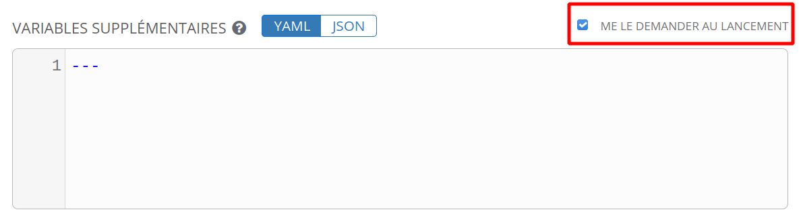

Les variables contenues dans `extra_vars` seront alors automatiquement
utilisables par le job.

Voici un exemple complet de passage de variables de Canopsis vers AWX :

**Payload Job Canopsis**

```json
{
  "extra_vars": {
    "component": "{{.Alarm.Value.Component}}",
    "resource": "{{.Alarm.Value.Resource}}",
    "entity_id": "{{.Entity.ID}}"
  }
}
```

### Jenkins 

L'ordonnanceur attend les variables pour un job directement dans l'URL (querystring).
Pour ce faire, vous devez définir des paramètres d'URL et non un payload.

[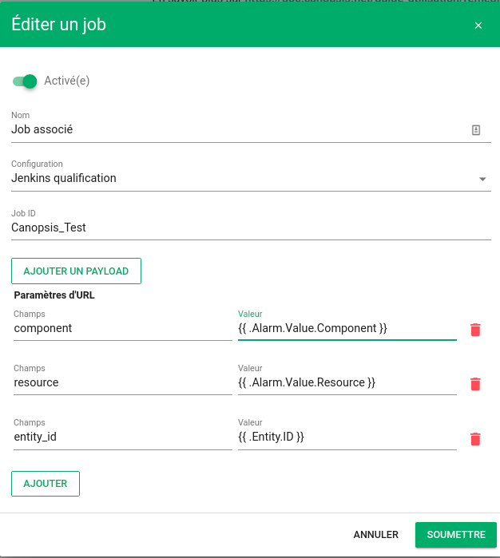](./img/remediation_jenkins8.png){target=_blank}

Du coté de Jenkins, vous pourrez exploiter ces variables grâce aux notations suivantes :

* `${variable1}`

Voici un exemple complet de passage de variables de Canopsis vers Jenkins :

**Paramètres d'URL du job Canopsis**

```json
{
  "component": "{{.Alarm.Value.Component}}",
  "resource": "{{.Alarm.Value.Resource}}",
  "entity_id": "{{.Entity.ID}}"
}
```
**Exploitation des variables dans un job Jenkins de type script shell**

```sh
#!/bin/bash

echo "Demande d'exécution de job reçue par Canopsis"
echo "Alarme concernée :"
echo -e "\tId de l'entité : ${entity_id}"
echo -e "\tComposant : ${component}"
echo -e "\tResource : ${resource}"
echo "Terminé"
```

## Avancé

### Message de retour d'un job Rundeck dans Canopsis

Il est possible de configurer, au moyen d'un webhook dans Rundeck, l'envoi
d'un commentaire dans l'alarme avec un message indiquant le succès ou l'échec
du job Rundeck déclenché.

Pour illustrer ce cas d'usage, reprenons un job simulant l'action « Redémarrer
le service » :

- Dans Rundeck, on a un job de redémarrage qui exécute le script suivant :

    ```bash
    #!/bin/bash

    echo "Demande d exécution de job reçue par Canopsis"
    echo "Alarme concernée :"
    echo -e "\tComposant : @option.component@"
    echo -e "\tResource : @option.resource@"
    echo "Service à redémarrer : $RD_OPTION_SERVICE_NAME"
    echo "Terminé"
    ```

- Dans Canopsis, on représente ce job en le liant à l'id Rundeck. Les
variables sont passées grâce au payload suivant :

    ```json
    {
      "options": {
        "component": "{{.Alarm.Value.Component}}",
        "resource": "{{.Alarm.Value.Resource}}",
        "service_name": "{{.Alarm.Value.Resource}}"
      }
    }
    ```

L'envoi d'un commentaire dans l'alarme nécessite de fabriquer un évènement de
type `comment` avec un ensemble de champs (`component`,
`resource`, `connector`, `connector_name`) qui identifie l'alarme.

Dans le payload, il faut donc ajouter des options pour arriver à la structure
suivante :

```json
{
    "options": {
        "component": "{{.Alarm.Value.Component}}",
        "resource": "{{.Alarm.Value.Resource}}",
        "service_name": "{{.Alarm.Value.Resource}}",
        "connector": "{{.Alarm.Value.Connector}}",
        "connector_name": "{{.Alarm.Value.ConnectorName}}"
    }
}
```

Dans Rundeck, créer un job « publish_comment_canopsis » qui exécute le script
ci-dessous :

```bash
curl -X POST -u root:root -H "Content-Type: application/json" -d '{
  "event_type": "comment",
  "connector": "@option.connector@",
  "connector_name": "@option.connectorname@",
  "component": "@option.component@",
  "source_type": "resource",
  "resource" : "@option.resource@",
  "author": "Rundeck",
  "output": "Job de remédiation (@option.jobname@) exécuté. <a href=\"@option.executionlink@#output\">Voir la sortie</a>"
}' 'http://canopsis:8082/api/v2/event'
```

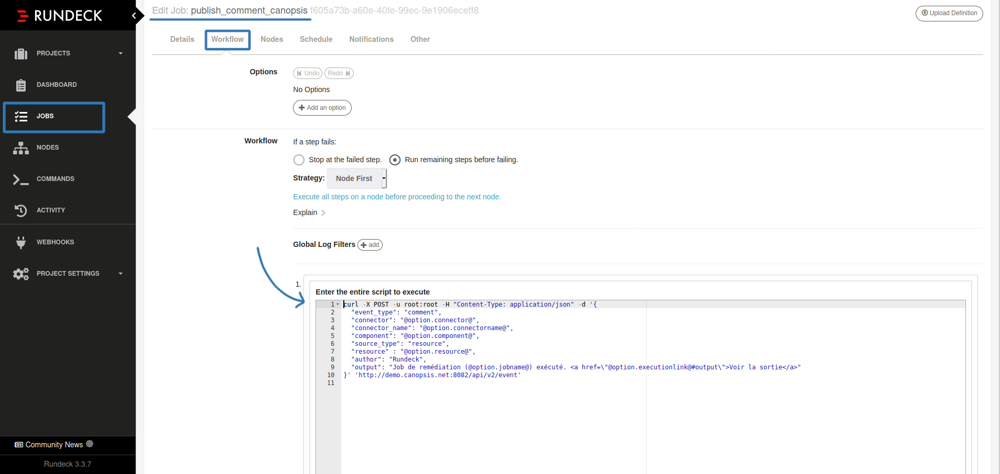

Créer, toujours dans Rundeck, un webhook « webhook_comment_canopsis » qui,
lorsqu'il est appelé, lance le job « publish_comment_canopsis ».

Passer les options suivantes afin de transmettre les informations en provenance
du job initial (job de redémarrage de service) :

```
-connector ${data.execution.job.options.connector}
-connectorname ${data.execution.job.options.connector_name}
-component ${data.execution.job.options.component}
-resource ${data.execution.job.options.resource}
-jobname ${data.execution.job.name}
-executionlink ${data.execution.href}
```

!!! Note
    Pour une meilleure lisibilité les options sont présentées sur plusieurs
    lignes ci-dessus, mais dans l'interface de Rundeck, les options doivent être
    enchaînées sur la même ligne.

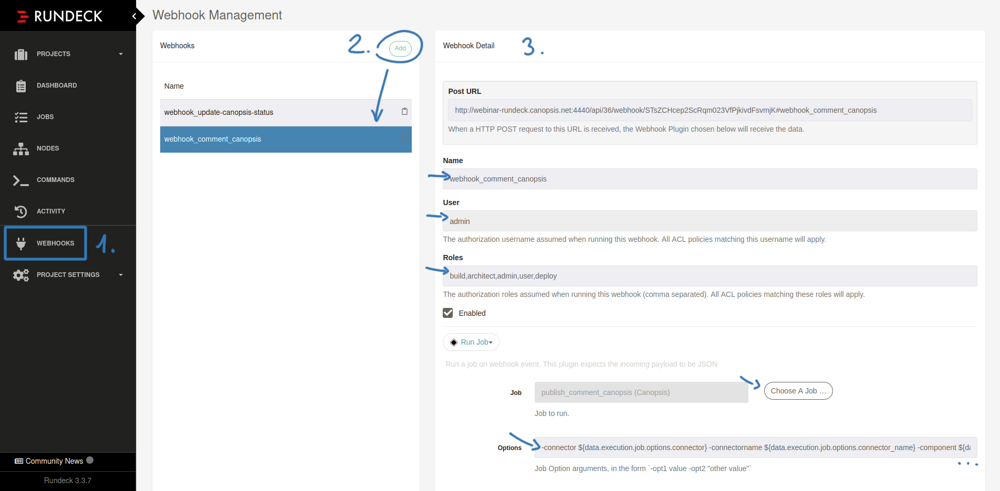

Sauvegarder le webhook et copier l'URL créée par Rundeck pour le webhook, par
exemple :

http://rundeck:4440/api/36/webhook/STsZCHcep2ScRqm023VfPjkivdFsvmjK#webhook_comment_canopsis

Modifier le job initial (job de redémarrage de service) pour y ajouter des
Notifications « On Success » et/ou « On Failure » :

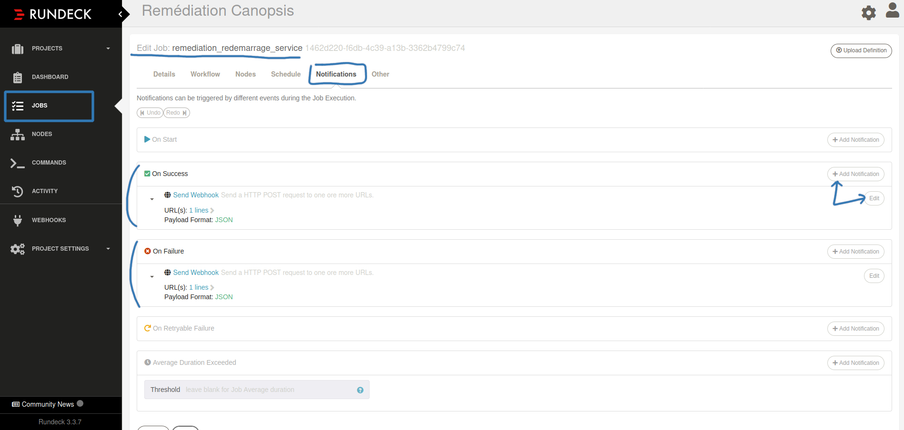

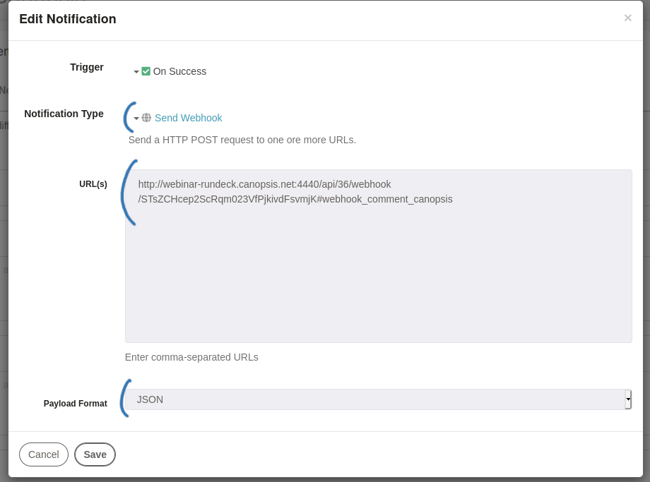

!!! Note
    Chacun peut d'après cet exemple configurer plus en détail des jobs de
    publication de commentaire différents, personnaliser le contenu des
    commentaires, traiter différemment les cas « On Success » et « On
    Failure »…

Avec ces éléments en place, il est possible de tester le déclenchement du job
de remédiation Rundeck depuis Canopsis et d'observer, une fois l'exécution
terminée, le commentaire dans la chronologie de l'alarme.

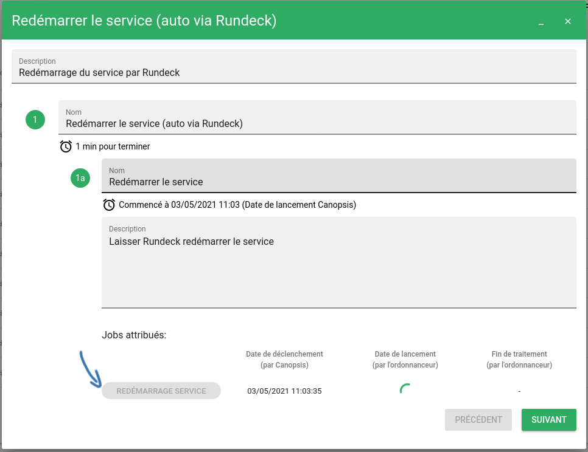

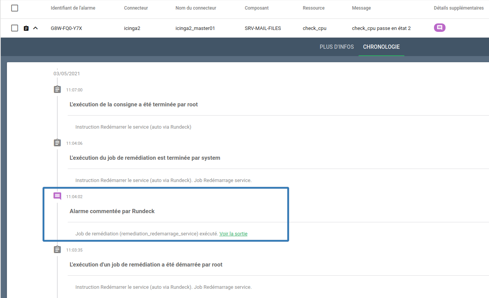

Le contenu suggéré en exemple contient un lien hypertexte vers Rundeck pour voir
le détail de l'exécution du job et le log de sortie. Ce lien est correctement
présenté si l'option « HTML activé dans la chronologie ? » est cochée dans les
paramètres avancés du [widget bac à alarmes][baa].

[remed-index]: ../../guide-utilisation/remediation/index.md
[mise-en-oeuvre]: ../../guide-utilisation/menu-administration/consignes.md
[baa]: ../../guide-utilisation/interface/widgets/bac-a-alarmes/index.md#paramètres-du-widget
