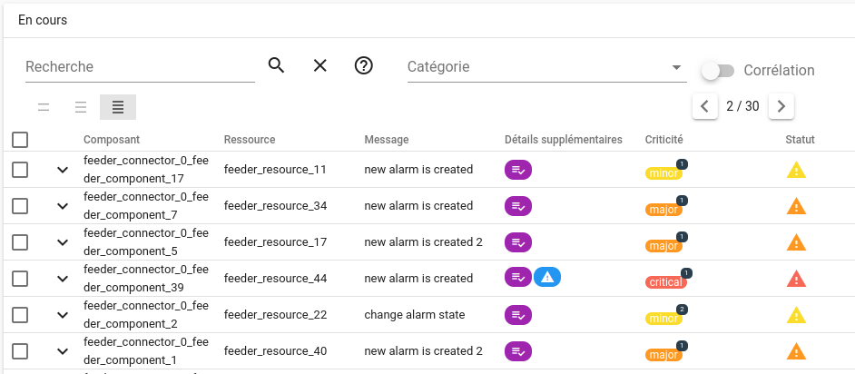

# Smart feeder (Pro)

Le `smart-feeder` est un générateur d'événements qui permet de reproduire un flux au plus proche de la réalité d'une production.  
Par exemple :

* lorsqu'il émet un événement de type "ack", il ne le fait que sur des alarmes ouvertes
* lorsqu'il émet un événement de type "assocticket", il ne le fait que sur des alarmes préalablement acquittées

Les intervalles de temps entre événements ne sont plus fixes par rapport au générateur précédent.  
Ces intervalles sont calculés selon le [Processus de Poisson](https://fr.wikipedia.org/wiki/Processus_de_Poisson). Pour faire simple, les intervalles ne sont pas dépendants les uns des autres et sont fixés aléatoirement, ce qui contribue à s'approcher de situations réelles.

Dans une période de temps considérée, il se peut qu'il y ait des bursts d'événements mais également des moments sans aucun événement.

Toutefois, le débit d'événements par seconde reste configurable.

!!! warning "Dépendance avec les métriques techniques"
    Smart-feeder a besoin que la collecte des métriques techniques soit activée.  
    Pour cela, vous pouvez suivre la [procédure associée](../../guide-de-depannage/metriques-techniques/index.md)

## Configuration

```yaml
time: 60
event_rate: 100

events:
  check_no_change:
    weight: 5
    outputs:
      - "no changes"
  check_new_alarm:
    weight: 20
    outputs:
      - "new alarm is created"
      - "new alarm is created 2"
  check_change_state:
    weight: 2
    outputs:
      - "change alarm state"
  check_ok_state:
    weight: 2
    outputs:
      - "alarm is ok"
  ack:
    weight: 4
    outputs:
      - "alarm is acked"
  snooze:
    weight: 1
    outputs:
      - "alarm is snoozed"
  ackremove:
    weight: 0
    outputs:
      - "ack is removed"
  assocticket:
    weight: 1
    outputs:
      - "ticket is added"

entities:
  parse_db: false

  default_connector: feeder_connector
  default_component: feeder_component
  default_resource: feeder_resource

  connectors:
    centreon:
      max_index: 2
      components:
        SUP:
          max_index: 50
          resources:
            CPU:
              max_index: 2
            PING:
              max_index: 4
    nagios:
      max_index: 3
      components:
        BUR:
          max_index: 50
          resources:
            CPU:
              max_index: 2
            PING:
              max_index: 4
```

- `time` - durée d'exécution du feeder, en secondes.
- `event_rate` - débit d'événements par seconde.
- `events` - configuration des événements.
- `entities` - configuration des entités.

### Events

Chaque section `events` respecte la structure suivante :

```yaml
<event_name>:
  weight: <weight>
  outputs:
    - <output 1>
    - <output 2>
```

Les différents types d'événements supportés sont les suivants :

* `check_no_change` - événement "type:check" pour mettre à jour une alarme sans changement de criticité
* `check_new_alarm` - événement "type:check" pour créer une nouvelle alarme
* `check_change_state` - événement "type:check" pour mettre à jour une alarme avec changement de criticité (KO)
* `check_ok_state` - événement "type:check" pour résoudre une alarme (criticité OK)
* `ack` - événement "type:ack"  pour acquitter une alarme
* `snooze` - événement "type:snooze" pour mettre en veille une alarme
* `ackremove` - événement "type:ackremove" pour supprimer un acquittement existant
* `assocticket` - événement "type:assocticket" pour associer un ticket à une alarme

Chaque bloc d'événement a 2 options :

* `weight` - définit la proportion de ce type dans le flux d'événements.
* `output` - contient la liste des "output" possibles pour ces événements. L'output est choisi aléatoirement. S'il n'est pas spécifié alors le message par défaut est utilisé.

Comment fonctionne le poids `weight` ?

De manière assez simple, le poids définit le volume d'événements ciblés par rapport au flux général.  
Par exemple, si le poids d'un événement `ack` vaut **2** et que le poids d'un événement `check_new_alarm` vaut **3**, alors pour 3 créations d'alarmes, il y aura 3 acquittements. En pourcentage, on aura **60%** de `check_new_alarm` et **40%** de `ack`.  

Si le poids vaut **0** alors aucun événement n'est généré.

### Entities

La section `entities` respecte la structure suivante :

* `connectors` - définit la structure du référentiel interne de Canopsis ([context-graph](../../guide-utilisation/vocabulaire/index.md#context-graph)).
* `default_connector` - nom du connecteur par défaut associé à une nouvelle entité.
* `default_component` - nom du composant par défaut associé à une nouvelle entité.
* `default_resource` - nom de la ressource par défaut associée à une nouvelle entité.
* `parse_db` - si positionné à `true` alors le smart-feeder lira les données déjà présentes en base pour générer les événements.

Chaque `connectors` respecte la structure suivante :

```yaml
<connector_name>:
    max_index: <max_index>
    components:
        <component_name>:
            max_index: <max_index>
            resources:
                <resource_name>:
                    max_index: <max_index>
                <resource_name>:
                    max_index: <max_index>                    
        <component_name>:
            max_index: <max_index>
            resources:
                <resource_name>:
                    max_index: <max_index>                    
```

Où `connector_name`, `component_name` et `resource_name` sont les noms des entités et où `max_index` indique le nombre maximum d'entités du type ciblé (utilisé en suffixe).

Par exemple, la configuration suivante :

```yaml
  connectors:
    centreon:
      max_index: 2
      components:
        SUP:
          max_index: 3
          resources:
            CPU:
              max_index: 1
            PING:
              max_index: 2
```

générera les connecteurs :

- `centreon/centreon_0`
- `centreon/centreon_1`

les composants :

- `centreon_0_SUP_0`
- `centreon_0_SUP_1`
- `centreon_0_SUP_2`
- `centreon_1_SUP_0`
- `centreon_1_SUP_1`
- `centreon_1_SUP_2`

et les ressources :

- `CPU_0/centreon_0_SUP_0`
- `PING_0/centreon_0_SUP_0`
- `PING_1/centreon_0_SUP_0`
- `CPU_0/centreon_0_SUP_1`
- `PING_0/centreon_0_SUP_1`
- `PING_1/centreon_0_SUP_1`
- `CPU_0/centreon_0_SUP_2`
- `PING_0/centreon_0_SUP_2`
- `PING_1/centreon_0_SUP_2`
- `CPU_0/centreon_1_SUP_0`
- `PING_0/centreon_1_SUP_0`
- `PING_1/centreon_1_SUP_0`
- `CPU_0/centreon_1_SUP_1`
- `PING_0/centreon_1_SUP_1`
- `PING_1/centreon_1_SUP_1`
- `CPU_0/centreon_1_SUP_2`
- `PING_0/centreon_1_SUP_2`
- `PING_1/centreon_1_SUP_2`

!!! info "Remarque concernant les noms de composants"  
    Comme les ressources et les composants ne peuvent dépendre que d'un connecteur à la fois, les ids d'entités doivent être uniques. Pour conserver de la simplicité dans la configuration, chaque nom de composant est préfixé par son nom de connecteur.

#### Valeurs par défaut

Si le smart-feeder doit créer énormément d'alarmes et ce durant un temps important, les paramètres d'entités risquent de ne pas être suffisants pour générer les événements.  
Par exemple, si le poids de `check_new_alarm` est supérieur à celui de `check_ok_state`, toutes les alarmes possibles seront créées.
Pour que le feeder continue de travailler correctement, il aura alors besoin de plus d'entités. C'est dans ce cadre que les valeurs par défaut seront utilisées.


#### DB Parsing

Il est possible de parcourir la base de données avant de démarrer la génération d'événements. Dans ce cas, la configuration du bloc `connectors` sera tout simplement ignorée.

Les entités de type `services` et `metaalarms` sont ignorés dans le parcours de la base de données.

Lorsque le parcours est fini, un message de log nous donne quelques métriques :

```
2023-04-21T16:25:34+02:00 INF lib/feeder/state_manager.go:229 > Parsed alarm acked_alarms=789 ko_alarms=2682 not_acked_alarms=1893 ok_alarms=376 without_ticket_alarms=2638
```

#### Events generation

Voici quelques informations pour mieux comprendre comment sont générés les événements en fonction de leur type :

`check_no_change` - choisit une alarme aléatoirement peu importe sa criticité et génère un événement avec la même criticité. C'est l'équivalent d'une source qui publierait plusieurs fois des événements identiques.

`check_new_alarm` - choisit une alarme OK aléatoirement et la transforme en alarme KO (minor, major, critical).

`check_change_state` - choisit une alarme KO aléatoirement et change la criticité. Utile pour tester la notion de `flapping`.

`check_ok_state` - Choisit une alarme KO aléatoirement et la résoud. Utile pour tester par exemple le trigger `resolve`.

`ack` - choisit une alarme KO aléatoirement et génère un événement `ack` associé. S'il n'y a pas d'alarme KO à ce moment là, un événement KO est généré en premier lieu.

`snooze`- choisit une alarme KO aléatoirement et la met en veille pour une durée comprise entre 1m et 3m. S'il n'y a pas d'alarme KO à ce moment là, un événement KO est généré en premier lieu.

**NOTE:** La fin d'une mise en veille d'alarme ne peut pas être détectée. C'est pourquoi il est possible qu'une alarme en cours bénéficie de plusieurs mises en veille.

`ackremove` - choisit une alarme acquittée aléatoirement et supprime l'acquittement. S'il n'y a pas d'alarme acquittée à ce moment là, une alarme KO est choisie et un acquittement est posé.

`assocticket` - choisit une alarme acquittée aléatoirement et y associe un ticket dont le numéro est compris entre 1 et 1000. S'il n'y a pas d'alarme acquittée à ce moment là, une alarme KO est choisie et un acquittement est posé.


## Exemple d'utilisation

En considérant que la configuration fournie au début de ce chapitre se trouve dans le fichier `config-smart-feeder-doc.yml`, nous pouvons utiliser la configuration docker-compose suivante (dans le fichier `smart-feeder.yml`) :

```yaml
services:
  #
  # Smart feeder that will generate event flow 
  #
  smart-feeder:
    image: ${DOCKER_REPOSITORY}${PRO_BASE_PATH}smart-feeder:${CANOPSIS_IMAGE_TAG}
    volumes:
      - "./config-smart-feeder-doc.yml:/opt/canopsis/etc/feeder.yml"
    mem_limit: 200m
    mem_reservation: 200m
    env_file:
      - compose.env
      - ${CPS_EDITION:?CPS_EDITION not set}.env
```

```sh
CPS_EDITION=pro docker compose -f smart-feeder.yml up -d
```

Dans un bac à alarmes, vous pourrez constater la création des alarmes, des acquittements, des tickets.



Les logs vous donneront des informations chiffrées :

```
canopsis-pro-smart-feeder-1  | 2023-10-11T13:03:02Z INF git.canopsis.net/canopsis/canopsis-pro/pro/go-engines-pro/cmd/smart-feeder/main.go:94 > Start generating alarm states
canopsis-pro-smart-feeder-1  | 2023-10-11T13:03:02Z INF git.canopsis.net/canopsis/canopsis-pro/pro/go-engines-pro/cmd/smart-feeder/main.go:101 > End generating alarm states
canopsis-pro-smart-feeder-1  | 2023-10-11T13:03:02Z INF git.canopsis.net/canopsis/canopsis-pro/pro/go-engines-pro/cmd/smart-feeder/main.go:104 > Start cleaning tech metrics
canopsis-pro-smart-feeder-1  | 2023-10-11T13:03:02Z INF git.canopsis.net/canopsis/canopsis-pro/pro/go-engines-pro/cmd/smart-feeder/main.go:111 > End cleaning tech metrics
canopsis-pro-smart-feeder-1  | 2023-10-11T13:03:02Z INF git.canopsis.net/canopsis/canopsis-pro/pro/go-engines-pro/cmd/smart-feeder/main.go:156 > Sending events
canopsis-pro-smart-feeder-1  | 2023-10-11T13:04:02Z INF git.canopsis.net/canopsis/canopsis-pro/pro/go-engines-pro/cmd/smart-feeder/main.go:162 > Sending complete
canopsis-pro-smart-feeder-1  | 2023-10-11T13:04:02Z INF git.canopsis.net/canopsis/canopsis-pro/pro/go-engines-pro/cmd/smart-feeder/main.go:165 > Generating tech metrics report
canopsis-pro-smart-feeder-1  | 2023-10-11T13:04:02Z INF git.canopsis.net/canopsis/canopsis-pro/pro/go-engines-pro/cmd/smart-feeder/main.go:172 > Generating complete
canopsis-pro-smart-feeder-1  | 
canopsis-pro-smart-feeder-1  | Tech metrics report:
canopsis-pro-smart-feeder-1  | Metric: fifo_event
canopsis-pro-smart-feeder-1  | 	Minimal = 0.00ms
canopsis-pro-smart-feeder-1  | 	Maximum = 0.00ms
canopsis-pro-smart-feeder-1  | 	Average = 0.00ms
canopsis-pro-smart-feeder-1  | 	Percentile .01 = 0.00ms
canopsis-pro-smart-feeder-1  | 	Percentile .05 = 0.00ms
canopsis-pro-smart-feeder-1  | 	Percentile .10 = 0.00ms
canopsis-pro-smart-feeder-1  | 	Percentile .50 = 0.00ms
canopsis-pro-smart-feeder-1  | 	Percentile .90 = 0.00ms
canopsis-pro-smart-feeder-1  | 	Percentile .95 = 0.00ms
canopsis-pro-smart-feeder-1  | 	Percentile .99 = 0.00ms
canopsis-pro-smart-feeder-1  | Metric: che_event
canopsis-pro-smart-feeder-1  | 	Minimal = 0.00ms
canopsis-pro-smart-feeder-1  | 	Maximum = 0.00ms
canopsis-pro-smart-feeder-1  | 	Average = 0.00ms
canopsis-pro-smart-feeder-1  | 	Percentile .01 = 0.00ms
canopsis-pro-smart-feeder-1  | 	Percentile .05 = 0.00ms
canopsis-pro-smart-feeder-1  | 	Percentile .10 = 0.00ms
canopsis-pro-smart-feeder-1  | 	Percentile .50 = 0.00ms
canopsis-pro-smart-feeder-1  | 	Percentile .90 = 0.00ms
canopsis-pro-smart-feeder-1  | 	Percentile .95 = 0.00ms
canopsis-pro-smart-feeder-1  | 	Percentile .99 = 0.00ms
canopsis-pro-smart-feeder-1  | Metric: axe_event
canopsis-pro-smart-feeder-1  | 	Minimal = 0.00ms
canopsis-pro-smart-feeder-1  | 	Maximum = 0.00ms
canopsis-pro-smart-feeder-1  | 	Average = 0.00ms
canopsis-pro-smart-feeder-1  | 	Percentile .01 = 0.00ms
canopsis-pro-smart-feeder-1  | 	Percentile .05 = 0.00ms
canopsis-pro-smart-feeder-1  | 	Percentile .10 = 0.00ms
canopsis-pro-smart-feeder-1  | 	Percentile .50 = 0.00ms
canopsis-pro-smart-feeder-1  | 	Percentile .90 = 0.00ms
canopsis-pro-smart-feeder-1  | 	Percentile .95 = 0.00ms
canopsis-pro-smart-feeder-1  | 	Percentile .99 = 0.00ms
canopsis-pro-smart-feeder-1  | Metric: correlation_event
canopsis-pro-smart-feeder-1  | 	Minimal = 0.00ms
canopsis-pro-smart-feeder-1  | 	Maximum = 0.00ms
canopsis-pro-smart-feeder-1  | 	Average = 0.00ms
canopsis-pro-smart-feeder-1  | 	Percentile .01 = 0.00ms
canopsis-pro-smart-feeder-1  | 	Percentile .05 = 0.00ms
canopsis-pro-smart-feeder-1  | 	Percentile .10 = 0.00ms
canopsis-pro-smart-feeder-1  | 	Percentile .50 = 0.00ms
canopsis-pro-smart-feeder-1  | 	Percentile .90 = 0.00ms
canopsis-pro-smart-feeder-1  | 	Percentile .95 = 0.00ms
canopsis-pro-smart-feeder-1  | 	Percentile .99 = 0.00ms
canopsis-pro-smart-feeder-1  | Metric: dynamic_infos_event
canopsis-pro-smart-feeder-1  | 	Minimal = 0.00ms
canopsis-pro-smart-feeder-1  | 	Maximum = 0.00ms
canopsis-pro-smart-feeder-1  | 	Average = 0.00ms
canopsis-pro-smart-feeder-1  | 	Percentile .01 = 0.00ms
canopsis-pro-smart-feeder-1  | 	Percentile .05 = 0.00ms
canopsis-pro-smart-feeder-1  | 	Percentile .10 = 0.00ms
canopsis-pro-smart-feeder-1  | 	Percentile .50 = 0.00ms
canopsis-pro-smart-feeder-1  | 	Percentile .90 = 0.00ms
canopsis-pro-smart-feeder-1  | 	Percentile .95 = 0.00ms
canopsis-pro-smart-feeder-1  | 	Percentile .99 = 0.00ms
canopsis-pro-smart-feeder-1  | Metric: action_event
canopsis-pro-smart-feeder-1  | 	Minimal = 0.00ms
canopsis-pro-smart-feeder-1  | 	Maximum = 0.00ms
canopsis-pro-smart-feeder-1  | 	Average = 0.00ms
canopsis-pro-smart-feeder-1  | 	Percentile .01 = 0.00ms
canopsis-pro-smart-feeder-1  | 	Percentile .05 = 0.00ms
canopsis-pro-smart-feeder-1  | 	Percentile .10 = 0.00ms
canopsis-pro-smart-feeder-1  | 	Percentile .50 = 0.00ms
canopsis-pro-smart-feeder-1  | 	Percentile .90 = 0.00ms
canopsis-pro-smart-feeder-1  | 	Percentile .95 = 0.00ms
canopsis-pro-smart-feeder-1  | 	Percentile .99 = 0.00ms
canopsis-pro-smart-feeder-1  | Metric: cps_event
canopsis-pro-smart-feeder-1  | 	Minimal = 0.00ms
canopsis-pro-smart-feeder-1  | 	Maximum = 0.00ms
canopsis-pro-smart-feeder-1  | 	Average = 0.00ms
canopsis-pro-smart-feeder-1  | 	Percentile .01 = 0.00ms
canopsis-pro-smart-feeder-1  | 	Percentile .05 = 0.00ms
canopsis-pro-smart-feeder-1  | 	Percentile .10 = 0.00ms
canopsis-pro-smart-feeder-1  | 	Percentile .50 = 0.00ms
canopsis-pro-smart-feeder-1  | 	Percentile .90 = 0.00ms
canopsis-pro-smart-feeder-1  | 	Percentile .95 = 0.00ms
canopsis-pro-smart-feeder-1  | 	Percentile .99 = 0.00ms
canopsis-pro-smart-feeder-1 exited with code 0
```
