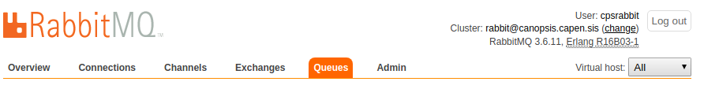
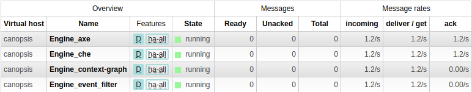
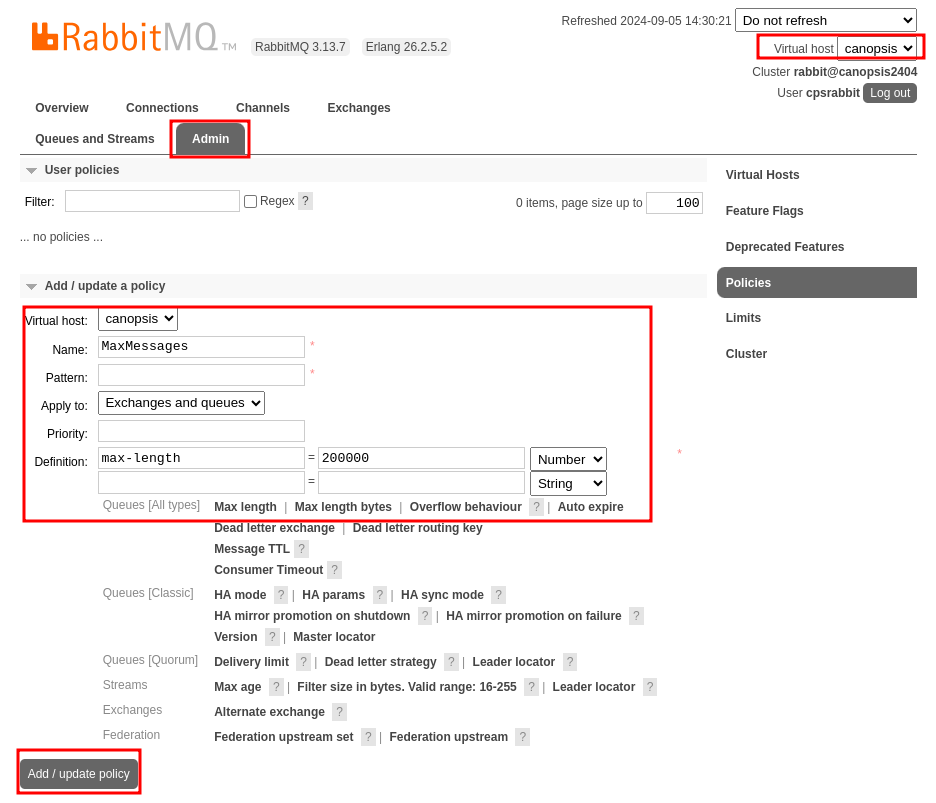
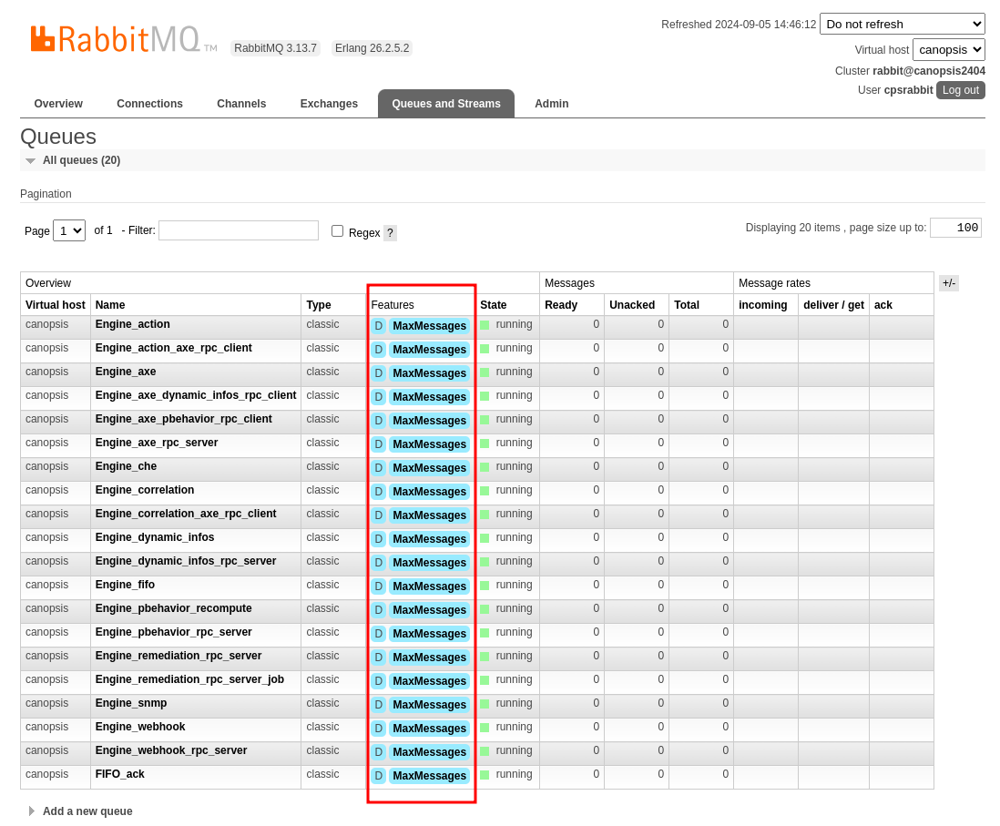

# Interface RabbitMQ

Dans le contexte d'une utilisation de Canopsis, RabbitMQ va vous servir à avoir une vision globale sur le bon fonctionnement de vos moteurs.
Vous pourrez y voir plusieurs informations utiles mais nous allons nous concentrer dans cette documentation à la section "Queues" qui nous montre le nombre de messages
en cours de traitement sur les différents moteurs de Canopsis.

**Rappel :**
L'interface de RabbitMQ est accessible via l'URL ```http://localhost:15672/```

## Gestion des files

Rendez-vous ici :



Vous y retrouverez un tableau comme celui-ci :



La première colonne *Overview* vous présente plusieurs informations telles que :

- **Virtual host :** Nom de la machine sur laquelle le moteur est présent.
- **Name :** Nom du moteur.
- **Feature :** Indique si l'architecture est en HA (haute disponibilité) ou non.
- **State :** État du moteur, peut être *running* ou *idle* (fonctionnement dégradé).

La seconde, *Messages*, vous présente :

- **Ready :** Nombre de messages prêts à être acquittés.
- **Unacked :** Nombre de messages qui ne sont pas encore acquittés.
- **Total :** Nombre de message total.

La troisième, *Message rates* permet d'avoir une idée sur les performances du moteur à gérer les files arrivantes. Trois statistiques permettent de juger l'efficacité en messages/seconde :

- **Incoming :** Nombre de messages arrivant dans le moteur.
- **Deliver / get :**
- **ack :**

Le but étant d'avoir une section "Messages" remplie de 0. Si ce n'est pas le cas, cela veut dire qu'un des moteurs de Canopsis est dans un état dégradé et n'assure plus sa gestion de files.
Dans ce cas plusieurs pistes de résolutions sont possibles :

## Plus de détails

Pour en savoir plus sur la configuration et l'état de santé d'un moteur, il vous suffit de cliquer sur le nom du moteur concerné.

Vous pourrez y retrouver l'*Overview* des **messages en attente** ainsi que le **taux de messages** par seconde que le moteur traite sous forme de tableau.

Les *Consumers* montrent les canaux connectés à la file d'attente, les *Bindings*, quant à eux, montrent les liaisons entre les exchanges et une file d'attente, vous avez aussi la possibilité d'ajouter des *bindings*.

*Publish message* permet de publier manuellement un message dans la file d'attente.

Afin de recevoir un message l'option *get messages* permet d'inspecter manuellement un message situé dans la file d'attente. Il est possible de le réintégrer dans la file d'attente.

*Delete* permet de supprimer la file d'attente, *Purge* permet de la vider.

## Policy

Afin d’éviter de remplir inutilement les files de RabbitMQ, il est possible de mettre en place une *policy*.

*Il est recommandé de mettre en place une telle politique. Le nombre de 200 000
(dans la commande ci-dessous) peut être revu en fonction du contexte.*


### Avec l'interface graphique

La procédure est la suivante :



Ensuite, vous devez voir apparaître votre policy sur les files dans l’onglet « Queues »:



### En ligne de commande

**Depuis un seul nœud**, invoquer la commande suivante:

```sh
rabbitmqctl set_policy --vhost canopsis --apply-to queues MaxMessages "" '{"max-length": 200000}'
```

## Aller plus loin

[Cette documentation](https://www.cloudamqp.com/blog/2015-05-27-part3-rabbitmq-for-beginners_the-management-interface.html#overview) peut vous permettre d'avoir plus de détails sur le fonctionnement général de l'interface de RabbitMQ.
