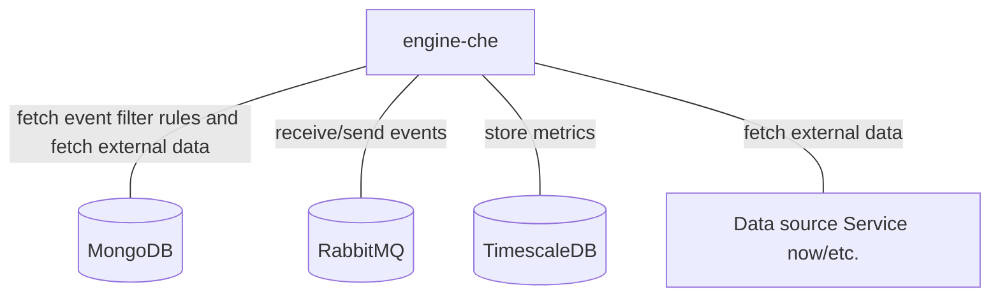

# Engine-che

## Services interactions

A simple schema which only displays direct interactions with all databases, RMQ, external APIs, etc.



## Detailed schemas

The following schemas display flows of events by each use-case of business logic.

### Create/update an entity on an event.

```mermaid
flowchart
    C[Canopsis connector]
    EF[engine-fifo]
    ECH[engine-che]
    EN[next engine]
    MDB[(MongoDB)]
    C -- 1 . Event --> EF
    EF -- 2 . Event --> ECH
    ECH -. 3 . Store entity .-> MDB
    ECH -- 4 . Event --> EN
```

### Event enrichment flow

```mermaid
flowchart
    C[Canopsis connector]
    EF[engine-fifo]
    ECH[engine-che]
    EN[next engine]
    MDB[(MongoDB)]
    DS[Data source Service now/etc.]
    C -- 1 . Event --> EF
    EF -- 2 . Event --> ECH
    ECH -. 3 . Fetch external data .-> DS
    ECH -. 4 . Store entity .-> MDB
    ECH -- 5 . Enriched event --> EN
```
