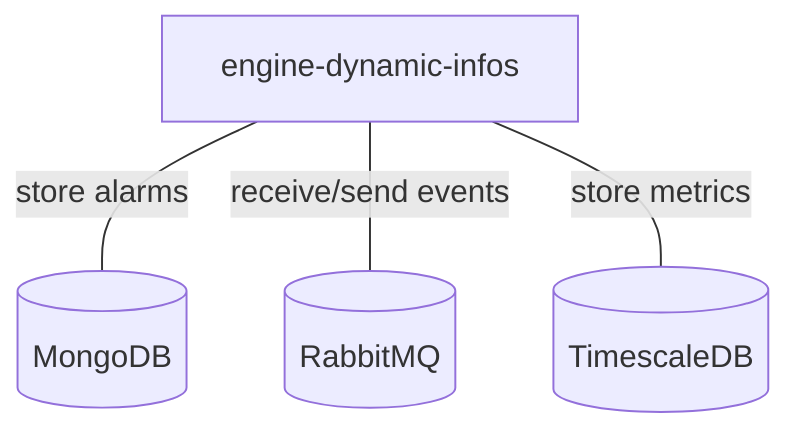

# Engine-dynamic-infos

## Services interactions

A simple schema which only displays direct interactions with all databases, RMQ, external APIs, etc.



## Detailed schemas

The following schemas display flows of events by each use-case of business logic.

### Add dynamic infos to an alarm on an event.

```mermaid
flowchart
    C[Canopsis connector]
    EF[engine-fifo]
    ECH[engine-che]
    EAX[engine-axe]
    EDI[engine-dynamic-infos]
    OE[other engines]
    EN[next engine]
    MDB[(MongoDB)]
    C -- 1 . Event --> EF
    EF -- 2 . Event --> ECH
    ECH -- 3 . Event --> EAX
    EAX -- 4 . Event --> OE
    OE -- 5 . Event --> EDI
    EDI -. 6 . Update alarm .-> MDB
    EDI -- 7 . Event --> EN
```

### Update alarms on a dynamic infos rule change.

```mermaid
flowchart
    A[API]
    EDI[engine-dynamic-infos]
    MDB[(MongoDB)]
    A -- 1 . Updated rule --> EDI
    EDI -. 2 . Update alarms .-> MDB
```
