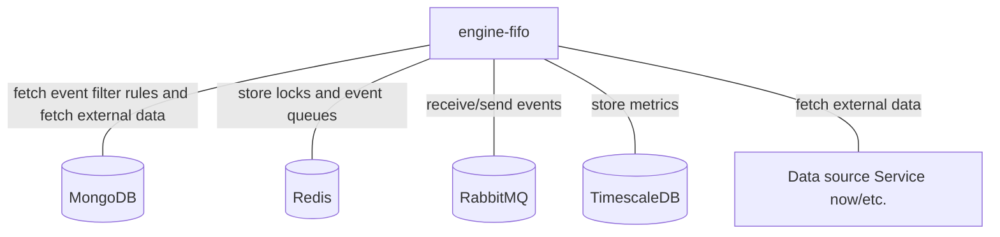

# Engine-fifo

## Services interactions

A simple schema which only displays direct interactions with all databases, RMQ, external APIs, etc.



## Detailed schemas

The following schemas display flows of events by each use-case of business logic.

### Event control flow

No event is processing at the moment for the same entity.

```mermaid
flowchart
    C[Canopsis connector]
    A[API]
    OE[Other engines]
    EF[engine-fifo]
    ECH[engine-che]
    EAC[engine-action]
    EN[next engines]
    R[(Redis)]
    C -- 1. Event --> EF
    A -- 1. Event --> EF
    OE -- 1. Event --> EF
    EF -.2. Check lock.-> R
    EF -- 3. Event --> ECH
    ECH -- 4. Event --> EN
    EN -- 5. Event --> EAC
    EAC -- 6. Ack event --> EF
    EF -. 7. Fetch next event.-> R
    EF -- 8. Next event--> ECH
```

An event is processing at the moment for the same entity.

```mermaid
flowchart
    C[Canopsis connector]
    A[API]
    OE[Other engines]
    EF[engine-fifo]
    R[(Redis)]
    C -- 1. Event --> EF
    A -- 1. Event --> EF
    OE -- 1. Event --> EF
    EF -.2. Check lock.-> R
    EF -. 3. Save event in queue.-> R
```

### Event enrichment flow

```mermaid
flowchart
    C[Canopsis connector]
    EF[engine-fifo]
    ECH[engine-che]
    DS[Data source Service now/etc.]
    C -- 1 . Event --> EF
    EF -. 2 . Fetch external data .-> DS
    EF -- 3 . Enriched event --> ECH
```
