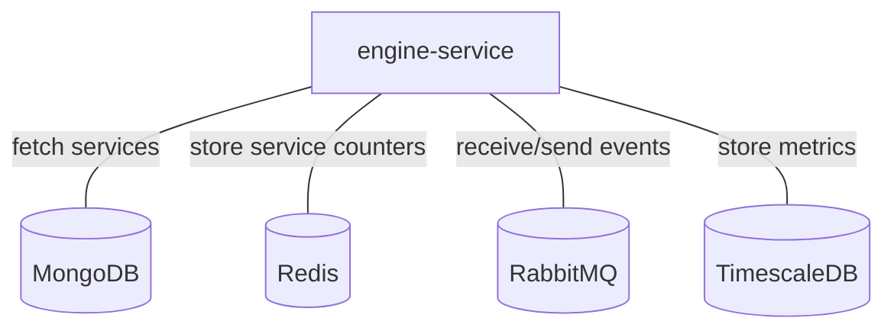

# Engine-service

## Services interactions

A simple schema which only displays direct interactions with all databases, RMQ, external APIs, etc.



## Detailed schemas

The following schemas display flows of events by each use-case of business logic.

### Create/update/remove a service.

```mermaid
flowchart
    A[API]
    EF[engine-fifo]
    ECH[engine-che]
    EAX[engine-axe]
    ESE[engine-service]
    MDB[(MongoDB)]
    R[(Redis)]
    A -- 1 . Compute event --> EF
    EF -- 2 . Compute event --> ECH
    ECH -. 3 . Update service dependencies .-> MDB
    ECH -- 4 . Compute event --> EAX
    EAX -- 5 . Compute event --> ESE
    ESE -. 6 . Update service counters .-> R
    ESE -- 7 . Check event for service --> EF
```

### Update a service on an alarm change.

```mermaid
flowchart
    C[Canopsis connector]
    EF[engine-fifo]
    ECH[engine-che]
    EAX[engine-axe]
    ESE[engine-service]
    MDB[(MongoDB)]
    R[(Redis)]
    C -- 1 . Event --> EF
    EF -- 2 . Event --> ECH
    ECH -. 3 . Update resource dependencies .-> MDB
    ECH -- 4 . Event --> EAX
    EAX -- 5 . Event --> ESE
    ESE -. 6 . Update service counters .-> R
    ESE -- 7 . Check event for service --> EF
```

### Update a service on scenario changes.

See [engine-action](./engine-action.md).
