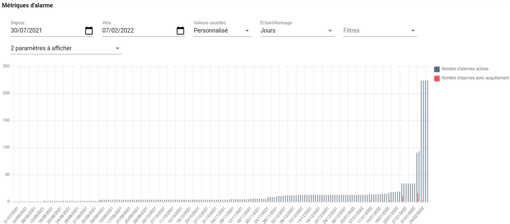
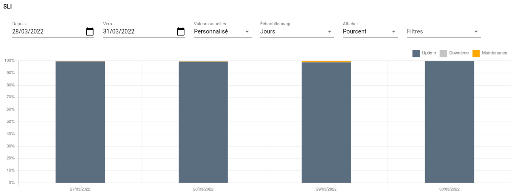

# Indicateurs statistiques et KPI

!!! Info
    Disponible uniquement en édition Pro.

Canopsis fournit des indicateurs statistiques et des indicateurs de performance (KPI).

#### Table des matières
1. [Utilisation](#utilisation) 
2. [Graphiques](#graphiques) 
 A. [Compteurs](#compteurs) 
 B. [Taux](#taux) 
 C. [Temps](#temps) 
 D. [Criticité](#criticite) 
 E. [SLI](#sli) 
3. [Filtres](#filtres) 
4. [Paramètres d’évaluation](#parametres-devaluation) 

## Utilisation

Dans le menu principal de Canopsis, cliquer sur le menu administration :

Dans le menu administration, cliquer sur le menu KPI :

Fonctionnalités disponibles :

## Graphiques
### Compteurs

| Nom            | Description     |
|----------------|-----------------|
| Alarmes Créées | Nombre d’alarmes créées pendant une période donnée (hors comportements périodiques). |
| Alarmes Résolues  | Nombre d’alarmes résolues (y compris les alarmes annulées) pendant une période donnée (hors comportements périodiques). |
| Alarmes Annulées  | Nombre d’alarmes annulées pendant une période donnée (hors comportements périodiques).  |
|  Alarmes Acquittées |  Nombre d’alarmes acquittées pendant une période donnée (hors comportements périodiques). |
| Nombre d’alarmes en cours pendant la période  | Nombre d’alarmes qui étaient actives pendant une période donnée (hors comportements périodiques).  |
| Nombre d’alarmes actuellement en cours  | Nombre d’alarmes qui sont actives à un instant donné.  |
| Nombre d’alarmes acquittées actuellement en cours  | Nombre d’alarmes actives et qui ont été acquittées à un instant donné.  |
| Nombre d’alarmes non acquittées actuellement en cours  |  Nombre d’alarmes actives et qui n’ont pas été acquittées à un instant donné. |
| Alarmes Actives | Nombre d’alarmes actives pendant une période donnée. |
| Alarmes Non-affichées | Nombre d’alarmes cachées. |
| Alarmes en cours de correction automatique | Nombre d’alarmes en cours de correction par un job inclus dans une consigne. |
| Alarmes avec PBehavior | Nombre d’alarmes couvertes par un comportement périodique d’arrêt de surveillance. |
| Alarmes Corrélées | Nombre d’alarmes déclenchées par une règle de corrélation. |
| Accusés de réception annulés | Nombre d’acquittements (ack) annulés. |
| Alarmes avec acks | Nombre d’alarmes ayant été acquittées. |
| Alarmes actives sans tickets | Nombre d’alarmes pour lesquelles aucun ticket n’est associé. |

### Taux

| Nom            | Description     |
|----------------|-----------------|
| Taux d’acquittement conforme SLA  | Pourcentage d’alarmes qui ont été acquittées en un temps conforme à un SLA (relatif à une configuration par widget et hors comportements périodiques)  |
| Taux de résolution conforme SLA  |  Pourcentage d’alarmes qui ont été résolues (y compris annulées) en un temps conforme à un SLA (relatif à une configuration par widget et hors comportements périodiques). |
| Taux d’alarmes corrélées | Pourcentage d’alarmes déclenchées par une règle de corrélation. |
| Taux d’alarmes avec correction automatique | Pourcentage d’alarmes corrigées par un job inclus dans une consigne. |
| Taux d’alarmes avec tickets créés | Pourcentage d’alarmes associés à un ticket. |
| Taux d’alarmes non-affichées | Pourcentages d’alarmes cachées. |

### Temps

| Nom            | Description     |
|----------------|-----------------|
|  Proportion du temps dans une criticité |  Pourcentage de temps passé par une entité dans une ou plusieurs criticités (relatif à une configuration par widget et hors comportements périodiques).   |
|  Temps passé dans une criticité | Temps passé par une entité dans une ou plusieurs criticités (relatif à une configuration par widget et hors comportements périodiques).  |
| Temps moyen entre les pannes (MTBF)  | Temps moyen entre les pannes sur une entité (hors comportements périodiques)  |
| Délai moyen d'acquittement des alarmes | Temps moyen d'acquittement des alarmes |
| Temps moyen pour résoudre des alarmes | Temps moyen avant passage des alarmes en état résolu. |
| Durée totale de l’activité | TODO |

### Criticité

| Nom            | Description     |
|----------------|-----------------|
|  Criticité courante | Criticité actuelle d’une entité : 0 pour OK, 1 pour Mineur, 2 pour Majeur et 3 pour Critique (comme dans la météo de service). |

### SLI

| Nom            | Description     |
|----------------|-----------------|
| SLI | Le Service Level Indicator montre le temps passé par le SI en bon fonctionnement, en maintenance et en panne |

## Filtres

## Paramètres d’évaluation
