# Affichage de consignes

!!! info
    Disponible uniquement en édition Pro.

Le moteur [`engine-dynamic-infos`](../menu-exploitation/informations-dynamiques.md) de Canopsis permet d'ajouter dynamiquement des informations aux alarmes.

Il est possible d'utiliser cette fonctionnalité pour ajouter des liens vers des consignes techniques aux alarmes, et pour afficher ces liens dans le Bac à alarmes et dans la Météo des services.

## Affichage d'une consigne

Les consignes sont définies grâce à des règles indiquant dans quelle conditions elles doivent être ajoutées à une alarme.

Cette partie présente la création d'une règle qui ajoute une consigne "Consigne technique 1" aux alarmes majeures et critiques du composant `server1`, et la configuration d'un Bac à alarmes affichant cette consigne.

### Création de la consigne

Pour créer une règle d'informations dynamiques, ouvrir le menu *Exploitation* (en haut à droite), cliquer sur *Informations dynamiques*, puis sur le bouton *Créer une information dynamique* (en bas à droite).

Le premier onglet de la modale *Créer une information dynamique* permet de donner un nom et une description à la règle.


Le deuxième onglet permet de définir les informations à ajouter aux alarmes. Pour pouvoir afficher une consigne, cette règle définit son titre (`label`) et la destination du lien (`url`) :

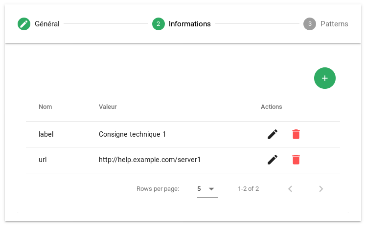

Le troisième onglet permet de définir des patterns, indiquant dans quelles conditions les informations doivent être présentes sur une alarme. Dans cet exemple, la consigne doit être affichée sur les alarmes majeures ou critiques du composant `server1` :

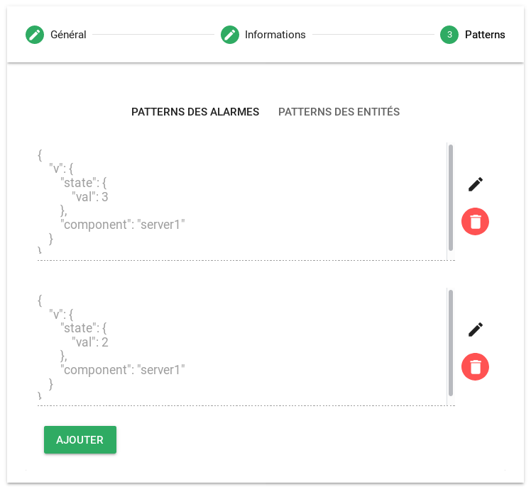

### Affichage dans le Bac à alarmes

Dans les *Paramètres avancés* d'un widget de type *Bac à alarmes*, ajouter une *Info popup* dans la colonne *Extra details* avec le template suivant :

```html
<strong>Consignes</strong>
<ul>
  {{#each alarm.v.infos}}
    <li><a href="{{url}}">{{label}}</a></li>
  {{/each}}
</ul>
```

Ce template itère sur les informations d'une alarme avec la commande `#each`, et les affiche dans une liste.

### Exemple

Lorsqu'une alarme majeure est créée sur une ressource du composant `server1`, cliquer sur l'icône  de la colonne *Extra details* du Bac à alarmes. Une *info popup* contenant le lien "Consigne technique 1" est ouverte :

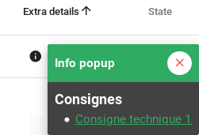

Lorsque cette alarme passe en criticité mineure, cliquer sur l'icône  de la colonne *Extra details* du Bac à alarmes. L'alarme ne correspond plus au pattern de la règle définie précédemment, l'*info popup* ne contient donc plus le lien "Consigne technique 1" :

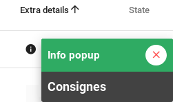

## Affichage de plusieurs consignes avec catégories

Cette partie présente la gestion de différents types d'informations, et la configuration d'un Bac à alarmes pour afficher des informations triées par type.

### Création des consignes

#### Modification de la première règle

Pour permettre l'affichage de différents types d'informations, une nouvelle information `type` est définie dans la règle précédente :

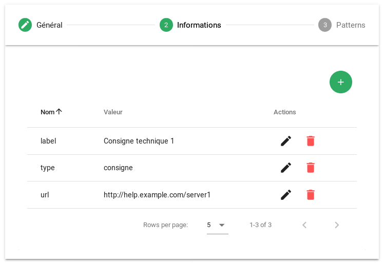

#### Deuxième règle

Cette règle ajoute une consigne "Consigne technique 2" aux alarmes du composant `server1` dont l'output contient "WARNING".

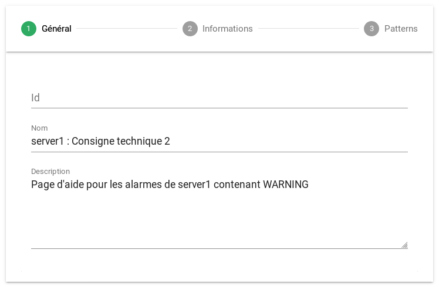

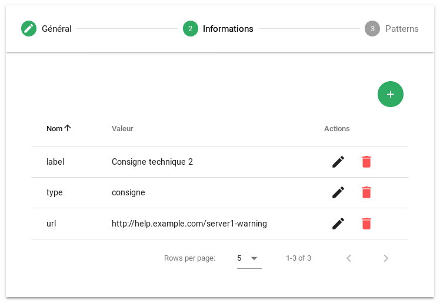

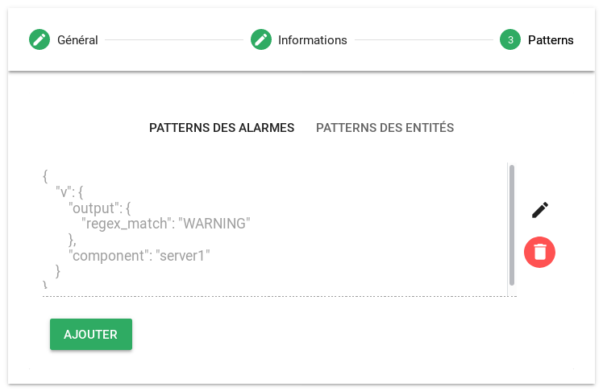

#### Troisième règle

Cette règle ajoute une page d'aide "Acquittement" aux alarmes non acquittées du composant `server1`.

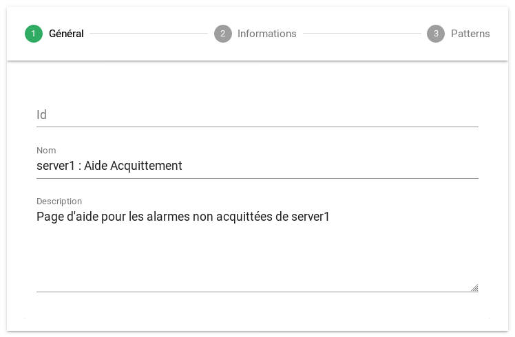

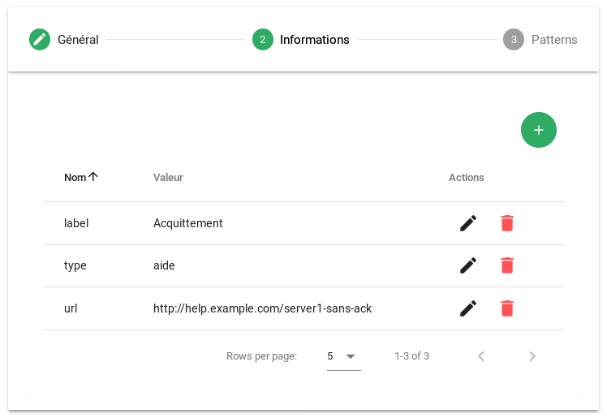

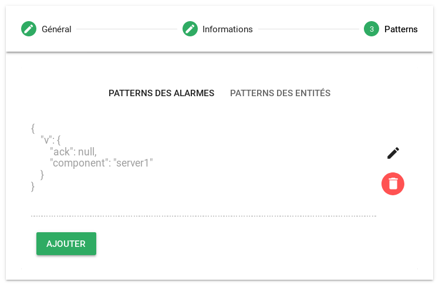

### Affichage dans le Bac à alarmes

Dans les *Paramètres avancés* d'un widget de type *Bac à alarmes*, modifier le template de l'*Info popup* de la colonne *Extra details* :

```html
<strong>Consignes</strong>
<ul>
  {{#each alarm.v.infos}}
    {{#compare type "==" "consigne"}}
      <li><a href="{{url}}">{{label}}</a></li>
    {{/compare}}
  {{/each}}
</ul>

<strong>Aides</strong>
<ul>
  {{#each alarm.v.infos}}
    {{#compare type "==" "aide"}}
      <li><a href="{{url}}">{{label}}</a></li>
    {{/compare}}
  {{/each}}
</ul>
```

Ce template utilise la commande `#compare` pour afficher uniquement les liens d'un certain type. Cela permet de filtrer les informations à afficher, et de les trier par catégorie.

### Exemple

Lorsqu'une alarme majeure est créée sur l'entité `cpu/server1`, les trois liens définis précédemment sont ajoutés.

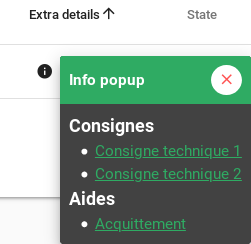

Lorsque l'alarme est acquittée, elle ne correspond plus à la deuxième règle. Le lien d'aide n'est donc plus présent.

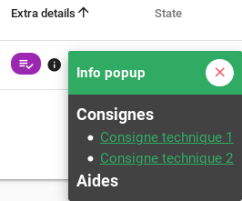

Si l'alarme passe en criticité mineure, et si son output ne contient plus "WARNING", elle ne correspond à aucune des règles, et ne contient donc aucun lien.

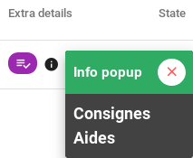
