# Comportements périodiques

Vous avez la possibilité, dans Canopsis, de définir des périodes pendant lesquelles des changements de comportements sont nécessaires :

* Plage de service d'une application : vous souhaitez repérer visuellement les applications qui doivent rendre un service à un moment donné.
* Maintenance : vous souhaitez déclarer en maintenance des entités pour que leurs alarmes ne remontent pas visuellement.
* Pause : vous souhaitez mettre en *pause* une application pour un temps indéterminé.

Pour cela vous allez utiliser des comportements périodiques (ou *pbehaviors*, pour *periodical behaviors*).

!!! Note
    Avec la v4 de Canopsis le fonctionnement des comportements périodiques à été complètement revu.
    Les informations qui figurent sur cette page ne sont donc valables que pour cette version.

Les cas d'usage détaillés dans cette documentation vous permettront de :

* Définir la plage de service d'une application
* Mettre en maintenance une entité

## Contexte

Considérons l'application `ERP` composée de différentes entités.

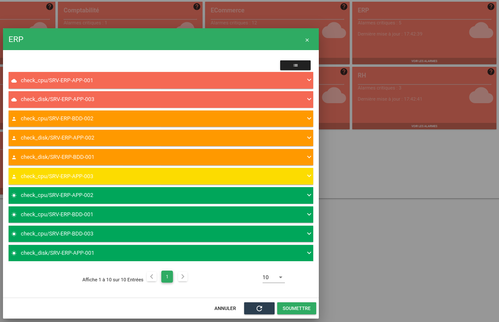

Vous aurez également créé une ou plusieurs raisons personnalisées par le biais de l'interface d'[administration de la planification](../../guide-administration/moteurs/moteur-pbehavior.md#administration-de-la-planification).

## Définition de la plage de service

Rendez-vous dans l'explorateur de contexte et recherchez votre service `ERP`.

Ajoutez-lui ensuite un comportement périodique en cliquant sur ce bouton.

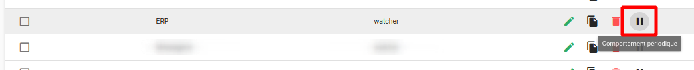

Pour créer une plage, du lundi au vendredi, de 19h15 à 8h :

* Sélectionnez sur le calendrier, la première occurrence de votre plage.

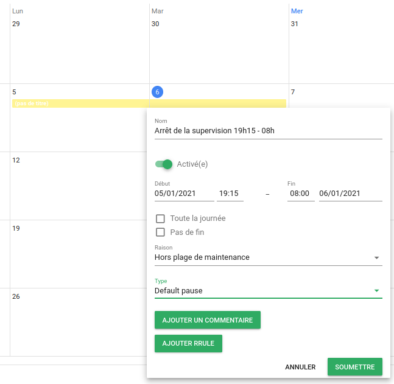

* Et ajoutez-lui une règle de récurrence du mardi au vendredi.

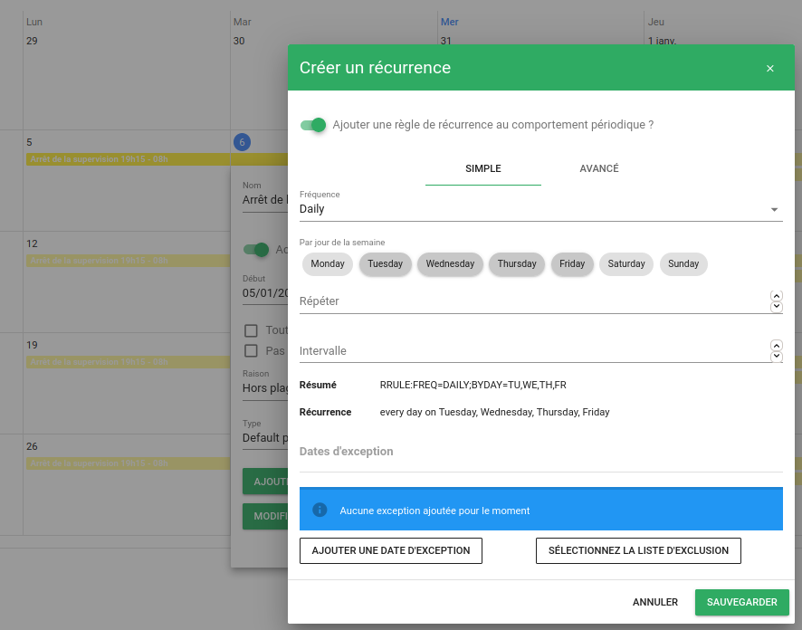

## Aperçu de la plage de service

Après avoir validé les différents formulaires, vous pouvez observer le résultat dans le calendrier.

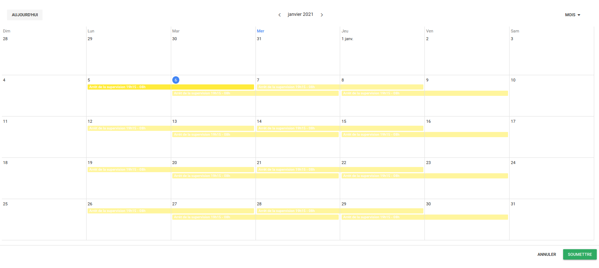

## Affichage dans la météo de services

Lorsque le comportement périodique créé précédemment est actif, la tuile se présente sous cette forme.

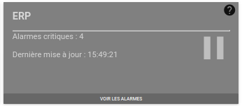

## Maintenance partielle

Si certaines entités d'une application ne sont pas en maintenance, la tuile s'affichera de cette façon.

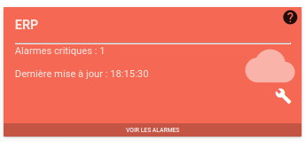

Vous pouvez également configurer le widget météo pour afficher plus d'informations sur les comportements actifs depuis les propriétés du widget.

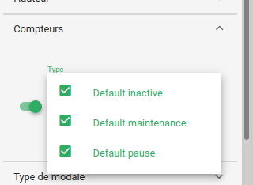

La tuile affichera alors des compteurs supplémentaires.

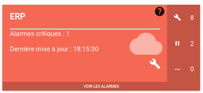

## Surcharge d'un comportement périodique

Si une application ou une entité possède déjà un comportement actif, tout nouveau comportement, **ayant une priorité plus élevée**, viendra surcharger les précédents.

Par exemple, l'application Messagerie a été mise en maintenance grâce à un premier comportement de type `maintenance`, priorité 2.

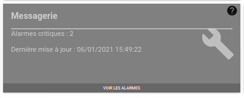

Si vous créez un nouveau comportement de type `pause`, priorité 3, alors que le précédent est toujours actif.

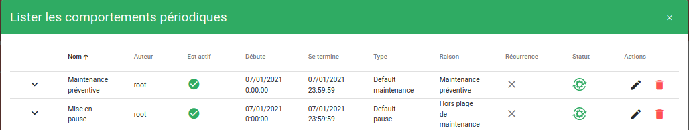

Vous observez que l'application est passée en pause.

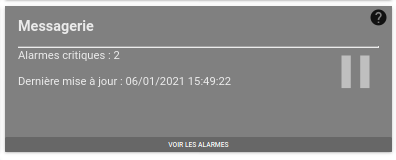

## Maintenance d'une entité

En parallèle des plages de services, vous pouvez déclarer des entités en maintenance par exemple.

Vous avez la possibilité de réaliser cette opération :

* **Depuis le panneau d'exploitation des comportements périodiques** : la mise en maintenance s'effectue à partir d'un filtre.
* **Depuis le Bac à alarmes** : dans ce cas, la mise en maintenance se fait de manière unitaire (en sélectionnant individuellement les alarmes concernées).
* **Depuis l'Explorateur de contexte** : la mise en maintenance se fait de manière unitaire sur des entités quelconques.

### Depuis le panneau d'exploitation

Pour cela, rendez-vous dans le menu Exploitation > Comportements périodiques, et ajoutez un comportement avec un filtre qui sélectionne les entités de *ERP*.

Cliquez d'abord sur le bouton `+` en bas à droite de la fenêtre.

Sélectionnez une date ou un intervalle de temps pendant lequel vous souhaitez que le comportement périodique soit actif. Vous pouvez sélectionner plusieurs dates en maintenant le bouton de la souris enfoncé et en la faisant glisser depuis la date de début jusqu'à la date de fin. Lorsque vous relâchez le bouton de la souris, la fenêtre de création s'affiche.

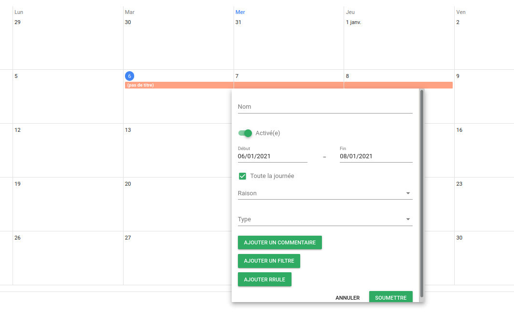

Remplissez les champs du formulaire puis cliquez sur le bouton Ajouter un filtre.

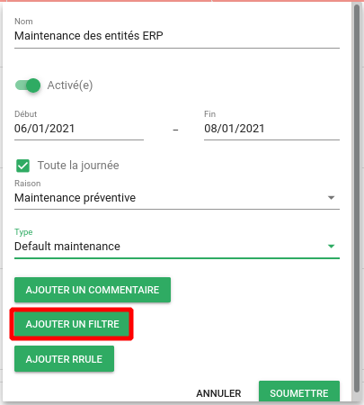

Créer ensuite votre filtre en fonction des variables des entités que vous souhaitez inclure.

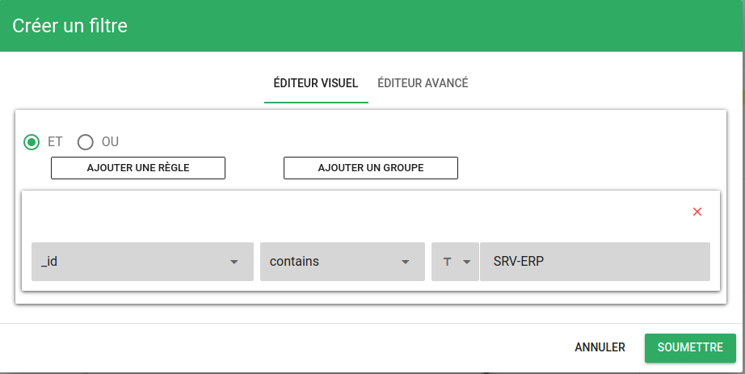  

Validez votre filtre avec le bouton Soumettre pour revenir au formulaire de création du comportement.
 
Vous pouvez alors afficher votre filtre au format JSON en passant le curseur sur l’icône `infos` apparue à coté du bouton pour ajouter un filtre.

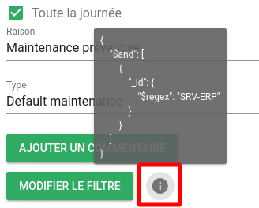

Validez ensuite le formulaire de création avec le bouton Soumettre et validez également le calendrier des comportements périodiques.

Les entités incluses dans votre filtre sont à présent en maintenance.  

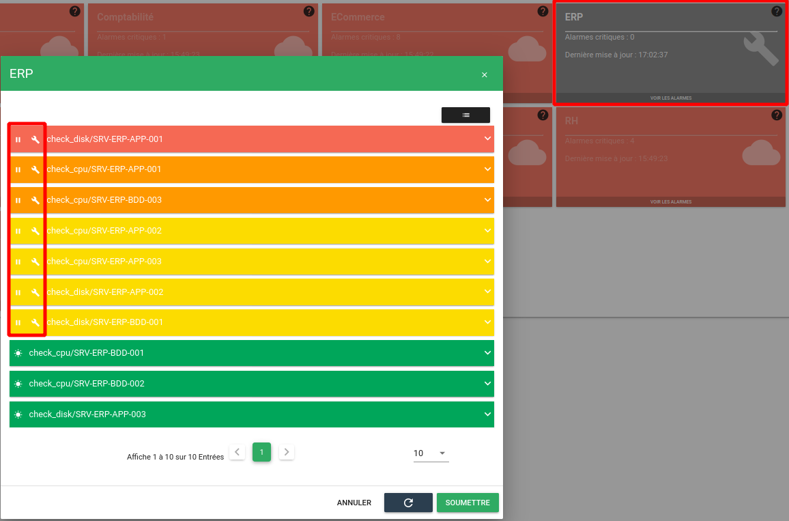  

Étant donné que ces entités constituent de manière exhaustive l'application *ERP*, l'application elle-même est considérée comme étant en maintenance.  

### Depuis le Bac à alarmes

#### Mettre une entité en maintenance

Depuis le Bac à alarmes, sélectionnez votre alarme et ajoutez-lui un comportement périodique par le biais de l'action dédiée.

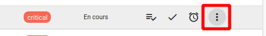  

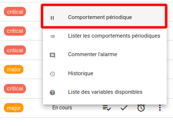  

Le processus est ensuite le même qu'en passant par l'interface d'exploitation, mis à part que le filtre sera généré automatiquement.

#### Filtrer les alarmes en fonction des comportements

Il est également possible d'appliquer des filtres sur les comportements périodiques.  

Les alarmes possèdent une variable `pbehavior`, qui contient elle-même des attributs sur lesquels on pourra filtrer. Pour accéder à la liste des variables, référez-vous à la capture précédente et cliquez sur Liste des variables disponibles.

Vous pourrez alors afficher les attributs de la variable `pbehavior` :

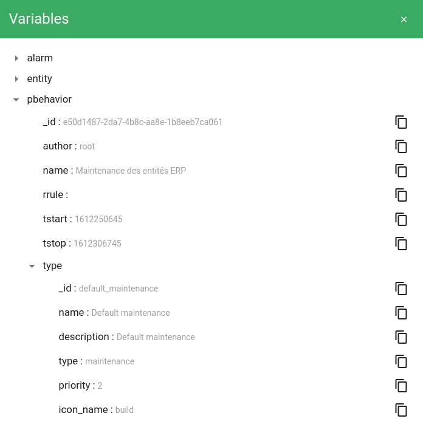

Sur un Bac à alarmes, vous pouvez ajouter un filtre en allant dans les propriétés du widget :

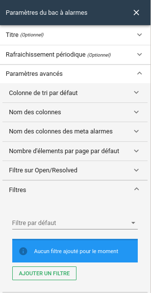  

Créez votre filtre à l'aide de l'éditeur.

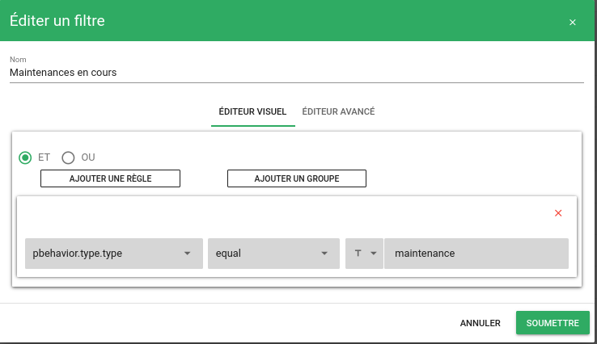  

Puis dans le widget bac à alarmes, sélectionnez le filtre nouvellement créé :

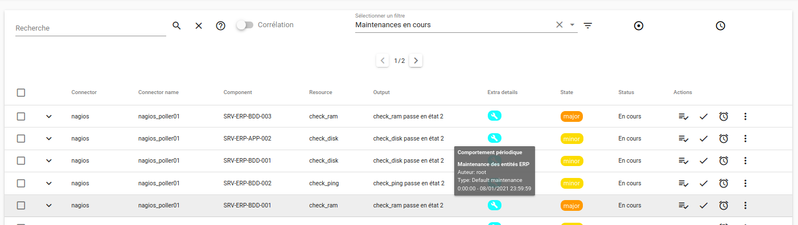  

Par ailleurs, la colonne `extra_details` affiche une icône pour signaler la présence d'un comportement périodique actif.  

### Depuis l'explorateur de contexte

La marche à suivre est identique à celle présentée pour mettre en place une plage de service :

* Rendez-vous dans l'Explorateur de contexte.
* Sélectionnez l'entité concernée
* Ajoutez un comportement périodique (le filtre est généré automatiquement).
