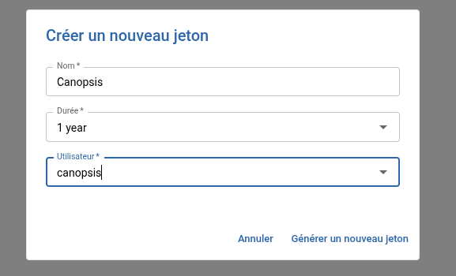
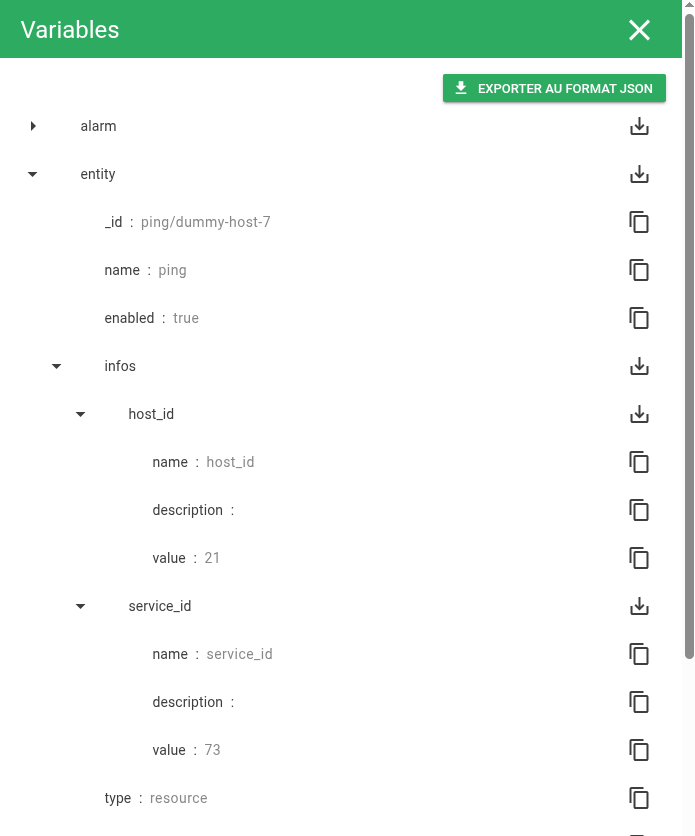
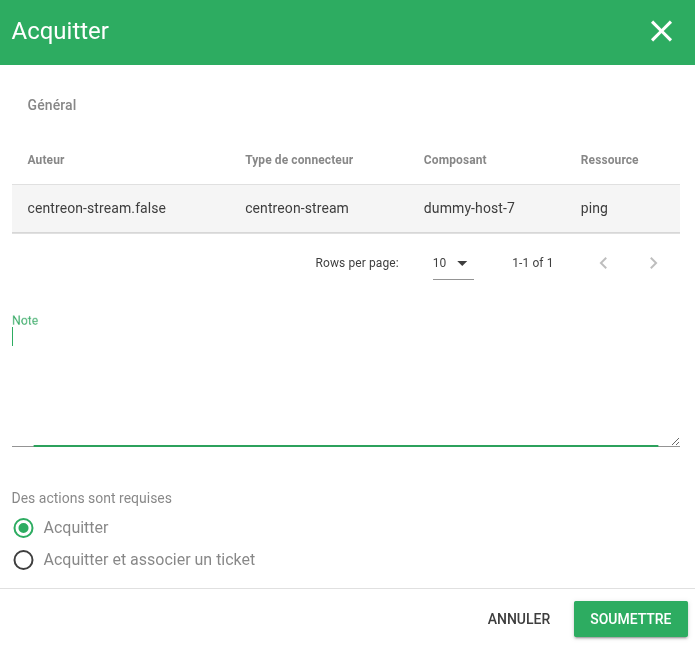
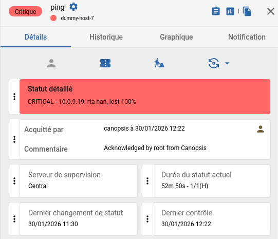

# Acquittement vers centreon

Lorsqu'un acquittement est positionné chez Centreon, il est aussi positionné sur l'alarme dans Canopsis. Ce cas d'usage montre comment positionner un acquittement sur Canopsis et qu'il soit positionné en retour sur Centreon.

## Pré-requis:
- Un Centreon avec le Stream Connector de configurer pour envoyer les événements de Centreon vers Canopsis : [Canopsis Events](https://docs.centreon.com/fr/docs/integrations/data-analytics/sc-canopsis-events/)
- Avoir créer un utilisateur Canopsis avec les bonnes ACL pour réaliser les actions suivantes.
    - Droits nécessaires:
        - Gestion des accès aux ressources :
            - Host Resources :
                - Hosts : `Include all hosts`
        - Gestion des accès sur les ressources :
            - Services Actions Access : 
                - `Acknowledge a service`
                - `Disacknowledge a service`
            - Hosts Actions Access : 
                - `Acknowledge a host`
                - `Disaknowledge a host`

## Documentation externe : 
- [Canopsis Events](https://docs.centreon.com/fr/docs/integrations/data-analytics/sc-canopsis-events/)
- [Gérer les droits des utilisateurs Centreon (ACL)](https://docs.centreon.com/fr/docs/administration/access-control-lists/)
- [Jetons d'API](https://docs.centreon.com/fr/docs/api/api-tokens/)
- [Centreon Web RestAPI](https://docs-api.centreon.com/api/centreon-web/25.10/)

## Centreon
### Créer un token API pour Canopsis

Une fois l'utilisateur pour Canopsis créé et que les ACL sont bien configurées, se rendre sur la page `Administration > API Tokens` et créer un token pour l'utilistaeur Canopsis



Récupérer et sauvegarder le token généré de côté pour le moment, il sera nécessaire plus tard.

## Canopsis
### Créer une règle d'enrichissement d'entité 

Pour pouvoir faire la requête d'acquittement vers Centreon, deux éléments seront nécessaires, le `host_id` et le `service_id`. Ces deux éléments devront être enrichi pour être placer dans les informations de l'entité et permettre d'utiliser ces valeurs dans le scénario.

Exemple d'un événement en sortie du Stream Connector : 
```json
[
	{
		"action_url": "",
		"component": "Host-name",
		"connector": "centreon-stream",
		"connector_name": "Central",
		"event_type": "check",
		"host_id": "15",
		"hostgroups": [
			"Group 1",
			"Group 2"
		],
		"long_output": "Plugin's long output",
		"notes_url": "",
		"output": "Plugin's output",
		"resource": "Service-name",
		"service_id": "47",
		"servicegroups": [],
		"source_type": "resource",
		"state": 1,
		"timestamp": 1708693347
	}
]
```

Créer une nouvelle règle d'enrichissement :

- Identifiant: `Enrichissement Centreon`
- Type: `Enrichissement`
- Description: `Copie les valeurs de host_id et le service_id pour les ajouter à l'entité`
- Modèles des événements:
  - Condition:
    - Recherché par: `Type du connecteur`
    - Condition: `Egal`
    - Valeur: `centreon-stream`
  - Et
    - Recherché par: `Extra Info`
    - Dictionnaire: `host_id`
    - Champ: `Nom`
    - Condition: `Existe`
  - Et
    - Recherché par: `Extra Info`
    - Dictionnaire: `service_id`
    - Champ: `Nom`
    - Condition: `Existe`
- Actions (1):
    - Type: `Copier une valeur d'un champ d'un événement vers une information d'une entité`
    - Nom: `host_id`
    - Valeur: `Event.ExtraInfos.host_id`
- Actions (2):
    - Type: `Copier une valeur d'un champ d'un événement vers une information d'une entité`
    - Nom: `service_id`
    - Valeur: `Event.ExtraInfos.service_id`

Une fois qu'un événement est envoyé et que l'alarme est créée, vérifier que les éléments apparaissent bien dans les informations de l'entité :



### Créer un scénario de type webhook

Créer un nouveau scénario de type webhook : 

- Nom: `Acquittement Centreon`
- Déclencheurs: `Alarme acquittée`
- Actions:
    - Type: `Webhook`
    - Transmettre l'auteur à l'étape suivante : `Oui`
    - Comportement si le pattern ne matche pas : `Fin`
    - Comportement en cas d'échec : `Fin`
    - Comportement en cas de succès : `Fin`
    - Général :
        - Méthode: `POST`
        - URL: `https://URL-DU-CENTREON/centreon/api/latest/monitoring/hosts/{{ .Entity.Infos.host_id.Value }}/services/{{ .Entity.Infos.service_id.Value }}/acknowledgements`
        - En-têtes
            - Clé d'en-tête: `X-AUTH-TOKEN`
            - Valeur d'en-tête: `Votre jeton`
        - Payload:
```json
{
"comment": "Acknowledged by {{ .Alarm.Value.ACK.Author }} from Canopsis",
"is_notify_contacts": false,
"is_persistent_comment": true,
"is_sticky": true
}
```
- Modèles des entités:
    - Condition:
        - Recherché par: `Type du connecteur`
        - Condition: `Egal`
        - Valeur: `centreon-stream/false`
    - Et
        - Recherché par: `Infos`
        - Dictionnaire: `host_id`
        - Champ: `Nom`
        - Condition: `Existe`
    - Et
        - Recherché par: `Infos`
        - Dictionnaire: `service_id`
        - Champ: `Nom`
        - Condition: `Existe`

## Tester un aquittement

Appliquer un acquittement côté Canopsis



Retourner sur Centreon et vérifier que l'acquittement est bien visible 

