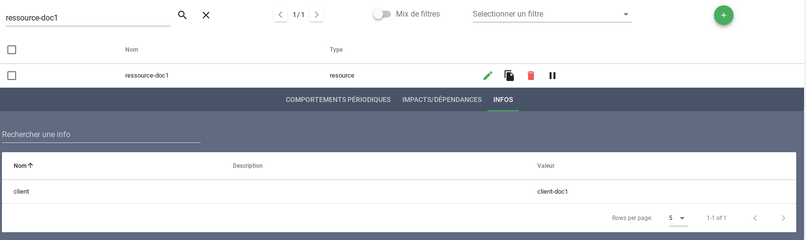

# L'enrichissement

Canopsis étant un hyperviseur, une des fonctions attendues concerne l'enrichissement de données.

Nous pouvons considérer que les informations transmises par les sources de données (et notamment les superviseurs) sont des informations *pauvres*.

Elles sont pauvres dans le sens où elles nous signifient dans la majeure partie des cas qu'il y a une alarme (ou une mise à jour d'alarme) concernant une entité.

!!! note "Une entité ?"
    Une entité est un composant typé (composant, ressource, service).

Pour aider les pilotes des centres d'opérations, il est indispensable d'enrichir ces informations et ainsi de qualifier au plus juste les alarmes à traiter.

Le but est donc de classer les alarmes et d'apporter de l'information objective sur des météos de services, afin de faciliter la prise de décision.

Plusieurs possibilités sont offertes dans Canopsis :

* Enrichissement systématique depuis les évènements
* Enrichissement conditionné par des règles de gestion appliquées aux évènements (Pro)
* Enrichissement par l'intermédiaire de référentiels externes (Pro)

## Enrichissement depuis les évènements

Vous avez paramétré des connecteurs de données qui transmettent des évènements à Canopsis. Un évènement est constitué d'attributs, certains sont obligatoires, d'autres facultatifs.

Considérons l'évènement suivant :

```json
{
    "resource": "ressource-doc1",
    "event_type": "check",
    "component": "composant-doc1",
    "connector": "cas-d-usage",
    "source_type": "resource",
    "state": 2,
    "connector_name": "cas-usage-enrichissement-evenement",
    "output": "doc cas d'usage",
    "client": "client-doc1"
}
```

En publiant cet évènement, l'attribut `client` ne sera pas interprété, car il ne participe pas à la spécification d'un évènement.

Vous souhaitez néanmoins que cette information soit disponible pour l'entité `ressource-doc1/composant-doc1`. Deux options du moteur `engine-che` sont nécessaires pour systématiser cette prise en charge :

* `-enrichContext` : active l'enrichissment à partir d'un évènement.
* `-enrichInclude "client"` : permet l'ajout de l'attribut `client` dans la champ `infos` de l'entité correspondante.

Pour rendre cette valeur visible sur l'interface de Canopsis, il faut ensuite l'ajouter manuellement. Pour cela, deux solutions :

* Pour un widget de manière générale (Plus d'infos, Info popup, Template) : `{{ entity.infos.client.value }}`
* Pour une colonne de Bac à alarmes : `entity.infos.client.value`


## Enrichissement via des règles de gestion

Dans Canopsis, il existe la possibilité de définir des règles **event-filter** dont le but est :

* de manipuler les attributs d'un évènement, d'une alarme, d'une entité ;
* d'enrichir les entités ;
* d'enrichir les entités à partir d'une collection de données externe (Pro).

La documentation complète se trouve [sur cette page](../menu-exploitation/filtres-evenements.md).

Prenons le cas d'usage suivant :

> Si l'évènement contient un attribut `"groupe" : "grp1"`, alors l'entité appartient au domaine métier « Logistique ».

Considérons l'évènement suivant :

```json
{
    "resource": "ressource-doc2",
    "event_type": "check",
    "component": "composant-doc2",
    "connector": "cas-d-usage",
    "source_type": "resource",
    "state": 2,
    "connector_name": "cas-usage-enrichissement-regle",
    "output": "doc cas d'usage",
    "groupe": "grp1"
}
```

Chose importante, les attributs pris en charge sont décrits [dans la partie sur les champs des évènements de la documentation de l'event-filter du moteur `engine-che`](../menu-exploitation/filtres-evenements.md).

Dans notre cas, l'attribut `groupe` est personalisé et sera donc *automatiquement* inséré dans un dictionnaire **`extrainfos`**.

On commence en ajoutant une règle via le menu adéquat :


Ensuite, on définit sur quels évènements sera exécutée cette règle. Dans notre cas, nous utilisons un critère tel que `connector_name`.


Dernière étape, nous allons récupérer le contenu de l'attribut `groupe` et le placer dans un nouvel attribut d'entité `domainemetier`.


!!! attention
    Pour manipuler l'entité comme nous venons de le faire, une opération préalable est nécessaire. Une règle de [copie d'entité](../menu-exploitation/filtres-evenements.md) doit être présente.

Le résultat pourra être observé sur un Bac à alarmes, par exemple :


## Enrichissement via référentiels externes

L'enrichissement par référentiel externe passe par le développement d'un *driver* dont le métier est de synchroniser un référentiel tiers avec le contexte Canopsis.

Dans l'édition Pro de Canopsis, il est notamment possible d'interconnecter les outils **Service Now** et **iTop**.

Pour plus d'informations, n'hésitez pas à [nous consulter](https://www.capensis.fr/canopsis/).

## Annexes

### Consulter le contexte

De manière générale, vous pouvez consulter le contenu de la base de données qui porte les entités, le Contexte.

Pour cela, vous devez instancier un widget « Explorateur de contexte » et y faire une recherche sur l'entité voulue.

Voici un exemple avec `ressource-doc1` :



Puis avec `ressource-doc2` :


