# Météo des Services

La Météo des services permet de représenter des états agrégés de services selon différentes règles.  
La documentation complète est disponible [ici](../../guide-utilisation/interface/widgets/meteo-des-services/index.md)

L'interface Canopsis utilise des *tuiles* pour représenter ces états.  
Une tuile correspond à l'état d'un *service*, qui est calculé selon des règles.  

!!! note
    Nous souhaitons représenter l'état de l'application *E-Commerce* sur une météo des services.
    Cette application est dépendante de 3 scénarios applicatifs :

    * Accès plate-forme
    * Workflow commande (Validation panier + Paiement)
    * Mon compte utilisateur

## Création des services

La première étape consiste à créer les services dans l'**explorateur de contexte**. À commencer par la création du service "Workflow commande" qui va regrouper les composants le constituant, puis le service "ECommerce" qui va regrouper les composants le constituant ainsi que le service "Workflow commande".

Ce qui donnerait un arbre de dépendance comme suit pour le service "ECommerce":

 * Accès plate-forme
 * Workflow commande
    * Validation panier
    * Paiement
 * Mon compte utilisateur

Pour créer un service, cliquer sur le "+" vert "add a new entity" puis le bouton bleu "add a new service entity".

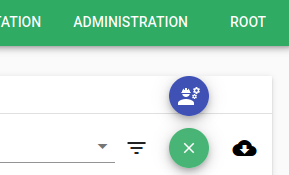

Dans la fenêtre qui s'ouvre, remplir les champs "Name", "Category" (en créer une nouvelle si besoin), "Impact level" et "Output template".

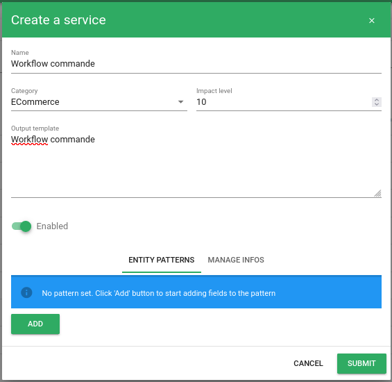

Puis ajouter les composants constituant le services avec le bouton "Add" sous "Entity patterns". Une nouvelle fenêtre s'ouvre alors.

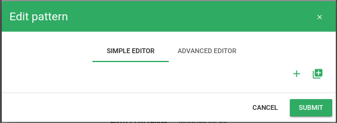

Cliquer sur le "+" correspondant à "add value rule field". Puis compléter les champs dans la nouvelle fenêtre.

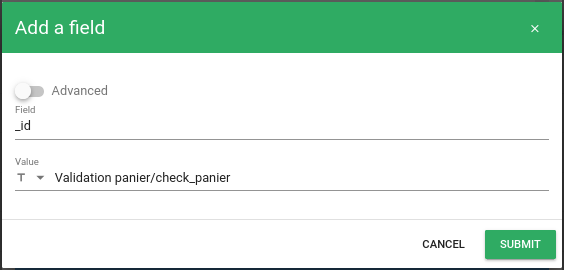

Valider l'ajout du champ.

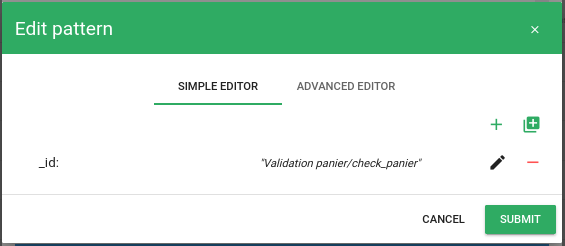

Valider l'ajout du pattern.

Puis recommencer les opérations afin d'ajouter au service, l'ensemble des composants le constituant.

Dans l'exemple, le service "Workflow commande" est constitué de ses éléments "Validation panier" et "Paiement".

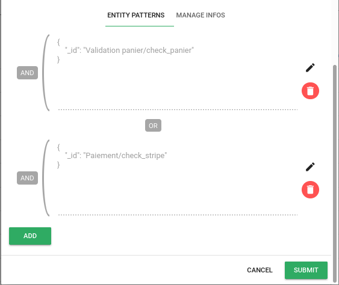

Valider la création du service puis créer le nouveau service "ECommerce".

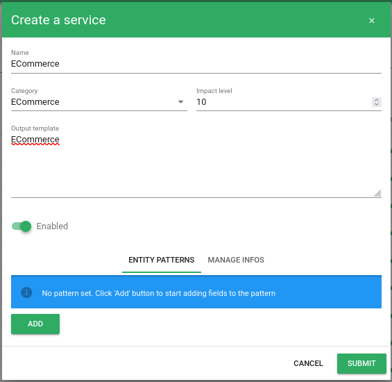

Puis ajouter les *patterns* de façon à ce que ce service comprenne les composants "Acces plateforme", "Mon compte" et le service "Workflow commande".

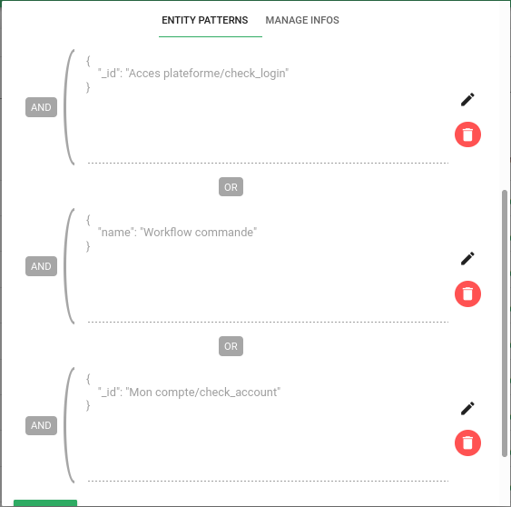

Lorsqu'on cliquqe sur le service "ECommerce" dans la liste des contextes, on peut aller visualiser l'arbre des dépendances (*tree of dependencies*).

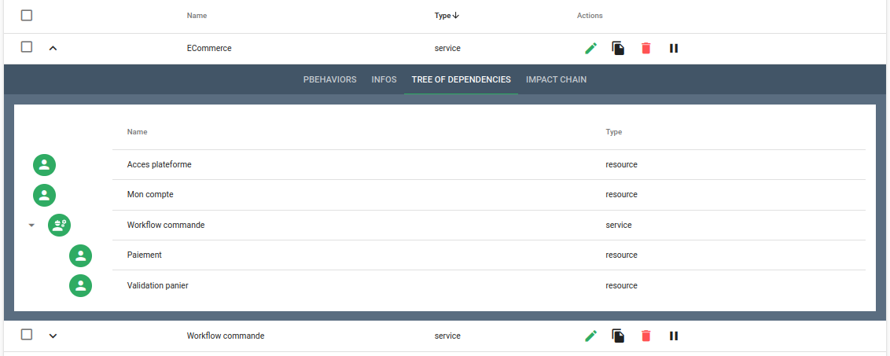

## Widget Service Weather

Pour ajouter le widget de météo, sélectionner "Service weather" dans la liste des widgets.

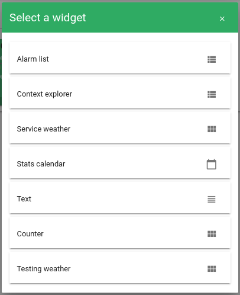  

À la validation de la création du widget, les deux services précédemments créés apparaissent sous forme de tuiles.

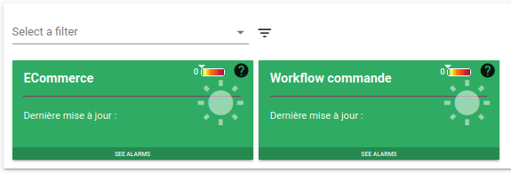

Au clic sur la tuile "ECommerce", on observe la liste des ses composants constituant le service.

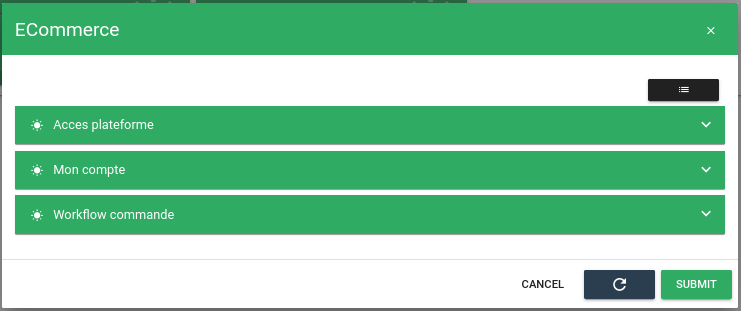

Ces modales peuvent être déroulées afin d'y consulter les *info* ainsi que l'arbre des dépendances.

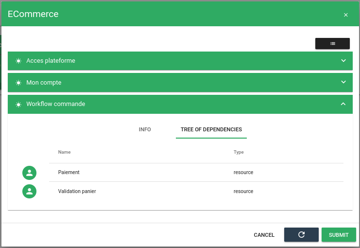

De même, pour la tuile "Workflow commande", les différents éléments apparaissent et des actions sont possibles.

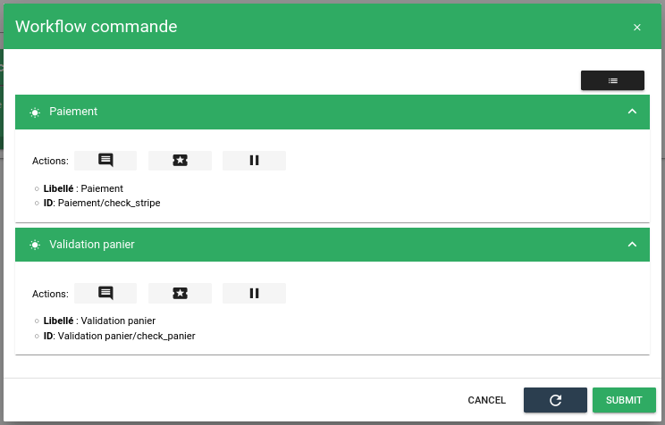

## Scénario

La phase de préparation est terminée.

Les éléments ont été paramétrés de manière manuelle, il est bien entendu beaucoup plus intéressant d'utiliser un mécanisme d'enrichissement par [synchronisation de référentiel externe](enrichissement.md#enrichissement-via-referentiels-externes) pour s'éviter ces opérations.  

Vous pouvez à présent simuler des alarmes sur les sous-éléments constituants et observer le comportement des tuiles de météo.  

Pour rappel la liste des éléments constituant:

* Accès plate-forme
* Validation panier
* Paiement
* Mon compte utilisateur

Il est possible de publier des événements sur ces 4 scénarios avec, par exemple, le [connecteur send-event](../../interconnexions/Transport/send_event.md).
