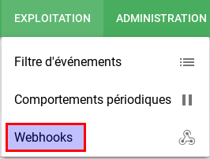
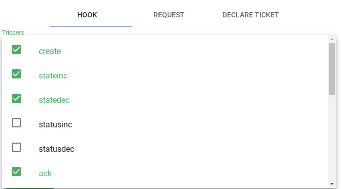
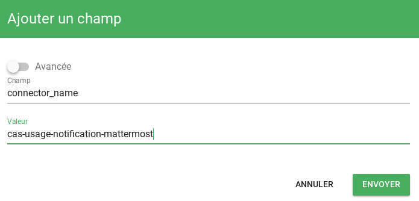
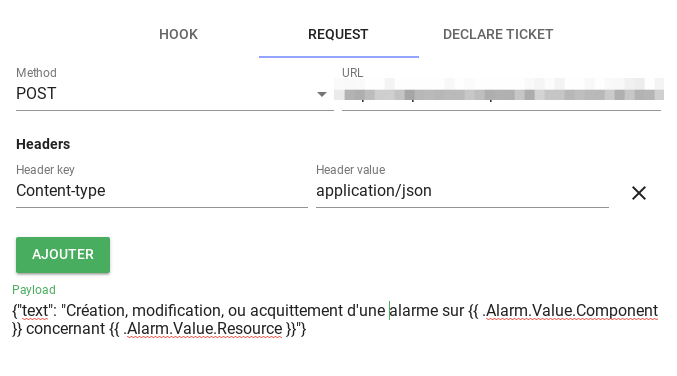
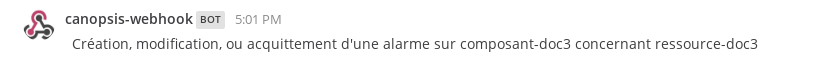
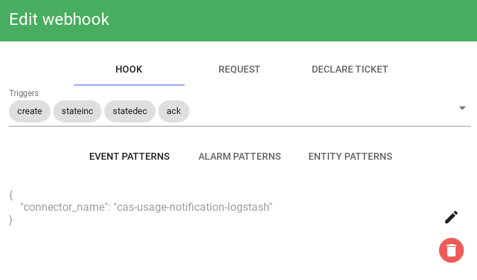
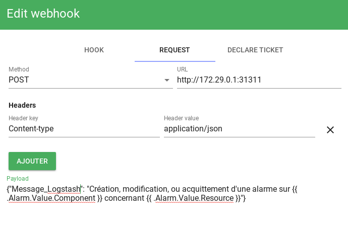

# Notifications vers un outil tiers

Canopsis est capable de *réagir* en fonction de critères objectifs afin de notifier un outil tiers en appelant une API HTTP.  
Ce guide vous propose d'interagir avec Mattermost et avec Logstash.  

!!! info
    Ces possibilités ne sont offertes que par l'utilisation de l'édition Pro de Canopsis.

Le moteur [`engine-webhook`](../menu-exploitation/scenarios.md) vous permet de prendre en charge cette fonctionnalité.

## Mattermost

Nous partons du principe que vous possédez une URL Mattermost valide pour publier du contenu.  

Prenons le cas d'usage suivant :

!!! note ""
    Je souhaite notifier Mattermost depuis Canopsis dans les cas suivants :
    Création d'alarme, Mise à jour de de criticité, acquittement d'un utilisateur

<!-- XXX: scénarios à partir de Canopsis 4.2.0 -->

Pour cela, rendez-vous dans le menu des **webhooks**

  

Vous devez créer un règle comme suit :

**Choix des triggers**

  

**Le pattern d'événements sur lesquels on applique la règle**

  

**La requête HTTP à exécuter**

  

Pour vérifier le résultat, nous considérons l'événement suivant :  

```json
{
  "resource": "ressource-doc3",
  "event_type": "check",
  "component": "composant-doc3",
  "connector": "cas-d-usage",
  "source_type": "resource",
  "state": 2,
  "connector_name": "cas-usage-notification-mattermost",
  "output": "doc cas d'usage"
}
```

Une fois publié, vous pourrez consulter votre canal Mattermost

  

## Logstash

Nous partons du principe que vous possédez un logstash à l'écoute.  
Pour information, voici la configuration minimaliste utilisée pour l'exemple :

```
input {
  http {
    host => "0.0.0.0"
    port => 31311
  }
}

output {
  stdout {
    codec => rubydebug
  }
}
```

Prenons le cas d'usage suivant :

!!! note ""
    Je souhaite envoyer un message HTTP à Logstash depuis Canopsis dans les cas suivants :
    Création d'alarme, Mise à jour de criticité, acquittement d'un utilisateur

<!-- XXX: scénarios à partir de Canopsis 4.2.0 -->

Pour cela, rendez-vous dans le menu des **webhooks**

  

Vous devez créer un règle comme suit :

**Choix des triggers et pattern**

  

**La requête HTTP à exécuter**

  

Pour vérifier le résultat, nous considérons l'événement suivant :  

```json
{
  "resource": "ressource-doc4",
  "event_type": "check",
  "component": "composant-doc4",
  "connector": "cas-d-usage",
  "source_type": "resource",
  "state": 2,
  "connector_name": "cas-usage-notification-logstash",
  "output": "doc cas d'usage"
}
```

Une fois publié, vous pourrez consulter le résultat sur la console de debug de Logstash

```
{
  "host" => "172.21.0.1",
  "Message_Logstash" => "Création, modification, ou acquittement d'une alarme sur composant-doc4 concernant ressource-doc4",
  "@timestamp" => 2019-02-26T16:46:38.249Z,
  "@version" => "1",
  "headers" => {
    "http_host" => "172.29.0.1:31311",
    "http_version" => "HTTP/1.1",
    "http_accept_encoding" => "gzip",
    "request_method" => "POST",
    "http_user_agent" => "Go-http-client/1.1",
    "content_length" => "122",
    "request_uri" => "/",
    "content_type" => "application/json",
    "request_path" => "/"
  }
}
```

## Notification Mail

Pour la notification par mail, nous nous appuyons sur une instance de Logstash à l'écoute.

### Configuration de logstash pour l'envoi de mail

#### Configuration générique

Ajoutez le fichier `/etc/logstash/conf.d/http.conf` pour pouvoir écouter sur son port HTTP :

```bash
input {
  http {}
}
```

Ajoutez le fichier `/etc/logstash/conf.d/email.conf` pour pouvoir configurer la notification :

```bash
output {
  email {
    to => "%{recipient}"
    from => 'monitor@example.org'
    subject => "%{subject}"
    template_file => "/etc/logstash/conf.d/email.tpl"
    address => "localhost"
    port => 25
  }
}
```

Les champs `address` et `port` correspondent aux informations du serveur SMTP (ici
`localhost`).

Si votre serveur requiert une authentification ou l'utilisation de STARTTLS,
vous pouvez utiliser les clefs de configuration :

- `username`
- `password`
- `use_tls` (true/false)

Ajoutez enfin le fichier `/etc/logstash/conf.d/email.tpl` qui servira de modèle pour l'envoi d'email :

```html
<pre>
Bonjour,

Une alarme a été créée sur le composant {{component}} :

Statut : {{status}}

Connecteur : {{connector}}
Ressource : {{resource}}

<a href="http://URL_CANOPSIS/alarms/{{_id}}">Lien vers l'alarme</a>
--
Canopsis webhook
</pre>
```

Note : Le modèle est en HTML.

#### Variante : emails `text/plain`

Si on veut plutôt envoyer des emails au format `text/plain`, utiliser la configuration suivante pour le fichier `/etc/logstash/conf.d/email.conf`

```bash
output {
  email {
    to => "%{recipient}"
    from => 'monitor@example.org'
    subject => "%{subject}"
    address => "localhost"
    port => 25
    body => "Ceci est un email au format texte, avec une %{variable}"
  }
}
```

#### Variante : Destinataires différenciés

Ici nous voulons avoir 2 envois d'emails différenciés, suivant que le `webhook` déclenché contienne le champ `reportalarm` ou le champ `declareticket`.

Le fichier `/etc/logstash/conf.d/email.conf` :

```
output {
  if [is_webhook_reportalarm] {
    email {
      address => "smtp.serveur.fr"
      port => 25
      from => "%{from}"
      to => "%{to}"
      subject => "%{subject}"
      body => "Report d'alarme \n\nComposant        : %{component}\nResource         : %{resource}\nConnecteur       : %{connector}\nNom du connecteur: %{connector_name}\nSource type      : %{source_type}\nStatus           : %{status}\nState            : %{state}\n\nCommentaire      : %{comment}"
      }
  }
  if [is_webhook_declareticket] {
    email {
      address => "smtp.serveur.fr"
      port => 25
      from => "%{from}"
      to => "%{to}"
      subject => "%{subject}"
      body => "Canopsis %{timestamp}||%{formattedDate} | %{ackAuthor}| |%{component}||||COMPOSANT: %{component} RESSOURCE: %{resource} |||||||%{outputStripped}||||||"
    }
  }
}
```

### Configuration du webhook

#### Envoi d'email générique

Créez un webhook en spécifiant les conditions de déclenchement que vous
souhaitez.

Dans la section request, ajoutez les paramètres suivants :

- Method: `POST`
- URL : L'url configurée pour l'input HTTP de logstash (le port par défaut est
  8080)
- Un header : `Content-Type`/`application/json`
- Payload :
```json
{
    "connector": "{{ .Alarm.Value.Connector }}",
    "status": "{{ .Alarm.Value.Status }}",
    "resource": "{{ .Alarm.Value.Resource }}",
    "component": "{{ .Alarm.Value.Component }}",
    "subject": "Notification Canopsis",
    "recipient": "local@example.org"
}
```

Ajustez à votre convenance le sujet ainsi que les destinataires du mail.

#### Envoi d'emails différenciés

Ici nous avons 2 webhooks, un qui inclut le champ `reportalarm` et un qui inclut le champ `declareticket`.

##### Reportalarm

- Method: `POST`
- URL : L'url configurée pour l'input HTTP de logstash (le port par défaut est
  8080)
- Un header : `Content-Type`/`application/json`
- Payload :

```json
{
   "is_webhook_reportalarm": "webhook_reportalarm",
   "subject": "Canopsis [Test Preprod]",
   "from": "User test <user_test@test.fr>",
   "to": "user_test@test.fr",
   "timestamp": "{{ .Event.Timestamp.Unix }}",
   "formattedDate": "{{ .Event.Timestamp | formattedDate "2006-02-01 15:04:05" }}",
   "ackAuthor": "{{ .Alarm.Value.ACK.Author }}",
   "component": "{{ .Alarm.Value.Component }}",
   "resource": "{{ .Alarm.Value.Resource }}",
   "connector": "{{ .Alarm.Value.Connector }}",
   "connector_name": "{{ .Alarm.Value.ConnectorName }}",
   "status": "{{ .Alarm.Value.Status.Value }}",
   "state": "{{ .Alarm.Value.State.Value }}",
   "comment": "{{ .Event.Output | split "~~" 2 }}"
}
```

##### Declareticket

- Method: `POST`
- URL : L'url configurée pour l'input HTTP de logstash (le port par défaut est
  8080)
- Un header : `Content-Type`/`application/json`
- Payload :

```json
{
   "is_webhook_declareticket": "webhook_declareticket",
   "subject": "Canopsis [Test Preprod]",
   "from": "User test <user_test@test.fr>",
   "to": "user_test@test.fr",
   "timestamp": "{{ .Event.Timestamp.Unix }}",
   "formattedDate": "{{ .Event.Timestamp | formattedDate "2006-02-01 15:04:05" }}",
   "ackAuthor": "{{ .Alarm.Value.ACK.Author }}",
   "component": "{{ .Alarm.Value.Component }}",
   "resource": "{{ .Alarm.Value.Resource }}",
   "outputStripped": {{ .Alarm.Value.State.Message | replace "\\\\n" "" | replace "\\n" "" | json }}
}
```
