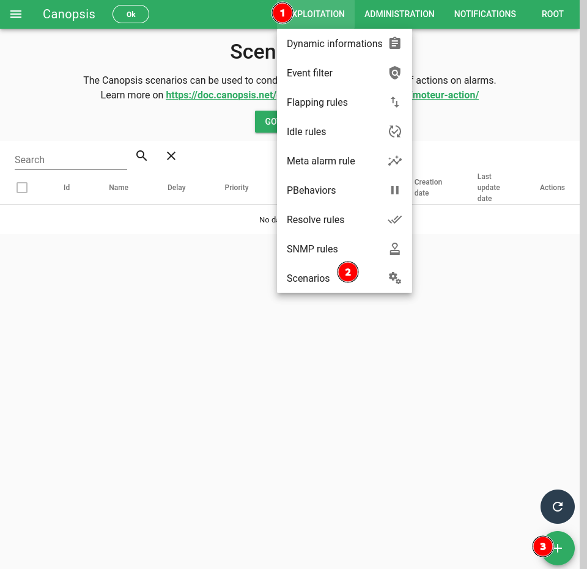
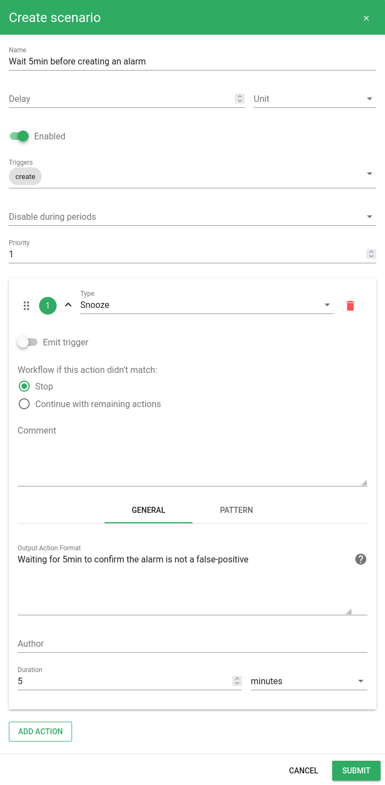

# Période de confirmation pour les nouvelles alarmes

Certaines sources de données peuvent remonter des alarmes qui ont tendance à se résoudre sans intervention au bout d'un certain temps.
Canopsis permet de trier ces faux positifs.

## Configuration

Rendez vous dans l'interface de gestion des *scenarios* et créez en un nouveau.



Configurez le comme ci-dessous avec comme alarm pattern :
```json
{
    "v": {
        "state": {
            "val": {
                ">": 0
            }
        }
    }
}
```



Lors de la réception d'une alarme, elle sera automatiquement ignorée pendant 5 minutes. Ce délai peut permettre à un évènement résolvant cette alarme d'arriver.

Si la configuration fonctionne vous devriez voir cet icône  sur les alarme arrivant dans le bac.


