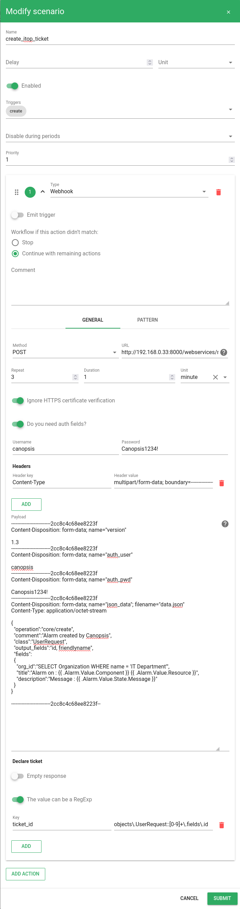
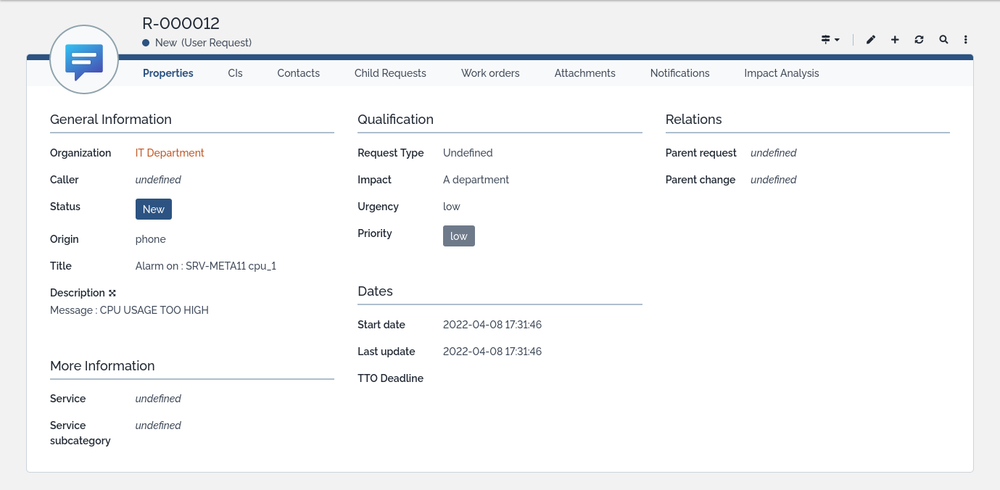

# Scenarios

## Période de confirmation pour les nouvelles alarmes

Certaines sources de données peuvent remonter des alarmes qui ont tendance à se résoudre sans intervention au bout d'un certain temps.
Canopsis permet de trier ces faux positifs.

### Configuration

Rendez vous dans l'interface de gestion des *scenarios* et créez en un nouveau.


Configurez le comme ci-dessous avec comme alarm pattern :
```json
{
    "v": {
        "state": {
            "val": {
                ">": 0
            }
        }
    }
}
```


Lors de la réception d'une alarme, elle sera automatiquement ignorée pendant 5 minutes. Ce délai peut permettre à un évènement résolvant cette alarme d'arriver.

Si la configuration fonctionne vous devriez voir cet icône  sur les alarme arrivant dans le bac.

## Création de tickets dans Itop à la récéption d'une alarme

### Configuration

Rendez vous dans l'interface de gestion des *scenarios* et créez en un nouveau.


Configurez le comme ci-dessous avec comme alarm pattern (adaptez la configuration à votre besoin):
```json
{
    "v": {
        "state": {
            "val": {
                ">": 0
            }
        }
    }
}
```



```json
{
	"_id": "5cccf32a-94b1-40eb-b04c-1820d3f0d8d7",
	"name": "create_itop_ticket",
	"author": "root",
	"enabled": true,
	"disable_during_periods": [],
	"triggers": [
		"create"
	],
	"actions": [
		{
			"type": "webhook",
			"comment": "",
			"parameters": {
				"declare_ticket": {
					"empty_response": false,
					"is_regexp": true,
					"ticket_id": "objects\\.UserRequest::[0-9]+\\.fields\\.id"
				},
				"request": {
					"auth": {
						"password": "Canopsis1234!",
						"username": "canopsis"
					},
					"headers": {
						"Content-Type": "multipart/form-data; boundary=------------------------2cc8c4c68ee8223f"
					},
					"method": "POST",
					"payload": "--------------------------2cc8c4c68ee8223f\nContent-Disposition: form-data; name=\"version\"\n\n1.3\n--------------------------2cc8c4c68ee8223f\nContent-Disposition: form-data; name=\"auth_user\"\n\ncanopsis\n--------------------------2cc8c4c68ee8223f\nContent-Disposition: form-data; name=\"auth_pwd\"\n\nCanopsis1234!\n--------------------------2cc8c4c68ee8223f\nContent-Disposition: form-data; name=\"json_data\"; filename=\"data.json\"\nContent-Type: application/octet-stream\n\n{\n  \"operation\":\"core/create\",\n  \"comment\":\"Alarm created by Canopsis\",\n  \"class\":\"UserRequest\",\n  \"output_fields\":\"id, friendlyname\",\n  \"fields\":\n  {\n    \"org_id\":\"SELECT Organization WHERE name = 'IT Department'\",\n    \"title\":\"Alarm on : {{ .Alarm.Value.Component }} {{ .Alarm.Value.Resource }}\",\n    \"description\":\"Message : {{ .Alarm.Value.State.Message }}\"\n  }\n}\n\n--------------------------2cc8c4c68ee8223f--",
					"skip_verify": true,
					"url": "http://192.168.0.33:8000/webservices/rest.php"
				},
				"retry_count": 3,
				"retry_delay": {
					"unit": "m",
					"value": 1
				}
			},
			"alarm_patterns": [
				{
					"v": {
						"state": {
							"val": {
								">": 0
							}
						}
					}
				}
			],
			"entity_patterns": null,
			"drop_scenario_if_not_matched": false,
			"emit_trigger": false
		}
	],
	"priority": 1,
	"delay": null,
}
```


Lors de la réception d'une alarme, un ticket sera automatiquement créé sur Itop.

Si la configuration fonctionne vous devriez voir apparaitre un ticket dans Itop :


