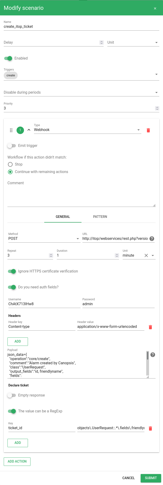

# Scenarios

## Période de confirmation pour les nouvelles alarmes

Certaines sources de données peuvent remonter des alarmes qui ont tendance à se résoudre sans intervention au bout d'un certain temps.
Canopsis permet de trier ces faux positifs.

### Configuration

Rendez vous dans l'interface de gestion des *scenarios* et créez en un nouveau.


Configurez le comme ci-dessous avec comme alarm pattern :
```json
{
    "v": {
        "state": {
            "val": {
                ">": 0
            }
        }
    }
}
```


Lors de la réception d'une alarme, elle sera automatiquement ignorée pendant 5minutes. Ce délai peut permettre à un évènement résolvant cette alarme d'arriver.

Si la configuration fonctionne vous devriez voir cet icône  sur les alarme arrivant dans le bac.

## Création de tickets dans Itop à la récéption d'une alarme

### Configuration

Créez le scenario suivant dans Canopsis:

!!! info Note
	Pensez à mettre à jour l'URL ainsi que les paramètres d'authentification pour qu'ils correspondent à votre instance Itop.

<details>

<summary>Requête CURL pour envoyer la configuration à Canopsis.</summary>
```bash
curl -X POST -u root:root -H "Content-type: application/json" -d '{
	"name" : "create_itop_ticket",
	"author" : "root",
	"enabled" : true,
	"disable_during_periods" : [ ],
	"triggers" : [
		"create"
	],
	"actions" : [
		{
			"type" : "webhook",
			"comment" : "",
			"parameters" : {
				"declare_ticket" : {
					"empty_response" : false,
					"is_regexp" : true,
					"ticket_id" : "objects\\.UserRequest::.*\\.fields\\.friendlyname"
				},
				"request" : {
					"auth" : {
						"username" : "admin",
						"password" : "ChAtX713IHw8"
					},
					"headers" : {
						"Content-type" : "application/x-www-form-urlencoded"
					},
					"method" : "POST",
					"payload" : "json_data={\n  \"operation\":\"core/create\",\n  \"comment\":\"Alarm created by Canopsis\",\n  \"class\":\"UserRequest\",\n  \"output_fields\":\"id, friendlyname\",\n  \"fields\":\n  {\n    \"org_id\":\"SELECT Organization WHERE name = \\\"Demo\\\"\",\n    \"title\":\"Alarm on : {{ .Alarm.Value.Component }} {{ .Alarm.Value.Resource }}\",\n    \"description\":\"Message : {{ .Alarm.Value.State.Message }}\",\n    \"functionalcis_list\" : [{\"functionalci_id\":\"SELECT Server WHERE name=\\\"{{ .Alarm.Value.Component}}\\\"\"}]\n  }\n}",
					"skip_verify" : true,
					"url" : "http://itop/webservices/rest.php?version=1.3&login_mode=basic"
				},
				"retry_count" : 3,
				"retry_delay" : {
					"unit" : "m",
					"value" : 1
				}
			},
			"alarm_patterns" : [
				{
					"v" : {
						"state" : {
							"val" : {
								">" : 0
							}
						}
					}
				}
			],
			"entity_patterns" : null,
			"drop_scenario_if_not_matched" : false,
			"emit_trigger" : false
		}
	],
	"priority" : 3,
	"delay" : null
}' 'http://localhost:8082/api/v4/scenarios'
```

</details>




Lors de la réception d'une alarme, un ticket sera automatiquement créé sur Itop.

Si la configuration fonctionne vous devriez voir apparaitre un ticket dans Itop :


