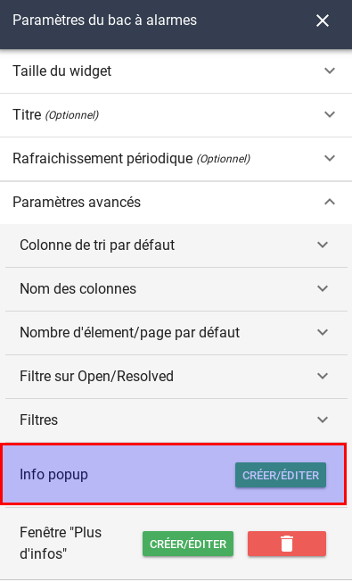
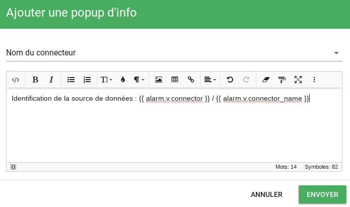
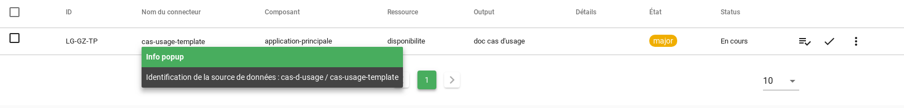
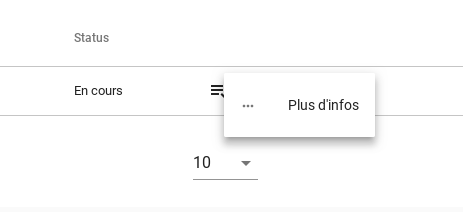
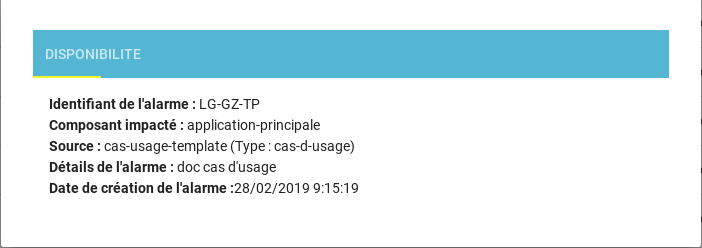
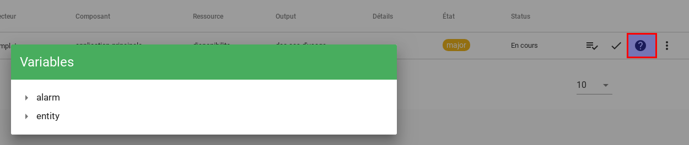
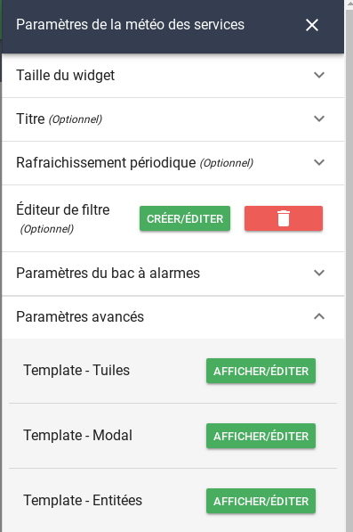
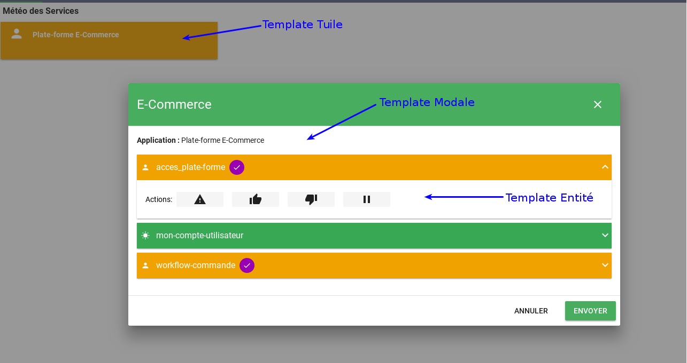
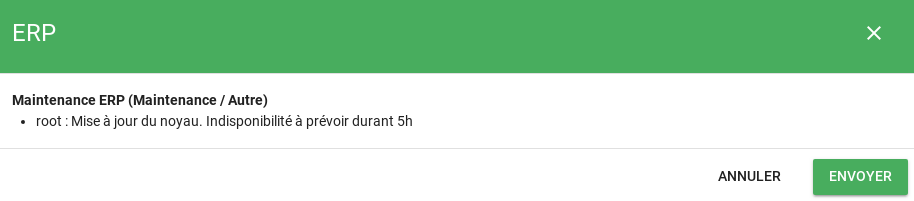
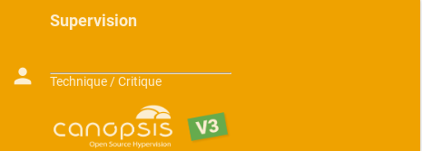

# Personnalisation des affichages via des templates handlebars

Dans l'interface graphique de Canopsis, il est possible en de multiples endroits de personnaliser les affichages en utilisant un éditeur HTML couplé à des variables.  
Pour faciliter les tâches de l'administrateur, Canopsis met à disposition :

* les helpers officiels [Handlebars](https://handlebarsjs.com/)
* des helpers handlebars spécifiques à Canopsis

Voici un tour d'horizon des espaces dans lesquels vous pouvez personnaliser les rendus.

## Bac à alarmes

Le bac à alarmes est présenté sous forme de tableau.  Les données à disposition dans ce bac sont issues des alarmes en elles-mêmes ainsi que du référentiel interne concernant les entités touchées par les alarmes.  
Le nombre de variables est de fait conséquent et le format tableau ne peut pas vous permettre de tout afficher.

Pour pallier cette limite, 2 mécanismes sont mis à disposition : 

* Info popup
* Plus d'infos

### Info popup

Les infos popup permettent d'afficher un popup contenant des données lors du clic sur un élément de colonne.  
Toutes les colonnes affichées peuvent bénéficier de ce système.  

Dans les paramètres du widget bac à alarmes :

  

Puis dans info popup :

  

Le rendu s'effectue au clic sur la colonne *Nom du connecteur* comme précisé dans la configuration

  

### Plus d'infos

Il existe un second mécanisme, *Plus d'infos*, dont le fonctionnement est identique à *Info popup*.  
Seul l'affichage se fait par l'intermédiaire d'un bouton d'action

  

Couplé avec des exemples fournis sur le site [vuetify](https://vuetifyjs.com/en/getting-started/quick-start), vous pouvez obtenir ce type de résultat : 

  

Le template associé est dans ce cas le suivant :

```html
<div class="v-card__text">
 <div class="v-tabs" data-booted="true">
  <div class="v-tabs__bar theme--dark cyan">
   <div class="v-tabs__wrapper">
    <div class="v-tabs__container">
     <div class="v-tabs__slider-wrapper" style="left: 0px; width: 68px;">
      <div class="v-tabs__slider yellow"><br></div>
     </div>
     <div class="v-tabs__div">
      <a class="v-tabs__item">
      {{ entity.name }}
      </a>
     </div>
    </div>
   </div>
  </div>
  <div class="v-window">
   <div class="v-window__container">
    <div class="v-window-item">
     <div class="v-card v-card--flat v-sheet theme--light">
      <div class="v-card__text">
       <strong>Identifiant&nbsp;de l'alarme :</strong> {{ alarm.v.display_name}}<br>
       <strong>Composant impacté :</strong> {{ alarm.v.component }}<br>
       <strong>Source :</strong> {{ alarm.v.connector_name }} (Type : {{ alarm.v.connector }})<br>
       <strong>Détails de l'alarme :</strong> {{ alarm.v.state.m }}<br>
       <strong>Date de création de l'alarme&nbsp;:</strong>{{timestamp alarm.v.creation_date }}</div>
      </div>
     </div>
    </div>
   </div>
  </div>
 </div>
</div>
```

### Variables

Au dela de ces fonctionnalités, vous pouvez connaitre l'ensemble des variables qui sont mises à disposition de chaque alarme en utilisant le mode *édition*.  
Un point d'interrogation fait alors son apparition à coté des actions et vous permettra de lister et copier ces variables.  

  

## Météo des services

Coté météo de service, la personnalisation peut se faire sur 3 niveaux :

* Les tuiles
* Les modales
* Les entités

  

Voici un descriptif des zones correspondantes :  

  

## Avancé

Le templating *handlebars* embarque un langage complet qui vous permet d'aller beaucoup plus loin que le simple affichage de variables.  
Pour afficher des structures de données complexes, Canopsis met généralement à disposition des helpers.  
Par exemple, pour afficher l'ensemble des entités d'un service de météo, il existe le helper *{{ entities }}*.  

Dans d'autres cas, soit le helper n'est pas encore développé, soit il ne le sera pas.  
Vous avez donc la possibilité d'utiliser *handlebars* pour personnaliser vos affichages.  

### Itérer sur des éléments de tableau

Voici un exemple concret de représentation.

!!! note
    Vous souhaitez afficher les commentaires associés à un comportement périodique sur une modale de météo de service


La structure dont on veut afficher les données est la suivante  :

```json
"watcher_pbehavior": [
  {
    "connector": "canopsis",
    "name": "Maintenance ERP",
    "author": "root",
    "enabled": true,
    "reason": "Autre",
    "comments": [
      {
        "message": "Mise à jour du noyau.\nIndisponibilité à prévoir durant 5h",
        "_id": "e3682357-1bd1-46b3-b5fb-b2ae3c9a4d37",
        "author": "root"
      }
    ],
    "filter": "{\"$and\": [{\"name\": \"ERP\"}]}",
    "type_": "Maintenance",
    "connector_name": "canopsis",
    "eids": [
      "watcher_c103d398-36eb-4172-9901-c55084eeed4e"
    ],
    "tstart": 1551344400,
    "timezone": "Europe/Paris",
    "tstop": 1551427200,
    "exdate": [],
    "_id": "a4b54ce8-3b36-11e9-be50-0242ac17000a",
    "isActive": true,
    "rrule": null
   }
]
```

Nous souhaitons donc itérer sur le tableau `watcher_pbehavior` puis sur le tableau `comments`.  
Voici le template de la modale : 

```handlebars
{{#each entity.watcher_pbehavior}}
  {{#with . as |pbh|}}
    <strong>{{pbh.name}} ({{pbh.type_}} / {{pbh.reason}})</strong> <br>
    <ul>
    {{#each pbh.comments}}
      {{#with . as |comment|}}
        <li>{{comment.author}} : {{comment.message}}</li>
      {{/with}}
    {{/each}}
    </ul>
  {{/with}}
{{/each}}
```

L'affichage associé sera au final : 

  

### Afficher des images dans une tuile de météo

Si vous souhaitez afficher des pictos applicatifs sur une tuile de météo, vous pouvez utiliser *handlebars*.  

  

Le template handlebars associé est le suivant : 

```handlebars
{{#if entity.infos.picto.value}}

{{/if}}
```

Cela suppose que l'attribut `picto` de votre entité porte un png encodé en base64.  

```
data:image/png;base64,iVBORw0KGgoA ... ==
```
