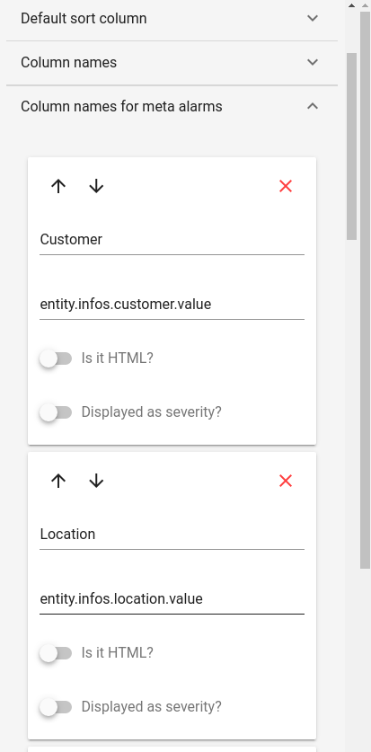
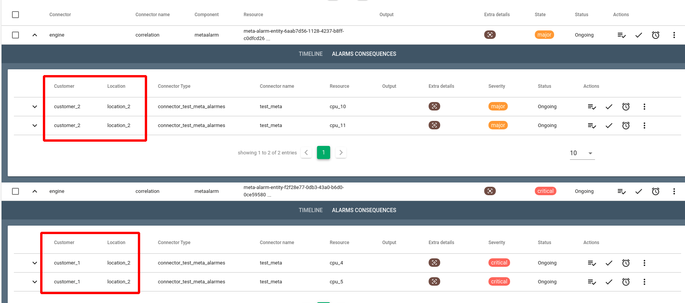

# Format de syntaxe des valuepath

Les règles de corrélation des alarmes comprennent des chemins d'accès aux valeurs (`valuepath`) sur lesquels se baser pour effectuer le regroupement d'alarmes.

Canopsis est conçu pour exprimer facilement ces `valuepath` sous la forme d'une série de composants séparés par le caractère `.`. Mais pas seulement, d'autres caractères ont une signification particulière, notamment `|`, `#`, `@`, `\` et `?`.

Voici un exemple d'évènement fictif.

``` json
{
  "connector": "zabbix01",
  "connector_name": "zabbix01",
  "source_type" : "resource",
  "event_type" : "check",
  "component" : "st-par-edge1",
  "resource" : "cpu_4",
  "state" : 3,
  "server": {"customer": "Stark-Telecom", "hostname": "st-par-edge1"},
  "location": "Equinix PA3"
  "loc.dc": "Paris"
  "links": ["Tata","Cogent","FranceIX"],
  "peers": [
    {"name": "Amazon", "asn": "16509", "ip": ["37.49.236.118", "2001:7f8:54::118 "], "link": "200G"},
    {"name": "Microsoft", "asn": "8075", "ip": ["37.49.236.5", "2001:7f8:54::5"], "link": "100G"},
    {"name": "Netflix", "asn": "2906", "ip": ["37.49.237.50", "2001:7f8:54::1:50 "], "link": "100G"}
  ]
}
```

Cet exemple fictif est volontairement complexe afin de mieux illustrer les différentes expressions possibles.

### Expressions basiques

Dans la plupart des cas, vous voudrez simplement récupérer des valeurs par nom d'objet ou index de tableau.

| Chemin | Résultat |
|--------|----------|
| `server.hostname` | `"st-par-edge1"` |
| `location` | `"Equinix PA3"` |
| `links` | `["Tata","Cogent","FranceIX"]` |
| `links.#` | `3` |
| `links.1` | `"Cogent"` |
| `lin*.2` | `"FranceIX"` |
| `l?ks.0` | `"Tata"` |
| `loc\.dc` | `"Paris"` |
| `peers.#.name` | `["Amazon","Microsoft","Netflix"]` |
| `peers.1.asn` | `8075` |

### Expressions Avancées

Vous pouvez également interroger un tableau pour trouver la première correspondance en utilisant `#(...)`, ou trouver toutes les correspondances avec `#(...)#`. Les requêtes prennent en charge les opérateurs de comparaison `==`, `!=`, `<`, `<=`, `>`, `>=` et les opérateurs de correspondance simple `%` (similaire) et `!%` (non similaire).

| Chemin | Résultat |
|--------|----------|
| `peers.#(link=="100G").name` | `"Microsoft"` |
| `peers.#(link=="100G")#.name` | `["Microsoft","Netflix"]` |
| `peers.#(ASN>3000)#.name` | `["Amazon","Microsoft"]` |
| `peers.#(name%"A*").asn` | `16509` |
| `peers.#(name!%"A*").asn` | `8075` |
| `peers.#(ip.#(%"37.49.237.*"))#.name` | `["Amazon","Microsoft","Netflix"]` |

### Exemple évènement réaliste

Voici un exemple d'évènement plus représentatif d'un cas réel.

``` json
{
    "connector": "connector_test_meta_alarmes",
    "connector_name": "test_meta",
    "source_type" : "resource",
    "event_type" : "check",
    "component" : "SRV-META",
    "resource" : "cpu_1",
    "state" : 2,
    "customer": "customer_1",
    "location": "location_1"
}
```

Pour regrouper les événements par `customer` et `location`, il suffira de définir les `value_paths` suivantes:

``` json hl_lines="8 9"
{
    "name": "Test groupement par chemins de valeur",
    "type": "valuegroup",
    "config": {
        "time_interval": 120,
        "threshold_count": 2,
        "value_paths": [ 
            "entity.infos.customer.value", 
            "entity.infos.location.value" 
        ]
    }
}
```

Cette syntaxe est aussi valable dans l'interface web de Canopsis pour l'ajout de colonnes dans les méta-alarmes du widget bac à alarmes.





## Aller plus loin

Pour voir toutes les possibilités supportées par Canopsis, consulter la documentation du projet [GJSON](https://github.com/tidwall/gjson/blob/master/SYNTAX.md).
