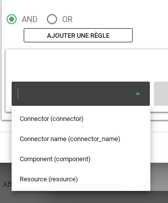
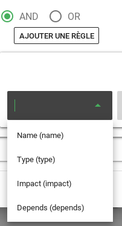
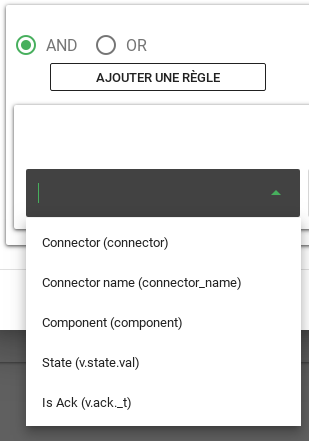
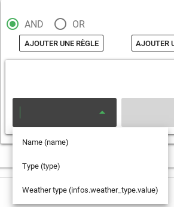

# Personnalisation des filtres

La liste des attributs présentés par l'éditeur de filtres peut être personnalisée.  
L'éditeur de filtres est utilisé pour filtrer 2 types d'objets : 

* Les alarmes (filtres du bac à alarmes)
* Les entités (filtres de l'explorateur de contexte, des comportements périodiques)

Par défaut, la liste des attributs vaut :

**Alarmes**



**Entités**



## Configuration

Pour personnaliser ces listes, vous devez envoyer une configuration sur une route d'API.  
Voici un exemple de configuration.  

````bash
curl -X POST -u root:root -H "Content-Type: application/json" -d '{
  "alarm": [
    {
      "name": "Connector",
      "value": "connector"
    },
    {
      "name": "Connector name",
      "value": "connector_name"
    },
    {
      "name": "Component",
      "value": "component"
    },
    {
      "name": "State",
      "value": "v.state.val"
    },
    {
      "name": "Is Ack",
      "value": "v.ack._t"
    }
  ],
  "entity": [
    {
    "name": "Name",
    "value": "name"
    },
    {
      "name": "Type",
      "value": "type"
    },
    {
      "name": "Weather type",
      "value": "infos.weather_type.value"
    }
  ]
}' 'http://localhost:8082/api/v2/associativetable/filterhints'
````
Vous devez obtenir le résultat suivant : 

````
true
````

## Vérification

### Alarmes

Lors de la création d'un filtre sur un bac à alarmes, la liste des attributs disponibles doit être la suivante :  



### Entités

**Comportement périodique** ET **Explorateur de contexte**

Lors de la création d'un filtre sur l'explorateur de contexte ou pour un comportement périodique, la liste doit être la suivante :  



