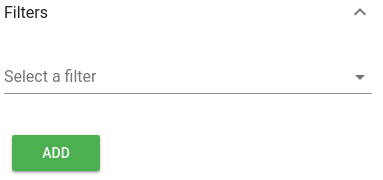
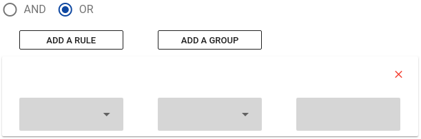
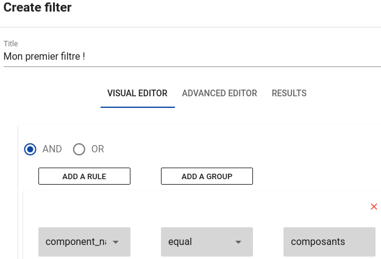
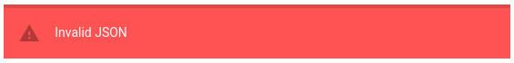
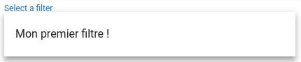

# Utilisation simples des filtres

Lors de la configuration d'une vue, il est possible d'appliquer des filtres à notre liste.

Pour cela, dans l'onglet "Filters"



Cliquez sur "add" pour créer votre premier filtre, une fenêtre apparaît :


Donnez un titre à votre filtre. Il existe deux méthodes de création, une pour les néophytes et une pour les utilisateurs expérimentés. Nous allons nous concentrer sur la première méthode, vous verrez dans un second temps que la méthode avancée évolue en même temps que vos actions sur l'autre méthode.

## AND / OR

Il faut maintenant choisir quel filtre prendre. Deux possibilités s'offrent à vous sous forme d'opérateurs booléens **ET** et **OU** (AND et OR). En choisir un, puis appuyer sur "Add a rule".



Dans la première colonne, choisir de quel type sera l'objet filtré. Quatre possibilités :

*  component\_name
*  connector\_name
*  connector
*  resource

Dans la seconde, le filtre qui lui sera alloué :

*  equal
*  not equal
*  in
*  not in
*  begins with
*  …

Puis, dans la dernière, il vous est possible de remplir un champ qui sera "matché" avec le filtre.

Il vous est possible d'ajouter autant de filtres que vous souhaitez en cliquant sur "Add a rule".

Vous pouvez aussi séparer vos filtres en groupes. Simplement en cliquant sur "Add a group", et le supprimer en cliquant simplement sur "Delete groupe".

## Éditeur avancé

On souhaite créer un filtre appelé "Mon premier filtre !" qui récupère les composants dont le nom est égal à "composants" :

Cela se fait très simplement comme suit



Maintenant, allons voir l'éditeur avancé, vous remarquerez que l'on retrouve certains éléments du dernier screen :

```
{
    "$and": [
        {
            "component_name": "composants"
        }
    ]
}
```

Compliquons les choses !

On veut maintenant ajouter le fait qu'une ressource ne doit pas être vide. Une fois la configuration réalisée via l'interface visuelle, on retrouve plusieurs éléments ajoutés à l'éditeur avancé :

```
{
    "$and": [
        {
            "component_name": "composants"
        },
        {
            "resource": {
                "$ne": ""
            }
        }
    ]
}
```

Il est bien évidemment possible de réaliser cette configuration via l'interface utilisateur avancée.

Le bouton "Parse" va vous servir à vérifier l'exactitude de votre JSON, si celui ci est invalide ce message apparaîtra :



## Résultat

Une fois votre Filtre réalisé, il apparaîtra dans le menu déroulant "select a filter".


