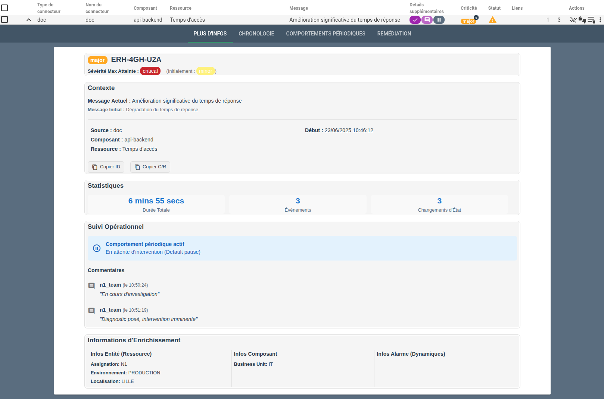

# Guide pratique : Créer un template "Plus d'infos" avancé

Cette page fournit un exemple complet et commenté d'un template Handlebars pour le popup ["Plus d'infos"](../widgets/bac-a-alarmes/index.md#plus-dinfos) de Canopsis. L'objectif est de créer une vue synthétique, riche et interactive d'une alarme, en exploitant de nombreux helpers et structures de données disponibles.

Pour une référence complète de tous les helpers disponibles, consultez la [documentation officielle des helpers Handlebars](../helpers/index.md).

!!! note "Contexte d'utilisation"
    Ce template est conçu pour être utilisé dans le menu **Administration > Paramètres > Modèles de Widgets > "Plus d'infos"**. L'objet de données principal disponible dans ce contexte est `alarm`.

## Aperçu du résultat

Ce template transforme les données brutes d'une alarme en une fiche d'information structurée en plusieurs cartes thématiques :

1.  **Identité de l'alarme** : État, nom, sévérité.
2.  **Contexte** : Messages, source, composant/ressource.
3.  **Statistiques** : Durée, nombre d'événements.
4.  **Suivi Opérationnel** : Comportements périodiques, commentaires, tickets.
5.  **Enrichissement** : Informations dynamiques de l'entité et de l'alarme.





## Le template complet

Voici le code source complet du template. Vous pouvez le copier directement pour l'utiliser. Les sections suivantes détaillent son fonctionnement.

```handlebars
{{!--
  TEMPLATE "PLUS D'INFOS"
  --------------------------------------------------------------------------
  - L'objet racine du template est `alarm`.
  - Les boucles `{{#each}}` utilisent `{{this.propriete}}` pour accéder aux données.
  - Le style est 100% en ligne et les icônes au format Material Design.
--}}
<div style="font-family:Arial, sans-serif;color:#2c3e50;line-height:1.5">

  {{!-- CARD 1: IDENTITÉ DE L'ALARME --}}
  <table width="100%" style="background-color:#ffffff;border:1px solid #e0e0e0;border-radius:8px;margin-bottom:16px">
    <tbody><tr>
      <td>
        <h2 style="margin:0 0 8px 0;font-size:1.4em;display:flex;align-items:center;gap:10px;flex-wrap:wrap">
          {{state alarm.v.state.val}}
          <span>{{alarm.v.display_name}}</span>
          {{#if alarm.is_meta_alarm}}
            <span style="display:inline-flex;align-items:center;gap:6px;background-color:#e8eaf6;color:#3f51b5;border:1px solid #c5cae9;padding:4px 10px;border-radius:16px;font-size:0.9em;font-weight:500;line-height:1">
              <i class="v-icon notranslate material-icons theme--light" style="font-size:16px">hub</i>
              Méta Alarme
            </span>
          {{/if}}
        </h2>
        <div style="font-size:0.9em">
          <strong>Sévérité Max Atteinte :</strong> {{state alarm.v.max_state}}
          <span style="color:#757575;margin-left:12px">(Initialement : {{state alarm.v.initial_state}})</span>
        </div>
      </td>
    </tr>
  </tbody></table>

  {{!-- CARD 2: CONTEXTE ET DONNÉES CLÉS --}}
  <table width="100%" style="background-color:#ffffff;border:1px solid #e0e0e0;border-radius:8px;margin-bottom:16px">
    <tbody><tr>
      <td>
        <h3 style="margin:0 0 12px 0;font-size:1.2em">Contexte</h3>
        <p style="margin:0 0 4px 0"><strong>Message Actuel :</strong> {{{alarm.v.output}}}</p>
        <p style="margin:0 0 16px 0;color:#5a6d80;font-size:0.9em"><strong>Message Initial :</strong> {{{alarm.v.initial_output}}}</p>
        <hr style="border:none;border-top:1px solid #e0e0e0;margin:16px 0">
        <table width="100%">
          <tbody><tr>
            <td width="50%" style="vertical-align:top;padding-right:10px">
              <ul style="margin:0;padding:0;list-style:none">
                <li style="padding-bottom:4px"><strong>Source :</strong> {{alarm.v.connector_name}}</li>
                <li style="padding-bottom:4px"><strong>Composant :</strong> {{alarm.v.component}}</li>
                <li><strong>Ressource :</strong> {{alarm.v.resource}}</li>
              </ul>
            </td>
            <td width="50%" style="vertical-align:top;padding-left:10px">
              <ul style="margin:0;padding:0;list-style:none">
                <li style="padding-bottom:4px"><strong>Début :</strong> {{timestamp alarm.v.creation_date format="long"}}</li>
                {{#if alarm.v.ticket}}
                  <li><strong>Ticket : </strong><a target="_blank" href="{{alarm.v.ticket.ticket_url}}">{{alarm.v.ticket.ticket}}</a></li>
                {{/if}}
              </ul>
            </td>
          </tr>
        </tbody></table>
        <div style="margin-top:20px">
          {{#copy alarm.v.display_name}}
            <a style="text-decoration:none;display:inline-flex;align-items:center;gap:6px;background-color:#f0f0f0;border:1px solid #ddd;padding:5px 10px;border-radius:6px;cursor:pointer;font-size:0.9em;color:#2c3e50">
              <i class="v-icon notranslate material-icons theme--light" style="font-size:16px">content_copy</i>
              Copier ID
            </a>
          {{/copy}}
          <span style="display:inline-block;width:8px"></span>
          {{#copy (concat alarm.v.component "/" alarm.v.resource)}}
            <a style="text-decoration:none;display:inline-flex;align-items:center;gap:6px;background-color:#f0f0f0;border:1px solid #ddd;padding:5px 10px;border-radius:6px;cursor:pointer;font-size:0.9em;color:#2c3e50">
              <i class="v-icon notranslate material-icons theme--light" style="font-size:16px">content_copy</i>
              Copier C/R
            </a>
          {{/copy}}
        </div>
      </td>
    </tr>
  </tbody></table>
  
  {{!-- CARD 3: STATISTIQUES --}}
  <table width="100%" style="background-color:#ffffff;border:1px solid #e0e0e0;border-radius:8px;margin-bottom:16px">
    <tbody><tr>
      <td>
        <h3 style="margin:0 0 12px 0;font-size:1.2em">Statistiques</h3>
        <table width="100%" style="text-align:center;border-spacing:12px 0;margin-left:-12px">
          <tbody><tr>
            <td width="33.3%" style="background-color:#f9f9f9;padding:12px;border-radius:6px">
              <div style="font-size:1.5em;font-weight:bold;color:#1976d2">{{duration alarm.v.duration}}</div>
              <div style="font-size:0.9em;color:#5a6d80">Durée Totale</div>
            </td>
            <td width="33.3%" style="background-color:#f9f9f9;padding:12px;border-radius:6px">
              <div style="font-size:1.5em;font-weight:bold;color:#1976d2">{{alarm.v.events_count}}</div>
              <div style="font-size:0.9em;color:#5a6d80">Événements</div>
            </td>
            <td width="33.3%" style="background-color:#f9f9f9;padding:12px;border-radius:6px">
              <div style="font-size:1.5em;font-weight:bold;color:#1976d2">{{alarm.v.total_state_changes}}</div>
              <div style="font-size:0.9em;color:#5a6d80">Changements d'État</div>
            </td>
          </tr>
        </tbody></table>
      </td>
    </tr>
  </tbody></table>

  {{!-- CARD 4: SUIVI OPÉRATIONNEL --}}
  <table width="100%" style="background-color:#ffffff;border:1px solid #e0e0e0;border-radius:8px;margin-bottom:16px">
    <tbody><tr>
      <td>
        <h3 style="margin:0 0 12px 0;font-size:1.2em">Suivi Opérationnel</h3>
        {{#if alarm.pbehavior}}
          <div style="background-color:#e3f2fd;color:#1565c0;padding:12px;border-radius:6px;margin-bottom:15px;display:flex;align-items:center;gap:12px">
            <i class="v-icon notranslate material-icons theme--light" style="font-size:24px;color:#1565c0">pause_circle_outline</i>
            <div>
              <strong style="display:block">Comportement périodique actif</strong>
              {{alarm.pbehavior.name}} ({{alarm.pbehavior.type.name}})
            </div>
          </div>
        {{/if}}
        
        {{#if alarm.v.comments}}
          <h4 style="margin:16px 0 8px 0">Commentaires</h4>
          {{#each alarm.v.comments}}
            <div style="border-bottom:1px solid #f0f0f0;padding:10px 0;display:flex;align-items:flex-start;gap:12px">
              <i class="v-icon notranslate material-icons theme--light" style="font-size:20px;color:#757575;margin-top:3px">comment</i>
              <div>
                <strong style="color:#2c3e50">{{this.a}}</strong>
                <span style="color:#5a6d80;font-size:0.85em">(le {{timestamp this.t}})</span>
                <p style="margin:4px 0 0 0;font-style:italic">"{{this.m}}"</p>
              </div>
            </div>
          {{/each}}
        {{/if}}
        
        {{#if alarm.v.tickets}}
          <h4 style="margin:16px 0 8px 0">Historique des tickets</h4>
          <ul style="margin:0;padding-left:20px;list-style-type:disc">
            {{#each alarm.v.tickets}}
              <li style="padding-bottom:4px">
                <a target="_blank" href="{{this.ticket_url}}">{{this.ticket}}</a> - créé par {{this.a}}
              </li>
            {{/each}}
          </ul>
        {{/if}}
      </td>
    </tr>
  </tbody></table>

  {{!-- CARD 5: INFORMATIONS D'ENRICHISSEMENT --}}
  <table width="100%" style="background-color:#ffffff;border:1px solid #e0e0e0;border-radius:8px">
    <tbody><tr>
      <td>
        <h3 style="margin:0 0 12px 0;font-size:1.2em">Informations d'Enrichissement</h3>
        <table width="100%">
          <tbody><tr style="vertical-align:top">
            <td width="33.3%" style="padding-right:10px">
              <strong style="display:block;margin-bottom:8px">Infos Entité (Ressource)</strong>
              <ul style="margin:0;padding:0;list-style:none;font-size:0.9em">
                {{#each alarm.entity.infos}}
                  <li style="padding-bottom:4px"><strong>{{this.description}}:</strong> {{this.value}}</li>
                {{/each}}
              </ul>
            </td>
            <td width="33.3%" style="padding-left:10px;border-left:1px solid #e0e0e0">
              <strong style="display:block;margin-bottom:8px">Infos Composant</strong>
              <ul style="margin:0;padding:0;list-style:none;font-size:0.9em">
                {{#each alarm.entity.component_infos}}
                  <li style="padding-bottom:4px"><strong>{{this.description}}:</strong> {{this.value}}</li>
                {{/each}}
              </ul>
            </td>
            <td width="33.3%" style="padding-left:10px;border-left:1px solid #e0e0e0">
              <strong style="display:block;margin-bottom:8px">Infos Alarme (Dynamiques)</strong>
              {{#if alarm.v.infos}}
                <ul style="margin:0;padding:0;list-style:none;font-size:0.9em">
                  {{#each alarm.v.infos}}
                    <li style="padding-bottom:4px"><strong>{{@key}}:</strong> {{this}}</li>
                  {{/each}}
                </ul>
              {{else}}
                <p style="margin:0;font-size:0.9em;color:#757575;font-style:italic">Aucune info dynamique.</p>
              {{/if}}
            </td>
          </tr>
        </tbody></table>
      </td>
    </tr>
  </tbody></table>
</div>
```

## Décomposition et explications

### Carte 1 : Identité de l'alarme

Cette section affiche les informations d'identification les plus importantes.

```handlebars
<h2 style="...">
  {{state alarm.v.state.val}}
  <span>{{alarm.v.display_name}}</span>
  {{#if alarm.is_meta_alarm}}
    <span style="...">
      <i class="v-icon ...">hub</i>
      Méta Alarme
    </span>
  {{/if}}
</h2>
<div>
  <strong>Sévérité Max Atteinte :</strong> {{state alarm.v.max_state}}
  <span>(Initialement : {{state alarm.v.initial_state}})</span>
</div>
```

* **{{state alarm.v.state.val}}** : Utilise le helper [state](./index.md#helper-state) pour afficher une pastille de couleur correspondant à la criticité de l'alarme (Majeur, Critique, etc.). Il est utilisé ici trois fois pour l'état actuel, maximal et initial.
* **{{alarm.v.display_name}}** : Affiche le nom de l'alarme.
* **{{#if alarm.is_meta_alarm}}** : Un bloc conditionnel. Le contenu à l'intérieur ne s'affiche que si la propriété alarm.is_meta_alarm est vraie.


### Carte 2 : Contexte et Données Clés

Cette carte détaille l'origine de l'alarme et fournit des boutons d'action.

```handlebars
<p><strong>Message Actuel :</strong> {{{alarm.v.output}}}</p>
<p><strong>Message Initial :</strong> {{{alarm.v.initial_output}}}</p>
...
<li><strong>Début :</strong> {{timestamp alarm.v.creation_date format="long"}}</li>
{{#if alarm.v.ticket}}
  <li><strong>Ticket : </strong><a href="{{alarm.v.ticket.ticket_url}}">{{alarm.v.ticket.ticket}}</a></li>
{{/if}}
...
{{#copy alarm.v.display_name}}
  <a>... Copier ID</a>
{{/copy}}
{{#copy (concat alarm.v.component "/" alarm.v.resource)}}
  <a>... Copier C/R</a>
{{/copy}}
```

* **{{{alarm.v.output}}}** : Les trois accolades ({{{ ... }}}) permettent d'afficher du HTML sans l'échapper. C'est utile si le message de sortie contient des balises de mise en forme.
* **{{timestamp alarm.v.creation_date format="long"}}** : Utilise le helper [timestamp](./index.md#helper-timestamp) pour formater la date de création de l'alarme dans un format lisible par l'homme.
* **{{#if alarm.v.ticket}}** : Affiche les informations du ticket (avec un lien cliquable) seulement si un ticket est associé à l'alarme.
* **{{#copy ...}}** : Helper interactif qui transforme son contenu en un bouton. Au clic, le texte passé en paramètre (alarm.v.display_name) est copié dans le presse-papiers.
* **{{concat ...}}** : Helper utilisé ici pour construire une chaîne de caractères "Composant/Ressource" avant de la passer au helper copy.


### Carte 3 : Statistiques

Présente des indicateurs clés sous forme de vignettes.

```handlebars
<div>{{duration alarm.v.duration}}</div>
<div>... Durée Totale</div>
...
<div>{{alarm.v.events_count}}</div>
<div>... Événements</div>
```

* **{{duration alarm.v.duration}}** : Utilise le helper [duration](./index.md#helper-duration) pour convertir une durée en secondes (provenant de alarm.v.duration) en un format lisible (ex: 2h 15m 30s).
* **{{alarm.v.events_count}}** : Affiche simplement la valeur numérique du nombre d'événements liés à l'alarme.


### Carte 4 : Suivi Opérationnel

Affiche l'historique des commentaires sur l'alarme ainsi que le comportement périodique en cours.

```handlebars
{{#if alarm.pbehavior}}
  ...
{{/if}}

{{#if alarm.v.comments}}
  <h4>Commentaires</h4>
  {{#each alarm.v.comments}}
    <div>
      <strong>{{this.a}}</strong>
      <span>(le {{timestamp this.t}})</span>
      <p>"{{this.m}}"</p>
    </div>
  {{/each}}
{{/if}}
```

* **{{#each alarm.v.comments}}** : Le helper each permet de boucler sur un tableau (ici, la liste des commentaires).
* **{{this}}** : À l'intérieur d'une boucle each, {{this}} représente l'élément courant de l'itération. On accède à ses propriétés avec {{this.propriete}} (ex: this.a pour l'auteur, this.m pour le message).
* La même logique de boucle {{#each}} est utilisée pour l'historique des tickets (alarm.v.tickets).


### Carte 5 : Informations d'Enrichissement

Cette dernière carte est cruciale pour afficher des données personnalisées issues des [règles d'enrichissement](../../menu-exploitation/filtres-evenements.md).

```handlebars
<strong>Infos Entité (Ressource)</strong>
<ul>
  {{#each alarm.entity.infos}}
    <li><strong>{{this.description}}:</strong> {{this.value}}</li>
  {{/each}}
</ul>
...
<strong>Infos Alarme (Dynamiques)</strong>
{{#if alarm.v.infos}}
  <ul>
    {{#each alarm.v.infos}}
      <li><strong>{{@key}}:</strong> {{this}}</li>
    {{/each}}
  </ul>
{{else}}
  <p>Aucune info dynamique.</p>
{{/if}}
```

* **{{#each alarm.entity.infos}}** : Boucle sur les "informations" définies sur l'entité. Chaque info est un objet avec une description et une value.
* **{{#each alarm.v.infos}}** : Boucle sur un objet contenant des [informations dynamiques](../../menu-exploitation/informations-dynamiques.md) ajoutées à l'alarme.
* **{{@key}}** : Variable spéciale disponible dans une boucle each sur un objet. Elle contient la clé de la propriété en cours. {{this}} contient sa valeur.
* **{{#if ...}} {{else}} ... {{/if}}** : Structure conditionnelle complète. Si alarm.v.infos existe et n'est pas vide, on affiche la liste. Sinon (else), on affiche le message "Aucune info dynamique.".
