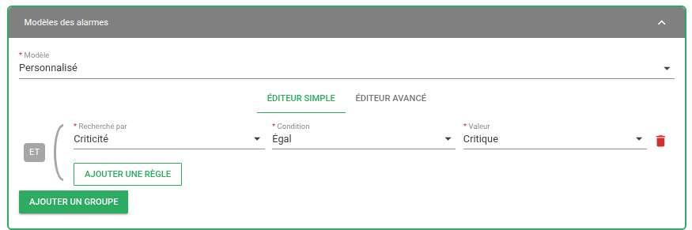
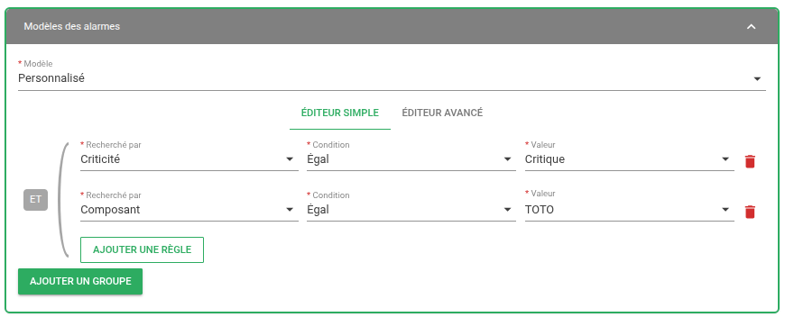
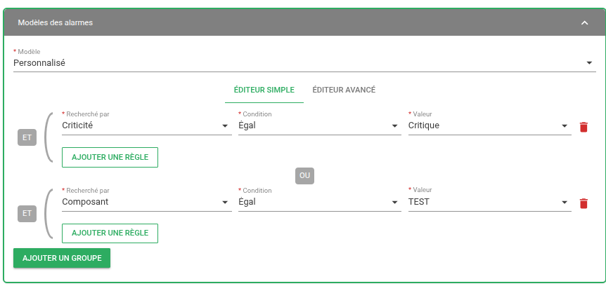
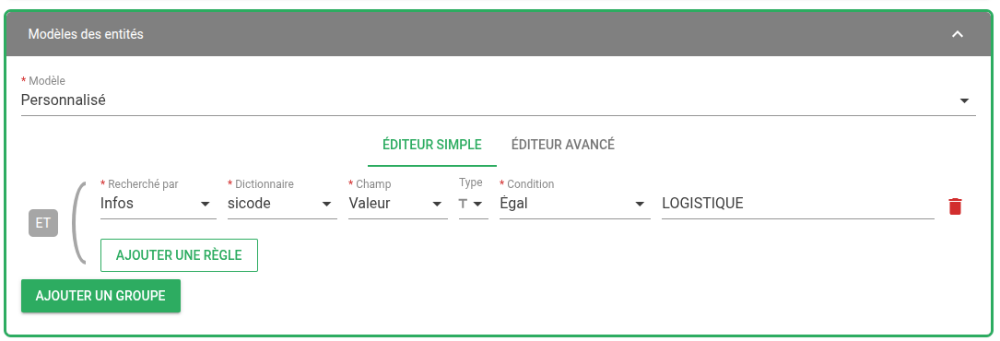
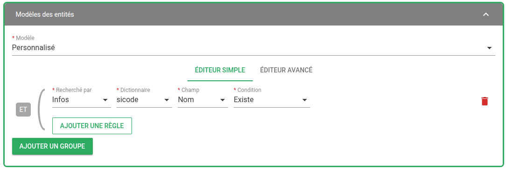

# Patterns (ou filtres) dans Canopsis

Les **patterns** (aussi appelés filtres) sont au coeur de Canopsis.  
Ils permettent de **filtrer dynamiquement les alarmes, les entités, les événements**, ou d'autres objets du système.

Ils sont utilisés dans de nombreuses vues de l'interface graphique, dans les [moteurs](../../../guide-administration/architecture-interne/moteurs), ainsi que dans les API.

## Fonctionnement général

L’interface graphique de Canopsis propose un **éditeur de filtres** avec :

* Une partie **graphique intuitive** (menus déroulants, champs, suggestions),
* Un **mode avancé** permettant d’écrire directement le filtre en JSON.

Consultez la documentation de référence sur les filtres ici :  
[Guide Développement — Filtres](../../../guide-developpement/filtres/)

## Structure d’un filtre

Un filtre est généralement un objet JSON composé de :
- **champ** : le champ sur lequel porte le test (ex. `Nom du connecteur`, `Criticité`, `Tag`)
- **opérateur** : l’opération à effectuer (`Egal`, `Contient`, `Commence par`, `Expression régulière`, etc.)
- **valeur** : la valeur de comparaison

Exemple simple :



```json
[
    [
        {
            "field": "v.state.val",
            "cond": {
                "value": 3,
                "type": "eq"
            }
        }
    ]
]
```

Des combinaisons logiques peuvent être utilisées avec les opérateurs AND et OR.

<div class="grid cards" markdown>

-   :material-filter-variant:{ .lg .middle } __Filtre avec ET (`AND`)__  
Les deux conditions doivent être vraies. <br>Tout est dans la **même sous-liste**, ce qui correspond à un **ET logique**.

    ---

    

    Correspondance en mode avancé :

    ```json
    [
      [
        {
          "field": "v.state.val",
          "cond": {
            "value": 3,
            "type": "eq"
          }
        },
        {
          "field": "v.component",
          "cond": {
            "value": "TEST",
            "type": "eq"
          }
        }
      ]
    ]
    ```

-   :material-filter-variant:{ .lg .middle } __Filtre avec OU (`OR`)__  
Une seule des deux conditions doit être vraie. <br>Chaque condition est dans une **liste différente**, ce qui correspond à un **OU logique**.

    ---

    

    Correspondance en mode avancé :

    ```json
    [
      [
        {
          "field": "v.state.val",
          "cond": {
            "value": 3,
            "type": "eq"
          }
        }
      ],
      [
        {
          "field": "v.component",
          "cond": {
            "value": "",
            "type": "eq"
          }
        }
      ]
    ]
    ```
</div>

## Cas particuliers des informations enrichies (Alarmes ou Entités)

Les champs enrichis (présents dans `infos`) sont très utilisés dans Canopsis pour **ajouter du contexte** à une alarme ou une entité (par exemple : criticité métier, application, environnement, etc.).

Cependant, **Canopsis ne connaît pas forcément le type** de ces informations par défaut.  
Pour permettre un filtrage correct, l’éditeur de pattern propose de **typer dynamiquement** le champ à la volée.

Cela permet à l’éditeur :

* de proposer les bons opérateurs selon le type (eq, is_one_of, etc.),
* de valider correctement la valeur entrée.

Les types mis à disposition sont les suivants :

* Chaine de caractères
* Nombre
* Booléen
* Tableau

L'exemple suivant propose de filtrer les entités dont la valeur du `sicode` vautla chaine de caractères `LOGISTIQUE` :



Il est également possible de tester simplement l'existence d'une information enrichie comme dans l'exemple suivant :




## Recommandations, bonnes pratiques

Les **patterns** (ou filtres) sont un outil **très puissant** dans Canopsis.  
Vous avez une grande liberté pour les écrire, que ce soit via l’éditeur graphique ou en mode JSON avancé.

Cependant, mal utilisés, les filtres peuvent **entraîner des baisses de performance** et devenir difficiles à maintenir.

!!! tip "Recommandations de filtrage"
    * **Préférez l’utilisation de l’opérateur _"Commence par"_ ou _"Se termine par"_ à la place d’une expression régulière (_"Expression régulière"_)**  
      Les expressions régulières (`regexp`) sont puissantes mais coûteuses. Lorsque cela est possible, utilisez plutôt des tests simples sur les préfixes ou les suffixes.

    * **Utilisez l’opérateur _"Égal à"_ dès que cela est possible**  
      L’opérateur `eq` est rapide et explicite. Il est à privilégier lorsque la valeur attendue est connue avec précision.

    * **Préférez les opérateurs _"Est l’un de"_ et _"N’est pas l’un de"_**  
      Ils permettent de tester plusieurs valeurs sans multiplier les groupes. Utilisez `is_one_of` ou `is_not_one_of` pour des filtres clairs et efficaces.

    - **Utilisez l’opérateur _"Contient"_ avec parcimonie**  
      Il est utile pour les champs contenant des listes, mais peut être inefficace sur de longues chaînes.

    * **Pensez à l’opérateur _"Existe"_ pour les champs facultatifs**  
      Les champs enrichis comme ceux dans `infos.xxx` peuvent ne pas toujours être présents. Vérifiez leur présence avec `exists` avant de filtrer sur leur valeur.

    * **Structurez vos filtres correctement :**  
        * Une liste de conditions dans un **même groupe** correspond à un **ET logique**.
        * Plusieurs groupes (listes distinctes) correspondent à un **OU logique**.
