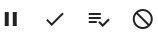
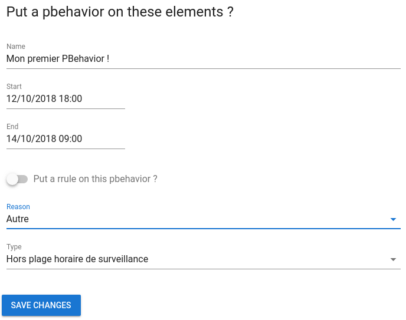

# Les comportements périodiques

Les comportements périodiques (ou *pbehaviors*) sont des évènements de calendrier récurrents qui arrêtent temporairement la surveillance d'une entité pendant un temps donné (pour la maintenance, par exemple).

# Utiliser la vue Context

## Introduction

Dans Canopsis, chaque évènement en cours de traitement contient des informations contextuelles.
Nous extrayons ces informations afin de créer une **entité**.

La vue **Context** permet de voir toutes les entités détectées.

> L'édition et la suppression sont ignorées par le système.
> Toutes les modifications seront effacées lors du prochain évènement entrant.

## Comportement périodique

Une entité peut avoir un comportement défini, décrivant son état réel.
Le comportement spécifié sera configuré avec une periode et éventuellement une récursion.

### Downtime

Un temps d'arrêt est défini sur une entité lorsque nous savons que cette entité sera « Down ». Cette situation peut se produire lorsque vous redémarrez un serveur, par exemple.
Le serveur aura un état erroné, qui sera ignoré par Canopsis pendant une courte période.

Les temps d'arrêt excluront les évènements de contrôle associés des sélecteurs l'utilisant.
Ainsi, le sélecteur ne sera pas influencé par les faux états erronés de l'entité.

Étant donné que l'évènement est exclu du sélecteur, le SLA exclut également les évènements des calculs.

## Comment l'utiliser ?

Pour instaurer un comportement périodique il vous suffit de selectionner un évènement, un bouton pause va alors apparaître :

Cliquez dessus, plusieurs configuration sont disponibles :

*  le titre de ce comportement périodique
*  sa durée
*  la mise en place d'une récurrence ou non
*  la raison
*  le type

### Exemple

On veut un comportement périodique nommé "Mon premier PBehavior !", qui s'étend du 12/10/2018 à 18h00 au 14/10/2018 à 9h00 dont la raison est "Autre" et dont le type est "hors plage horaire de surveillance".

Dans ce cas, notre fenêtre sera la suivante :

### Récurrence

On voudrait maintenant mettre en place une règle de récurrence sur un comportement périodique.

Il vous suffit de cliquer sur "Put a rrule on this PBehavior ?"

#### Configuration basique

Nous allons tout d'abord nous concentrer sur la configuration basique. Plusieurs options sont disponibles :

*  La fréquence : toutes les X secondes, minutes, heures, jours, semaines, mois ou années.
*  Jusqu'à : date et heure de fin de l'activation de ce comportement périodique.
*  Un jour en particulier : choisir un jour où le comportement périodique va s'activer.
*  Répétition : combien de fois le comportement périodique va s'activer.
*  Intervalle : intervalle de jours entre chaque activation du comportement périodique.

#### Configuration Avancée

La configuration avancée est reservée aux utilisateurs les plus expérimentés.

Elle permet, comme son nom l'indique, d'appliquer des règles plus détailées comme sélectionner les jours / heures / secondes sur un laps de temps précis (mois, années, semaines) dans lesquelles le comportement périodique va se déclencher.
